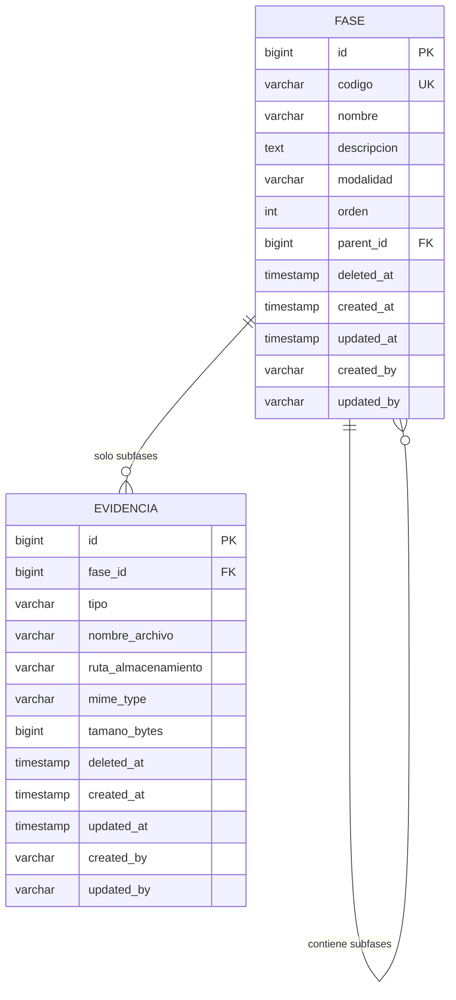

# Diseño Técnico — Gestión de Fases

> **Proyecto:** SIGESA — Sistema de Gestión de Acreditación Universitaria  
> **Feature:** Gestión de Fases y Subfases  
> **Versión del documento:** 1.0  
> **Stack:** Java 21 · Spring Boot 4.x · Spring Data JPA · H2 (dev) / PostgreSQL (prod) · Lombok

---

## 1. Objetivo

Definir el diseño técnico del módulo de **Gestión de Fases**, que permite administrar las fases de un proceso de acreditación según la modalidad (**ARCUSUR** o **CEUB**). Una fase raíz puede contener **subfases** (un solo nivel de profundidad). Las subfases están preparadas para asociar **evidencias** (documentos e imágenes) en un módulo posterior.

---

## 2. Alcance

| Incluido | Excluido (por ahora) |
|---|---|
| CRUD de fases raíz y subfases | Autenticación y autorización |
| Soft delete y hard delete con cascada | CRUD de evidencias (solo esquema previsto) |
| Auditoría (`created_at`, `updated_at`, `created_by`, `updated_by`) | Referencias desde procesos de acreditación |
| API versionada `/api/v1` | Reasignación de subfase a otro padre |
| Paginación y filtros estándar Spring | |

---

## 3. Modelo de Dominio

### 3.1 Reglas de negocio

1. Toda **Fase** pertenece a exactamente una **ModalidadAcreditacion** (`ARCUSUR` | `CEUB`).
2. Una **fase raíz** tiene `parent_id = NULL`. Una **subfase** tiene `parent_id` apuntando a una fase raíz.
3. **Jerarquía de un solo nivel:** una subfase no puede tener hijos. El servicio rechaza la creación si el padre ya es subfase.
4. El **código** es único a nivel global (independiente de modalidad y nivel).
5. El campo **orden** es opcional; no se exige secuencia consecutiva.
6. Una fase raíz **puede existir sin subfases**.
7. En **PUT**, el `parent_id` de una subfase es **inmutable** (no se puede mover a otra fase padre).
8. **Soft delete:** se marca `deleted_at`; opcionalmente se propaga en cascada a subfases activas.
9. **Hard delete:** eliminación física en cascada (subfases → evidencias asociadas).
10. Las **evidencias** solo pueden asociarse a **subfases** (validación en módulo futuro).

### 3.2 Diagrama entidad-relación



---

## 4. Base de Datos

### 4.1 Enum `ModalidadAcreditacion`

| Valor | Descripción |
|---|---|
| `ARCUSUR` | Modalidad de acreditación ARCUSUR |
| `CEUB` | Modalidad de acreditación CEUB |

Implementación Java: `enum ModalidadAcreditacion { ARCUSUR, CEUB }` con `@Enumerated(EnumType.STRING)`.

### 4.2 Tabla `fase`

```sql
CREATE TABLE fase (
    id              BIGINT GENERATED ALWAYS AS IDENTITY PRIMARY KEY,
    codigo          VARCHAR(50)  NOT NULL,
    nombre          VARCHAR(200) NOT NULL,
    descripcion     TEXT,
    modalidad       VARCHAR(20)  NOT NULL,
    orden           INTEGER,
    parent_id       BIGINT,
    deleted_at      TIMESTAMP,
    created_at      TIMESTAMP    NOT NULL DEFAULT CURRENT_TIMESTAMP,
    updated_at      TIMESTAMP    NOT NULL DEFAULT CURRENT_TIMESTAMP,
    created_by      VARCHAR(100),
    updated_by      VARCHAR(100),

    CONSTRAINT uk_fase_codigo        UNIQUE (codigo),
    CONSTRAINT fk_fase_parent        FOREIGN KEY (parent_id) REFERENCES fase (id),
    CONSTRAINT chk_fase_modalidad    CHECK (modalidad IN ('ARCUSUR', 'CEUB')),
    CONSTRAINT chk_fase_no_self_ref  CHECK (id <> parent_id)
);

CREATE INDEX idx_fase_modalidad     ON fase (modalidad);
CREATE INDEX idx_fase_parent_id     ON fase (parent_id);
CREATE INDEX idx_fase_deleted_at    ON fase (deleted_at);
CREATE INDEX idx_fase_modalidad_parent ON fase (modalidad, parent_id);
```

**Notas:**

- Las consultas activas filtran `deleted_at IS NULL`.
- `parent_id IS NULL` identifica fases raíz.
- La unicidad global de `codigo` se garantiza con `uk_fase_codigo` (incluye registros soft-deleted; ver § 8.3).

### 4.3 Tabla `evidencia` (prevista — fuera de alcance funcional)

```sql
CREATE TABLE evidencia (
    id                  BIGINT GENERATED ALWAYS AS IDENTITY PRIMARY KEY,
    fase_id             BIGINT       NOT NULL,
    tipo                VARCHAR(20)  NOT NULL,
    nombre_archivo      VARCHAR(255) NOT NULL,
    ruta_almacenamiento VARCHAR(500) NOT NULL,
    mime_type           VARCHAR(100),
    tamano_bytes        BIGINT,
    deleted_at          TIMESTAMP,
    created_at          TIMESTAMP    NOT NULL DEFAULT CURRENT_TIMESTAMP,
    updated_at          TIMESTAMP    NOT NULL DEFAULT CURRENT_TIMESTAMP,
    created_by          VARCHAR(100),
    updated_by          VARCHAR(100),

    CONSTRAINT fk_evidencia_fase   FOREIGN KEY (fase_id) REFERENCES fase (id),
    CONSTRAINT chk_evidencia_tipo  CHECK (tipo IN ('DOCUMENTO', 'IMAGEN'))
);

CREATE INDEX idx_evidencia_fase_id ON evidencia (fase_id);
```

La validación de que `fase_id` corresponde a una **subfase** se implementará en el servicio de evidencias.

---

## 5. Capa de Persistencia

### 5.1 Entidad `Fase`

```java
@Entity
@Table(name = "fase")
@Getter @Setter
@Builder @NoArgsConstructor @AllArgsConstructor
public class Fase {

    @Id
    @GeneratedValue(strategy = GenerationType.IDENTITY)
    private Long id;

    @Column(nullable = false, unique = true, length = 50)
    private String codigo;

    @Column(nullable = false, length = 200)
    private String nombre;

    @Column(columnDefinition = "TEXT")
    private String descripcion;

    @Enumerated(EnumType.STRING)
    @Column(nullable = false, length = 20)
    private ModalidadAcreditacion modalidad;

    private Integer orden;

    @ManyToOne(fetch = FetchType.LAZY)
    @JoinColumn(name = "parent_id")
    private Fase parent;

    @OneToMany(mappedBy = "parent", cascade = CascadeType.ALL, orphanRemoval = true)
    @OrderBy("orden ASC NULLS LAST, id ASC")
    private List<Fase> subfases = new ArrayList<>();

    private LocalDateTime deletedAt;

    @CreatedDate
    @Column(nullable = false, updatable = false)
    private LocalDateTime createdAt;

    @LastModifiedDate
    @Column(nullable = false)
    private LocalDateTime updatedAt;

    @CreatedBy
    @Column(length = 100)
    private String createdBy;

    @LastModifiedBy
    @Column(length = 100)
    private String updatedBy;

    public boolean isSubfase() {
        return parent != null;
    }

    public boolean isDeleted() {
        return deletedAt != null;
    }
}
```

> Habilitar `@EnableJpaAuditing` en la aplicación. Mientras no exista autenticación, `created_by` / `updated_by` recibirán el valor `"system"`.

### 5.2 Repositorio `FaseRepository`

```java
public interface FaseRepository extends JpaRepository<Fase, Long>, JpaSpecificationExecutor<Fase> {

    Optional<Fase> findByIdAndDeletedAtIsNull(Long id);

    Optional<Fase> findByCodigoAndDeletedAtIsNull(String codigo);

    boolean existsByCodigoAndDeletedAtIsNull(String codigo);

    boolean existsByCodigoAndIdNotAndDeletedAtIsNull(String codigo, Long id);

    @EntityGraph(attributePaths = {"subfases"})
    Optional<Fase> findWithSubfasesByIdAndParentIsNullAndDeletedAtIsNull(Long id);

    Page<Fase> findByParentIsNullAndDeletedAtIsNull(Pageable pageable);
}
```

Los filtros dinámicos (modalidad, texto, orden, etc.) se implementan con `Specification<Fase>`.

---

## 6. DTOs

### 6.1 Request DTOs

```java
// Crear fase raíz (subfases opcionales en el mismo payload)
public record FaseCreateRequest(
    @NotBlank @Size(max = 50)  String codigo,
    @NotBlank @Size(max = 200) String nombre,
    @Size(max = 5000)          String descripcion,
    @NotNull                     ModalidadAcreditacion modalidad,
    @Min(0)                      Integer orden,
    @Valid                       List<SubfaseCreateRequest> subfases
) {}

// Crear subfase bajo una fase raíz existente
public record SubfaseCreateRequest(
    @NotBlank @Size(max = 50)  String codigo,
    @NotBlank @Size(max = 200) String nombre,
    @Size(max = 5000)          String descripcion,
    @Min(0)                      Integer orden
) {}

// Actualizar fase raíz (reemplaza el conjunto de subfases si se envía la lista)
public record FaseUpdateRequest(
    @NotBlank @Size(max = 200) String nombre,
    @Size(max = 5000)          String descripcion,
    @Min(0)                      Integer orden,
    @Valid                       List<SubfaseUpdateRequest> subfases
) {}

// Actualizar subfase (parent_id no incluido — inmutable)
public record SubfaseUpdateRequest(
    @NotNull                     Long id,          // null en subfases nuevas dentro de FaseUpdateRequest
    @NotBlank @Size(max = 50)  String codigo,
    @NotBlank @Size(max = 200) String nombre,
    @Size(max = 5000)          String descripcion,
    @Min(0)                      Integer orden
) {}
```

### 6.2 Response DTOs

```java
public record SubfaseResponse(
    Long id,
    String codigo,
    String nombre,
    String descripcion,
    Integer orden,
    int cantidadEvidencias,   // 0 hasta implementar módulo evidencias
    LocalDateTime createdAt,
    LocalDateTime updatedAt
) {}

public record FaseResponse(
    Long id,
    String codigo,
    String nombre,
    String descripcion,
    ModalidadAcreditacion modalidad,
    Integer orden,
    List<SubfaseResponse> subfases,   // árbol completo (un nivel)
    LocalDateTime createdAt,
    LocalDateTime updatedAt
) {}

public record FaseSummaryResponse(
    Long id,
    String codigo,
    String nombre,
    ModalidadAcreditacion modalidad,
    Integer orden,
    int cantidadSubfases,
    LocalDateTime createdAt
) {}

// Wrapper estándar Spring Data
public record PageResponse<T>(
    List<T> content,
    int page,
    int size,
    long totalElements,
    int totalPages,
    boolean first,
    boolean last
) {}
```

### 6.3 Mapper

Interface `FaseMapper` (MapStruct recomendado) con métodos:

- `Fase toEntity(FaseCreateRequest request)`
- `Fase toEntity(SubfaseCreateRequest request, Fase parent)`
- `void updateEntity(FaseUpdateRequest request, @MappingTarget Fase entity)`
- `void updateEntity(SubfaseUpdateRequest request, @MappingTarget Fase entity)`
- `FaseResponse toResponse(Fase entity)`
- `FaseSummaryResponse toSummaryResponse(Fase entity)`

---

## 7. Capa de Servicio

### 7.1 Interface `FaseService`

```java
public interface FaseService {

    /** Crea una fase raíz; opcionalmente crea subfases anidadas en la misma transacción. */
    FaseResponse crear(FaseCreateRequest request);

    /** Crea una subfase bajo una fase raíz existente. */
    SubfaseResponse crearSubfase(Long faseId, SubfaseCreateRequest request);

    /** Obtiene detalle de fase raíz con árbol completo de subfases activas. */
    FaseResponse obtenerPorId(Long id);

    /** Obtiene detalle de subfase (sin hijos). */
    SubfaseResponse obtenerSubfasePorId(Long faseId, Long subfaseId);

    /**
     * Listado paginado de fases raíz con filtros opcionales.
     * Filtros: modalidad, q (nombre/código), incluirEliminadas, ordenMin, ordenMax.
     */
    PageResponse<FaseSummaryResponse> listar(
        ModalidadAcreditacion modalidad,
        String q,
        Boolean incluirEliminadas,
        Integer ordenMin,
        Integer ordenMax,
        Pageable pageable
    );

    /**
     * Listado paginado de subfases de una fase raíz.
     * Filtros: q (nombre/código), incluirEliminadas, ordenMin, ordenMax.
     */
    PageResponse<SubfaseResponse> listarSubfases(
        Long faseId,
        String q,
        Boolean incluirEliminadas,
        Integer ordenMin,
        Integer ordenMax,
        Pageable pageable
    );

    /** Actualiza fase raíz. Si se envía lista de subfases, sincroniza (crear/actualizar/soft-delete ausentes). */
    FaseResponse actualizar(Long id, FaseUpdateRequest request);

    /** Actualiza subfase. No permite cambiar parent_id. */
    SubfaseResponse actualizarSubfase(Long faseId, Long subfaseId, SubfaseUpdateRequest request);

    /** Soft delete de fase raíz y sus subfases activas (cascada). */
    void eliminarSoft(Long id);

    /** Soft delete de subfase individual. */
    void eliminarSubfaseSoft(Long faseId, Long subfaseId);

    /** Hard delete físico de fase raíz, subfases y evidencias (cascada JPA + FK). */
    void eliminarHard(Long id);

    /** Hard delete físico de subfase y sus evidencias. */
    void eliminarSubfaseHard(Long faseId, Long subfaseId);
}
```

### 7.2 Excepciones de dominio

| Excepción | HTTP | Caso |
|---|---|---|
| `FaseNotFoundException` | 404 | ID inexistente o soft-deleted (según operación) |
| `CodigoDuplicadoException` | 409 | Código ya registrado (activo) |
| `JerarquiaInvalidaException` | 422 | Subfase con hijos; padre es subfase; modalidad distinta |
| `OperacionNoPermitidaException` | 422 | Intento de cambiar `parent_id` o modalidad en PUT |

---

## 8. Estrategia de Borrado

### 8.1 Soft delete

```
DELETE /api/v1/fases/{id}?hard=false          (default)
DELETE /api/v1/fases/{id}/subfases/{subId}?hard=false
```

- Setea `deleted_at = now()` y `updated_by`.
- En fase raíz: propaga soft delete a todas las subfases activas.
- Registros soft-deleted quedan excluidos de listados por defecto (`incluirEliminadas=false`).

### 8.2 Hard delete

```
DELETE /api/v1/fases/{id}?hard=true
DELETE /api/v1/fases/{id}/subfases/{subId}?hard=true
```

- Elimina físicamente el registro y, por cascada, subfases y evidencias.
- Operación irreversible.

### 8.3 Código tras soft delete

Tras soft delete, el `codigo` permanece en BD (constraint UNIQUE). Para reutilizar un código, se requiere hard delete previo o estrategia futura de sufijo (`codigo + "_deleted_" + id`). **Supuesto v1.0:** no se reutilizan códigos de registros soft-deleted.

---

## 9. API REST

**Base path:** `/api/v1`

**Paginación estándar:** query params `page` (0-based), `size`, `sort` (ej. `sort=orden,asc`).

### 9.1 Fases raíz

| Método | Ruta | Descripción |
|---|---|---|
| `POST` | `/fases` | Crear fase raíz (+ subfases anidadas opcionales) |
| `GET` | `/fases` | Listado paginado de fases raíz |
| `GET` | `/fases/{id}` | Detalle con árbol completo de subfases |
| `PUT` | `/fases/{id}` | Actualizar fase raíz |
| `DELETE` | `/fases/{id}` | Soft (default) o hard delete (`?hard=true`) |

#### `GET /api/v1/fases` — Query params

| Param | Tipo | Default | Descripción |
|---|---|---|---|
| `modalidad` | `ARCUSUR` \| `CEUB` | — | Filtrar por modalidad |
| `q` | string | — | Búsqueda parcial en `codigo` y `nombre` |
| `incluirEliminadas` | boolean | `false` | Incluir soft-deleted |
| `ordenMin` | int | — | Filtro rango orden |
| `ordenMax` | int | — | Filtro rango orden |
| `page` | int | `0` | Página |
| `size` | int | `20` | Tamaño |
| `sort` | string | `orden,asc` | Ordenamiento |

**Ejemplo request — POST `/api/v1/fases`:**

```json
{
  "codigo": "AUTOEVALUACION",
  "nombre": "Autoevaluación institucional",
  "descripcion": "Fase inicial del proceso ARCUSUR",
  "modalidad": "ARCUSUR",
  "orden": 1,
  "subfases": [
    {
      "codigo": "AUTO-DOC-1",
      "nombre": "Documentación curricular",
      "descripcion": "Evidencias documentales del plan de estudios",
      "orden": 1
    },
    {
      "codigo": "AUTO-IMG-1",
      "nombre": "Registro fotográfico de infraestructura",
      "orden": 2
    }
  ]
}
```

**Ejemplo response — GET `/api/v1/fases/{id}`:**

```json
{
  "id": 1,
  "codigo": "AUTOEVALUACION",
  "nombre": "Autoevaluación institucional",
  "descripcion": "Fase inicial del proceso ARCUSUR",
  "modalidad": "ARCUSUR",
  "orden": 1,
  "subfases": [
    {
      "id": 10,
      "codigo": "AUTO-DOC-1",
      "nombre": "Documentación curricular",
      "descripcion": "Evidencias documentales del plan de estudios",
      "orden": 1,
      "cantidadEvidencias": 0,
      "createdAt": "2026-06-15T10:00:00",
      "updatedAt": "2026-06-15T10:00:00"
    }
  ],
  "createdAt": "2026-06-15T10:00:00",
  "updatedAt": "2026-06-15T10:00:00"
}
```

### 9.2 Subfases (rutas anidadas)

| Método | Ruta | Descripción |
|---|---|---|
| `POST` | `/fases/{faseId}/subfases` | Crear subfase bajo fase raíz |
| `GET` | `/fases/{faseId}/subfases` | Listado paginado de subfases |
| `GET` | `/fases/{faseId}/subfases/{subfaseId}` | Detalle de subfase |
| `PUT` | `/fases/{faseId}/subfases/{subfaseId}` | Actualizar subfase |
| `DELETE` | `/fases/{faseId}/subfases/{subfaseId}` | Soft o hard delete |

#### `GET /api/v1/fases/{faseId}/subfases` — Query params

Mismos filtros que fases raíz excepto `modalidad` (heredada del padre).

### 9.3 Controller (firmas)

```java
@RestController
@RequestMapping("/api/v1/fases")
@RequiredArgsConstructor
public class FaseController {

    private final FaseService faseService;

    @PostMapping
    @ResponseStatus(HttpStatus.CREATED)
    public FaseResponse crear(@Valid @RequestBody FaseCreateRequest request) { ... }

    @GetMapping
    public PageResponse<FaseSummaryResponse> listar(
        @RequestParam(required = false) ModalidadAcreditacion modalidad,
        @RequestParam(required = false) String q,
        @RequestParam(defaultValue = "false") boolean incluirEliminadas,
        @RequestParam(required = false) Integer ordenMin,
        @RequestParam(required = false) Integer ordenMax,
        @PageableDefault(sort = "orden", direction = Sort.Direction.ASC) Pageable pageable
    ) { ... }

    @GetMapping("/{id}")
    public FaseResponse obtenerPorId(@PathVariable Long id) { ... }

    @PutMapping("/{id}")
    public FaseResponse actualizar(@PathVariable Long id, @Valid @RequestBody FaseUpdateRequest request) { ... }

    @DeleteMapping("/{id}")
    @ResponseStatus(HttpStatus.NO_CONTENT)
    public void eliminar(
        @PathVariable Long id,
        @RequestParam(defaultValue = "false") boolean hard
    ) { ... }

    @PostMapping("/{faseId}/subfases")
    @ResponseStatus(HttpStatus.CREATED)
    public SubfaseResponse crearSubfase(
        @PathVariable Long faseId,
        @Valid @RequestBody SubfaseCreateRequest request
    ) { ... }

    @GetMapping("/{faseId}/subfases")
    public PageResponse<SubfaseResponse> listarSubfases(
        @PathVariable Long faseId,
        @RequestParam(required = false) String q,
        @RequestParam(defaultValue = "false") boolean incluirEliminadas,
        @RequestParam(required = false) Integer ordenMin,
        @RequestParam(required = false) Integer ordenMax,
        Pageable pageable
    ) { ... }

    @GetMapping("/{faseId}/subfases/{subfaseId}")
    public SubfaseResponse obtenerSubfase(
        @PathVariable Long faseId,
        @PathVariable Long subfaseId
    ) { ... }

    @PutMapping("/{faseId}/subfases/{subfaseId}")
    public SubfaseResponse actualizarSubfase(
        @PathVariable Long faseId,
        @PathVariable Long subfaseId,
        @Valid @RequestBody SubfaseUpdateRequest request
    ) { ... }

    @DeleteMapping("/{faseId}/subfases/{subfaseId}")
    @ResponseStatus(HttpStatus.NO_CONTENT)
    public void eliminarSubfase(
        @PathVariable Long faseId,
        @PathVariable Long subfaseId,
        @RequestParam(defaultValue = "false") boolean hard
    ) { ... }
}
```

---

## 10. Manejo de Errores

`@RestControllerAdvice` con respuesta uniforme:

```json
{
  "timestamp": "2026-06-15T10:30:00",
  "status": 409,
  "error": "Conflict",
  "message": "Ya existe una fase con el código 'AUTO-DOC-1'",
  "path": "/api/v1/fases"
}
```

Validaciones `@Valid` devuelven `400` con detalle de campos.

---

## 11. Estructura de Paquetes

```
com.umss.sigesa
├── domain
│   ├── model
│   │   ├── Fase.java
│   │   └── ModalidadAcreditacion.java
│   └── exception
│       ├── FaseNotFoundException.java
│       ├── CodigoDuplicadoException.java
│       └── JerarquiaInvalidaException.java
├── repository
│   └── FaseRepository.java
├── service
│   ├── FaseService.java
│   └── impl
│       └── FaseServiceImpl.java
├── web
│   ├── controller
│   │   └── FaseController.java
│   ├── dto
│   │   ├── request
│   │   └── response
│   ├── mapper
│   │   └── FaseMapper.java
│   └── advice
│       └── GlobalExceptionHandler.java
└── config
    └── JpaAuditingConfig.java
```

---

## 12. Pruebas

| Capa | Enfoque | Cobertura objetivo |
|---|---|---|
| `FaseServiceImpl` | Unit tests con Mockito | ≥ 90 % (JaCoCo) |
| `FaseController` | `@WebMvcTest` | Endpoints y validaciones |
| `FaseRepository` | `@DataJpaTest` | Specifications y soft delete |

Casos críticos:

- Crear fase con múltiples subfases anidadas en un POST.
- Rechazar subfase bajo otra subfase.
- Unicidad global de código.
- Soft delete en cascada desde fase raíz.
- Hard delete en cascada (con evidencias mock).
- PUT de subfase sin cambio de padre.
- Filtros combinados en listado paginado.

---

## 13. Supuestos documentados

1. **Auditoría:** sin autenticación, `created_by` / `updated_by` = `"system"`.
2. **Evidencias:** tabla definida; CRUD diferido al módulo correspondiente.
3. **Sincronización en PUT:** si `FaseUpdateRequest.subfases` se envía, las subfases existentes no incluidas reciben soft delete (no hard delete automático).
4. **Reutilización de código:** no permitida mientras exista registro soft-deleted con el mismo código.
5. **Modalidad inmutable** en PUT de fase raíz (no se expone en `FaseUpdateRequest`).

---

## 14. Próximos pasos

1. Implementar entidad, repositorio, servicio y controller según este diseño.
2. Configurar JaCoCo con umbral mínimo 90 % en `FaseServiceImpl`.
3. Implementar módulo **Evidencias** (upload de documentos/imágenes vinculado a subfases).
4. Integrar autenticación y poblar `created_by` / `updated_by` con el usuario autenticado.
