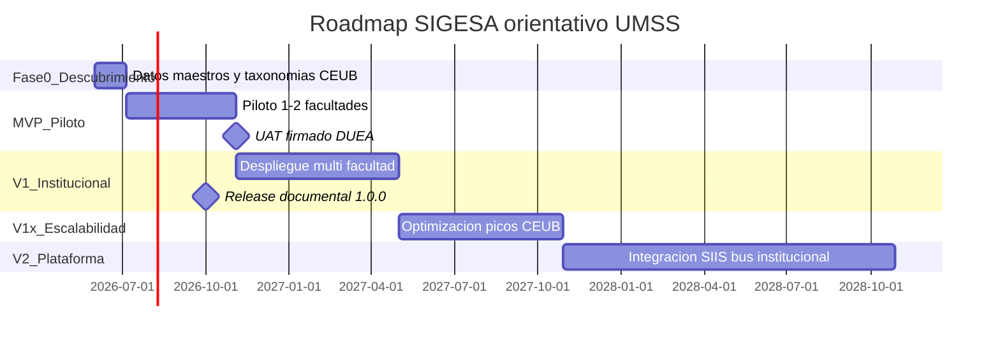

# Roadmap del producto — SIGESA / AcredIA · UMSS

| Metadato | Valor |
|----------|-------|
| **Producto** | SIGESA — Sistema de Evaluación y Acreditación de Carreras |
| **Institución** | Universidad Mayor de San Simón (UMSS) · DUEA |
| **Versión** | v1.0 |
| **Fecha** | 14/05/2026 |
| **Documento padre** | `docs/03_prd/PRD.md` |
| **Historias** | `docs/03_prd/user_stories.md` |
| **Journeys** | `docs/03_prd/user_journeys.md` |
| **Release documental** | `docs/10_aportes/release-1.0.0.md` |
| **Horizonte** | 2026–2028 (orientativo; sujeto a calendario académico y CEUB) |

---

## 1. Visión del roadmap

SIGESA evoluciona en **cuatro oleadas** alineadas al calendario de acreditación boliviano:

1. **MVP / piloto** — Flujo trazable CC→TD en 1–2 facultades.  
2. **v1.0 institucional** — Cobertura multi-facultad, portal y planes de mejora.  
3. **v1.x escalabilidad** — Picos de convocatoria, roles extendidos, exportaciones.  
4. **v2.0 plataforma** — Integraciones UMSS, IA asistida gobernada, evaluador externo.

---

## 2. Releases y objetivos

| Release | Nombre | Objetivo estratégico | Audiencia principal |
|---------|--------|----------------------|---------------------|
| **0.9** | Piloto / MVP | Sustituir correo/WhatsApp como canal principal en carreras piloto | [CC], [TD], [JD] piloto |
| **1.0.0** | Institucional | Operación estable en todas las facultades UMSS en convocatoria activa | DUEA + facultades |
| **1.1.0** | Hardening | Portal, buscador, gobernanza IA-SDLC en producción | DUEA + TI |
| **1.2.0** | Extensión roles | Decano [DC], Excel masivo, optimización carga | Gobierno académico |
| **2.0.0** | Plataforma | SIIS, SSO, IA asistida bajo RB-11, evaluador externo | Institución + externos |

---

## 3. Fase 0 — Descubrimiento y preparación (2026-Q2)

| Entregable | Descripción | Responsable | Dependencia |
|------------|-------------|-------------|-------------|
| Catálogo carreras/facultades | 12 facultades, carreras activas UMSS | DUEA + PM | Resoluciones internas |
| Taxonomía CEUB v1 | Fases, subfases, indicadores (T-012) | JD + [TD] | Documentos normativos |
| Taxonomía ARCU-SUR v1 | Misma estructura donde aplique | JD | CEUB vigente (`RB-01`) |
| Infra base | Entornos dev/staging/prod, SMTP, S3 | DevOps UMSS | Política TI |
| Capacitación diseño | Workshops J-01, J-03 con prototipo Hi-Fi | UX + DUEA | LFSD validado |

**No incluye:** código productivo en producción.

---

## 4. MVP — Piloto institucional (Release 0.9)

### 4.1 Objetivo

Reemplazar el canal informal principal por un **flujo trazable** en **una o dos facultades piloto**, demostrando ciclo completo carga → dictamen → dashboard básico.

### 4.2 User stories incluidas

| ID | Historia | Prioridad |
|----|----------|-----------|
| PRD-US-001 | Login institucional | P0 |
| PRD-US-002 | Admin usuarios [JD] | P0 |
| PRD-US-003 | Carga evidencia [CC] | P0 |
| PRD-US-004 | Historial versiones | P0 |
| PRD-US-005 | Confirmación carga | P0 |
| PRD-US-006 | Aprobar/rechazar [TD] | P0 |
| PRD-US-007 | Avance subfase | P0 |
| PRD-US-008 | Observaciones [CC] | P0 |
| PRD-US-009 | Dashboard semáforos (básico) | P0 |
| PRD-US-011 | Reporte PDF (básico) | P0 |
| PRD-US-013 | Alertas [CC] | P0 |
| PRD-US-014 | Notif. carga [TD] | P0 |
| PRD-US-015 | Buscador [TD] | P0 |
| PRD-US-018 | Log auditoría [JD] | P0 |
| PRD-US-022 | Estado respaldos | P0 |

**Opcional MVP+:** PRD-US-016 (portal público) si política de go-live lo exige.

### 4.3 Tasks técnicas (LFSD §2.5)

T-001 … T-009, T-011, T-012 (parcial piloto), alineadas a FSD-UC-001 … UC-005.

### 4.4 Criterios de salida del piloto

| Criterio | Umbral |
|----------|--------|
| Adopción [CC] carrera piloto | ≥ 80 % indicadores cargados en SIGESA |
| CSAT [CC]/[TD] | ≥ 4/5 |
| Notificaciones críticas | 100 % ≤ 15 min |
| Incidentes P0 abiertos | 0 |
| Firma UAT | Jefatura DUEA |

### 4.5 Journeys validados en piloto

- **J-01** Cierre evidencia CEUB  
- **J-05** Cola revisión [TD]  
- **J-03** (dashboard básico)

---

## 5. Release 1.0.0 — Despliegue institucional

### 5.1 Objetivo

Cobertura **multi-facultad** UMSS, estabilización operativa, métricas de adopción y línea base documental (BRD/PRD/FSD/trazabilidad).

### 5.2 Incremento sobre MVP

| ID | Historia / capacidad | Prioridad |
|----|----------------------|-----------|
| PRD-US-010 | Filtros dashboard | P1 |
| PRD-US-016 | Portal público | P1 |
| PRD-US-019 | Plantillas versionadas | P1 |
| PRD-US-021 | Plan de mejora | P1 |
| — | Hardening NFR (TLS, WCAG crítico, uptime 99 %) | P0 |
| — | Capacitación masiva CC/TD por facultad | — |

### 5.3 Hitos institucionales

| Hito | Fecha orientativa | Entregable |
|------|-------------------|------------|
| Go-live multi-facultad | 2026-10 | Sistema en producción UMSS |
| Release notes | 2026-10 | `docs/10_aportes/release-1.0.0.md` |
| Matriz trazabilidad congelada | 2026-10 | Baseline auditoría |

### 5.4 KPIs de adopción v1.0

| KPI | Meta |
|-----|------|
| MAU [CC] + [TD] | ≥ 80 % a M+3 |
| KPI-01 tiempo búsqueda [TD] | ≤ 2 min |
| KPI-03 PDF P95 | ≤ 5 min |
| Cobertura auditoría acciones | 100 % (NFR-013) |

---

## 6. Release 1.1.0 — Hardening y gobernanza

### 6.1 Objetivo

Endurecer componentes expuestos y operacionalizar **AI-SDLC** y observabilidad.

| Tema | Entregables |
|------|-------------|
| Portal público | CDN, cache, contenido estático |
| Buscador | Índices BD, pruebas k6 formales |
| Gobernanza IA | `.cursor/rules` CR-SIG-01…04; panel PCOV/SFID/TII |
| DevSecOps | Escaneo CVE en CI; runbooks incidentes |
| Documentación | Sincronización `docs/` canónico |

**Historias:** refuerzo US-015, US-016; sin nuevas US obligatorias.

---

## 7. Release 1.2.0 — Escalabilidad y extensión

### 7.1 Objetivo

Soportar **picos de convocatoria CEUB** y ampliar actores de gobierno académico.

| ID | Historia / tema |
|----|----------------|
| PRD-US-012 | Exportación Excel async |
| PRD-US-020 | Vista decano [DC] |
| — | Workers horizontales PDF/notificaciones |
| — | Réplicas lectura BD (evaluación arquitectura) |
| — | Cola de cargas con priorización |

---

## 8. Release 2.0.0 — Visión plataforma (2027+)

### 8.1 Objetivo

Integración ecosistema UMSS e **IA asistida** con supervisión humana (`RB-11`).

| Capacidad | Descripción | Fuera de v1 |
|-----------|-------------|-------------|
| **SIIS / bus institucional** | Enriquecimiento catálogo carrera (solo lectura) | LFSD §2.2 |
| **SSO UMSS** | Single sign-on evaluación técnica | ADR pendiente |
| **IA asistida** | Clasificación observaciones, borradores TD, explicación semáforos | Feature flags + DPIA |
| **Evaluador externo [EE]** | Lectura acotada proceso asignado | Rol LFSD §3 |
| **Certificados** | QR verificación, firma avanzada | PRD-US-017 evolución |

### 8.2 Skills IA planificados (v2)

| Skill | Release objetivo |
|-------|------------------|
| SKILL-SIG-05 | Clasificación observaciones |
| SKILL-SIG-06 | Explicación semáforo |
| SKILL-SIG-07 | Borrador observación TD |

---

## 9. Cronograma académico vs roadmap técnico

| Ventana académica | Requisito SIGESA |
|-------------------|------------------|
| 3 meses antes deadline carga masiva | MVP operativo en facultades afectadas |
| 1 mes antes visita CEUB | v1.0 estable + reportes PDF |
| Post-visita | Plan de mejora (US-021) |

Diagrama de referencia: `docs/07_diagramas/gantt-005-diagrama.mmd`.

---

## 10. Matriz roadmap ↔ épicas ↔ módulos

| Fase | Épicas PRD | Módulos lógicos |
|------|------------|-----------------|
| MVP | E1 IAM, E2 Documentos, E3 Workflow, E4 Dashboard básico | MOD-AUTH, MOD-DOCS, MOD-WF, MOD-DASH, MOD-NOTIF, MOD-AUD |
| v1.0 | + E5 Notif, E6 Portal, E7 Gobernanza | + MOD-PUB, MOD-ADMIN |
| v1.2 | E4 extendido | MOD-REP Excel |
| v2.0 | IA + integraciones | MOD-ESB (futuro) |

---

## 11. Riesgos al cronograma

| Riesgo | Impacto | Mitigación en roadmap |
|--------|---------|------------------------|
| Retraso datos maestros DUEA | Alto | Fase 0 obligatoria antes de MVP |
| Cambio normativa CEUB | Alto | US-019 plantillas versionadas en v1.0 |
| SMTP institucional inestable | Medio | MVP incluye cola retry; US-013 |
| Resistencia adopción [CC] | Medio | Piloto + capacitación por journey J-01 |

---

## 12. Gobierno del roadmap

| Actividad | Frecuencia | Participantes |
|-----------|------------|---------------|
| Revisión de prioridades backlog | Sprint / quincena | PM, Tech Lead, JD |
| Ajuste fechas por convocatoria CEUB | Trimestral | DUEA + Decanatos |
| Congelamiento alcance release | 4 semanas antes go-live | Comité de cambio |

**Regla:** ningún ítem P0 se mueve de release sin ADR y aprobación [JD].

---

## 13. Registro de cambios

| Versión | Fecha | Cambio |
|---------|-------|--------|
| v1.0 | 14/05/2026 | Roadmap inicial MVP → v2.0 alineado PRD-US y release 1.0.0 |

---

*Mantener sincronizado con `user_stories.md` y `user_journeys.md`.*