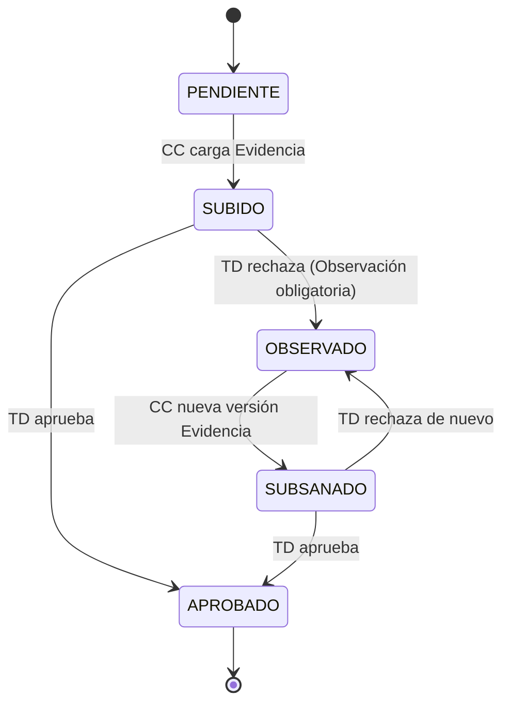
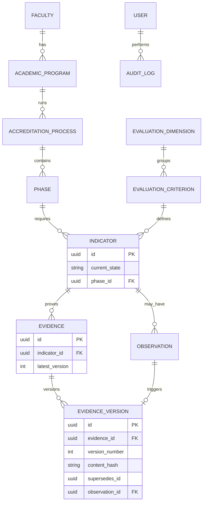

# Functional Specification Document (FSD) — SIGESA / AcredIA

## Control de versión del documento

| Campo | Valor |
|-------|-------|
| **Versión** | **Dorada v1.0** |
| **Última actualización (timestamp)** | `2026-05-16T15:51:39-04:00` |
| **Resumen de cambios** | FSD Dorado: 18 casos de uso, máquina de estados, ER Mermaid, 18 reglas de negocio, 16 NFRs, catálogo API, 3 prompt-contratos, trazabilidad BRD↔MRD↔PRD. Sistema de **automatización** de acreditación (no ERP). |
| **BRD** | `docs/01_brd/BRD.md` v2.1 |
| **MRD** | `docs/02_mrd/MRD.md` v1.1 |
| **PRD** | `docs/03_prd/PRD.md` v1.0 |
| **Roadmap** | `docs/03_prd/ROADMAP.md` |
| **Matriz** | [`matriz_trazabilidad.md`](../09_trazabilidad/matriz_trazabilidad.md) |
| **NFRs** | [`docs/05_nfr/NFR_ISO25010.md`](../05_nfr/NFR_ISO25010.md) |
| **Estado** | Borrador — apto para DTI Dorado |

> **Propósito:** especificar el **comportamiento funcional** del sistema (actores, flujos, datos, reglas, interfaces) derivado del PRD Dorado. No prescribe stack; las decisiones técnicas van a ADR/DTI.

---

## 0. Metadatos

| Campo | Valor |
|-------|-------|
| Producto | SIGESA / AcredIA — Sistema de automatización del ciclo de acreditación CEUB/ARCU-SUR (UMSS) |
| Modo | **FSD clásico** |
| Autores | Equipo AcredIA (consolidación) |
| Glosario | `context/03_domain_glossary.md` · [`glosario.md`](glosario.md) (vista FSD) |
| Máquina de estados | `team/alexAlvarez/docs/context/04_state_machine.md` (referencia normativa) |
| Skills aplicadas | `sigesa-generacion-documentos-tecnicos` · `sigesa-arquitectura-tecnica-ia` · `sigesa-auditor-trazabilidad-dti` |

### Artefactos descompuestos (FSD)

| Artefacto | Ruta |
|-----------|------|
| Casos de uso | [`casos_uso.md`](casos_uso.md) |
| Gherkin | [`gherkin.md`](gherkin.md) |
| Reglas de negocio | [`reglas_negocio.md`](reglas_negocio.md) |
| Modelo de datos (funcional) | [`modelo_datos.md`](modelo_datos.md) |
| Contratos API | [`api_contracts.md`](api_contracts.md) |
| Glosario FSD | [`glosario.md`](glosario.md) |
| **Diagramas (`.mmd`)** | Vista [`07_diagramas/`](07_diagramas/README.md) → canónico [`../07_diagramas/`](../07_diagramas/README.md) |
| **C4 (DTI)** | MVP: [`c4-007`](../07_diagramas/c4-007-07-contenedores-sistema.mmd) · Target: [`c4-008`](../07_diagramas/c4-008-08-contenedores-produccion.mmd) — ver [`docs/05_dti/DTI.md`](../05_dti/DTI.md) §2, [`consistency_mvp_runtime_audit.md`](../09_trazabilidad/consistency_mvp_runtime_audit.md) |

> Modelo físico PostgreSQL: [`docs/05_dti/modelo_datos.md`](../05_dti/modelo_datos.md).

---

## 1. Resumen ejecutivo

SIGESA automatiza el ciclo **Proceso → Fase → Dimensión → Criterio → Indicador → Evidencia** para la DUEA UMSS. Los actores **[CC]**, **[TD]** y **[JD]** operan sobre un repositorio único con **versionado append-only**, máquina de estados del **Indicador** y panel ejecutivo. **[P]** consulta información **publicada**. El FSD traduce 28 requisitos del PRD en **18 casos de uso** verificables con Gherkin, reglas `FSD-BR-*` alineadas al BRD y contratos API lógicos. **No** incluye ERP, SIIS ni RRHH (BRD-CST-07).

---

## 2. Alcance

### 2.1 Dentro del alcance (v1.0 — ver `ROADMAP.md`)

Autenticación UMSS y RBAC; plantillas CEUB/ARCU-SUR; carga/búsqueda/versionado/subsanación de **Evidencia**; workflow [TD]; dashboards; alertas; PDF ejecutivo; bitácora; portal [P] (Should v1.1).

### 2.2 Fuera del alcance

| Ítem | Referencia |
|------|------------|
| ERP / SIIS / RRHH / tesorería | BRD-CST-07 |
| Dictamen automático sin humano | BRD-RB-14 |
| Stack, hosting, CI/CD detallado | DTI (`docs/05_dti/`) |

### 2.3 Supuestos y dependencias

BRD-ASM-01…05; correo institucional; datos maestros carreras/facultades; plantillas validadas por comité normativo.

### 2.4 Plan técnico (referencia — detalle en DTI)

| Bloque | Decisión funcional (no stack) |
|--------|------------------------------|
| Estilo | Arquitectura cloud distribuida con servicios hexagonales (Evidence, Audit, Orchestration, Notification) |
| Persistencia Evidencia | Append-only; sin `DELETE` físico en blobs aprobados |
| Autenticación | `AuthPort` + `LocalAuthAdapter` (v1.0); `LdapAuthAdapter` (v1.1) — ADR-0003 |
| ADR | `docs/adr/README.md` — ADR-0001…0013 (inmutable, EventBridge, SQS FIFO, S3, estado append-only) |
| Módulos lógicos | `MOD-AUTH`, `MOD-PROCESS`, `MOD-EVIDENCE`, `MOD-WORKFLOW`, `MOD-DASH`, `MOD-NOTIFY`, `MOD-REPORT`, `MOD-PUBLIC`, `MOD-AUDIT` |

### 2.5 Descomposición en tasks (Spec Kit)

| Task | Descripción | FSD-UC | Release |
|------|-------------|--------|---------|
| T-001 | Modelo datos Proceso/Fase/Indicador | UC-003 | v1.0-rc |
| T-002 | Auth + RBAC | UC-001, UC-002 | v1.0-rc |
| T-003 | Upload Evidencia + versionado | UC-004, UC-005 | v1.0-rc |
| T-004 | State machine Indicador | UC-008, UC-009, UC-010 | v1.0-rc |
| T-005 | Observaciones + subsanación | UC-006, UC-008 | v1.0-rc |
| T-006 | Búsqueda indexada | UC-007 | v1.0 |
| T-007 | Dashboards + semáforo | UC-011, UC-012, UC-013 | v1.0 |
| T-008 | Notificaciones outbox | UC-015 | v1.0 |
| T-009 | Reporte PDF | UC-014 | v1.0 |
| T-010 | Bitácora append-only | UC-017 | v1.0 |
| T-011 | Portal público | UC-016 | v1.1 |
| T-012 | Importación CSV | UC-018 | v1.1 |

---

## 3. Actores y roles

| Actor | Tipo | Responsabilidad | Permisos clave |
|-------|------|-----------------|----------------|
| [CC] | humano | Carga/subsana Evidencia de su carrera | Crear, leer y versionar Evidencia propia; leer observaciones |
| [TD] | humano | Valida, aprueba/rechaza Indicador | Transiciones estado Indicador; búsqueda global |
| [JD] | humano | Configuración, reportes, publicación | Usuarios, plantillas, semáforo, PDF, portal publish |
| [P] | humano | Consulta pública | Solo lectura publicados |
| Sistema notificaciones | sistema | Correo institucional | Outbox eventos |
| Sistema auditoría | sistema | Log inmutable | Append log |

---

## 4. Máquina de estados (referencia normativa)

### 4.1 Estados del Indicador



### 4.2 Regla de cierre de Fase (hard constraint)

`COUNT(indicadores_fase) == COUNT(indicadores WHERE estado = APROBADO)` — si no, **excepción** `FASE_CIERRE_BLOQUEADO` (FSD-UC-010).

### 4.3 Diagrama de secuencia — Subsanación

> Versión editable (fuente): [`07_diagramas/seq-006-006-subsanar-evidencia-secuencia.mmd`](07_diagramas/seq-006-006-subsanar-evidencia-secuencia.mmd) · Estados: [`state-006-006-008-009-estados-indicador.mmd`](07_diagramas/state-006-006-008-009-estados-indicador.mmd)

```mermaid
sequenceDiagram
  participant CC as Coordinador [CC]
  participant SYS as SIGESA
  participant TD as Técnico [TD]
  CC->>SYS: POST Evidencia v1
  SYS->>TD: Notificación revisión
  TD->>SYS: POST aprobar/rechazar Indicador (inserta indicator_state_history)
  SYS->>CC: Notificación rechazo
  CC->>SYS: POST Evidencia v2 (observationId)
  Note over SYS: v1 permanece; append-only
  SYS->>TD: Notificación subsanación
  TD->>SYS: POST aprobar Indicador (inserta indicator_state_history)
```

---

## 5. Casos de uso funcionales

### Índice

| ID | Nombre | PRD-US | PRD-REQ | Release |
|----|--------|--------|---------|---------|
| FSD-UC-001 | Autenticación y sesión | 001, 003 | 001 | v1.0 |
| FSD-UC-002 | Gestión de usuarios [JD] | 002 | 001 | v1.0 |
| FSD-UC-003 | Plantillas y Proceso CEUB/ARCU-SUR | 023 | 002,004,016 | v1.0 |
| FSD-UC-004 | Cargar Evidencia | 005, 025 | 005, 022 | v1.0 |
| FSD-UC-005 | Versionado y bloqueo de borrado | 007, 008 | 006, 007 | v1.0 |
| FSD-UC-006 | Subsanar Evidencia | 006 | 008 | v1.0 |
| FSD-UC-007 | Buscar Evidencia | 004 | 015 | v1.0 |
| FSD-UC-008 | Rechazar Indicador | 009 | 008, 009 | v1.0 |
| FSD-UC-009 | Aprobar Indicador | 010 | 009 | v1.0 |
| FSD-UC-010 | Avanzar/cerrar Fase | 011 | 010, 017 | v1.0 |
| FSD-UC-011 | Dashboard [CC] y observaciones | 012, 015 | 012 | v1.0 |
| FSD-UC-012 | Bandeja auditoría [TD] | 014 | 012 | v1.0 |
| FSD-UC-013 | Panel semáforo [JD] | 013 | 011 | v1.0 |
| FSD-UC-014 | Reporte ejecutivo PDF | 021 | 014 | v1.0 |
| FSD-UC-015 | Notificaciones y alertas | 017–019 | 013 | v1.0 |
| FSD-UC-016 | Portal público | 016, 020 | 019, 026 | v1.1 |
| FSD-UC-017 | Bitácora de auditoría | 022 | 018 | v1.0 |
| FSD-UC-018 | Importación masiva | 024 | 020 | v1.1 |

---

### FSD-UC-001 — Autenticación y sesión

- **Trazabilidad:** PRD-REQ-001 · PRD-US-001, 003 · BRD-REQ-001 · MRD-N-09
- **Actor principal:** Usuario interno ([CC], [TD], [JD])
- **Precondiciones:** Usuario registrado con correo `@umss.edu.bo` (BRD-RB-13)
- **Disparador:** Submit login
- **Flujo principal:**
  1. Usuario ingresa credenciales.
  2. Sistema valida vía `LocalAuthAdapter` (v1.0); en v1.1 `LdapAuthAdapter` (ADR-0003).
  3. Sistema crea sesión con rol y alcance carrera/facultad.
  4. Redirige a dashboard según rol.
  5. Registra `AUDIT_LOGIN` (UC-017).
- **Excepciones:** E1 credenciales inválidas → 401 genérico; E2 sin rol → 403; E3 no autenticado en acción sensible → 401 (US-003)

```gherkin
Escenario: Login exitoso con rol
  Dado un usuario con correo @umss.edu.bo y rol [CC]
  Cuando autentica con credenciales válidas
  Entonces obtiene sesión activa
  Y accede solo a datos de su carrera

Escenario: Acción sin sesión
  Dado un cliente no autenticado
  Cuando invoca POST /evidences
  Entonces recibe 401
  Y no persiste datos
```

---

### FSD-UC-004 — Cargar Evidencia

- **Trazabilidad:** PRD-REQ-005 · PRD-US-005 · BRD-REQ-005 · FSD-BR-06
- **Actor principal:** [CC]
- **Precondiciones:** Indicador en `PENDIENTE` o `OBSERVADO`; usuario con permiso carrera
- **Flujo principal:**
  1. [CC] selecciona Proceso → Fase → Indicador.
  2. Adjunta Evidence + metadatos obligatorios (Criterio/Indicador).
  3. Sistema valida tipo/tamaño; calcula hash.
  4. Persiste `Evidence` v1 y publica `EvidenceUploaded`.
  5. Audit Service consume el evento e inserta transición `PENDIENTE → SUBIDO` en `indicator_state_history`.
  6. Notification Service notifica al [TD] (UC-015).
  7. Si el blob de Evidencia > umbral → barra progreso (US-025).
- **Excepciones:** E1 sin Indicador → 400; E2 formato inválido → 422

```gherkin
Escenario: Carga válida
  Dado un [CC] y un Indicador en PENDIENTE
  Cuando sube Evidence válida con metadatos completos
  Entonces se crea Evidence versión 1
  Y el Indicador pasa a SUBIDO
  Y el [TD] recibe notificación en un máximo de 15 minutos
```

**Datos entrada:** `indicatorId`, `evidenceBlob`, `description`, `criterionId`  
**Datos salida:** `evidenceId`, `version`, `contentHash`, `currentState`

---

### FSD-UC-005 — Versionado append-only

- **Trazabilidad:** PRD-REQ-006, 007 · PRD-US-007, 008 · BRD-CST-01 · BRD-RB-18
- **Reglas:** Sin `DELETE` en Evidencia `APROBADO`; intentos → `AUDIT_DELETE_DENIED`
- **Flujo:** Consulta historial ordenado; la versión vigente se deriva por `version DESC` y cadena `supersedesId`

```gherkin
Escenario: Bloqueo eliminación Evidencia aprobada
  Dado Evidence en estado Aprobado
  Cuando cualquier rol intenta DELETE /evidences/{id}
  Entonces el sistema responde 409 EVIDENCE_IMMUTABLE
  Y registra evento en bitácora
```

---

### FSD-UC-006 — Subsanar Evidencia

- **Trazabilidad:** PRD-REQ-008 · PRD-US-006 · BRD-RB-16
- **Precondiciones:** Indicador `OBSERVADO`; existe `observationId`
- **Postcondiciones:** Nueva versión con `supersedesVersion` y `observationId`; v1 intacta

---

### FSD-UC-007 — Buscar Evidencia

- **Trazabilidad:** PRD-REQ-015 · PRD-US-004 · NFR-002
- **Filtros:** carrera, Fase, Indicador, texto, gestión
- **Criterio éxito:** tarea E2E ≤ 2 min (mediana piloto)

---

### FSD-UC-008 — Rechazar Indicador

- **Trazabilidad:** PRD-REQ-008, 009 · PRD-US-009
- **Regla:** `justification` obligatorio (min 20 caracteres — configurable)
- **Postcondiciones:** Indicador `OBSERVADO`; entidad `Observation` creada; notifica [CC]

```gherkin
Escenario: Rechazo sin justificación
  Dado un [TD] en revisión
  Cuando confirma rechazo con justificación vacía
  Entonces el sistema responde 422 JUSTIFICATION_REQUIRED
  Y el Indicador permanece en SUBIDO
```

---

### FSD-UC-009 — Aprobar Indicador

- **Trazabilidad:** PRD-REQ-009 · PRD-US-010
- **Postcondiciones:** Indicador `APROBADO`; evalúa regla cierre Fase (UC-010)

---

### FSD-UC-010 — Avanzar/cerrar Fase

- **Trazabilidad:** PRD-REQ-010, 017 · PRD-US-011
- **Solo [TD]** (o [JD] si política extendida — por defecto [TD])
- **Excepción:** `FASE_CIERRE_BLOQUEADO` + lista indicadores pendientes

```gherkin
Escenario: Cierre bloqueado
  Dado una Fase con un Indicador en SUBIDO
  Cuando el [TD] solicita cerrar la Fase
  Entonces el sistema rechaza con FASE_CIERRE_BLOQUEADO
  Y devuelve la lista de Indicadores no APROBADO
```

---

### FSD-UC-011 a UC-018 (resumen funcional)

| UC | Flujo resumido | Gherkin ref |
|----|----------------|-------------|
| UC-002 | [JD] CRUD usuarios/roles; desactivación conserva auditoría | PRD-US-002 |
| UC-003 | Activar plantilla CEUB/ARCU-SUR; un Proceso activo/tipo/carrera | PRD-US-023 |
| UC-011 | Dashboard carrera; lista observaciones por plazo | PRD-US-012, 015 |
| UC-012 | Filtros bandeja [TD] por carrera/estado/Fase | PRD-US-014 |
| UC-013 | Semáforo global; reglas Rojo/Amarillo/Verde | PRD-US-013 |
| UC-014 | PDF con filtros + timestamp; P95 ≤ 5 min | PRD-US-021 |
| UC-015 | Outbox: aprobación, rechazo, plazo, nueva Evidencia | PRD-US-017–019 |
| UC-016 | GET público solo `published=true` | PRD-US-016, 020 |
| UC-017 | Log append-only; export CSV [JD] | PRD-US-022 |
| UC-018 | Import CSV validación fila a fila | PRD-US-024 |

---

## 6. Reglas de negocio

| ID | Regla | Tipo | Origen BRD | UC |
|----|-------|------|-----------|-----|
| FSD-BR-01 | Evidencia siempre ligada a Indicador/Criterio | Validación | BRD-RB-06 | UC-004 |
| FSD-BR-02 | Append-only: no borrado físico aprobados | Política | BRD-CST-01 | UC-005 |
| FSD-BR-03 | Solo [CC] carga (salvo delegación auditada) | Política | BRD-RB-15 | UC-004 |
| FSD-BR-04 | Solo [TD] aprueba/rechaza Indicador | Autorización | BRD-REQ-009 | UC-008, 009 |
| FSD-BR-05 | Rechazo requiere justificación | Validación | BRD-REQ-008 | UC-008 |
| FSD-BR-06 | Subsanación enlaza `observationId` | Trazabilidad | BRD-RB-16 | UC-006 |
| FSD-BR-07 | Cierre Fase solo si todos APROBADO | Estado | BRD-CST-03 | UC-010 |
| FSD-BR-08 | Un Proceso activo por tipo/carrera/periodo | Negocio | BRD-RB-02 | UC-003 |
| FSD-BR-09 | [CC] solo ve su carrera | Seguridad | BRD-CST-04 | UC-011 |
| FSD-BR-10 | Portal sin borradores | Publicación | BRD-REQ-016 | UC-016 |
| FSD-BR-11 | Dictamen final solo humano [JD]/[TD] | Ética | BRD-RB-14 | — |
| FSD-BR-12 | Correo solo @umss.edu.bo | Seguridad | BRD-RB-13 | UC-001 |
| FSD-BR-13 | Notificación crítica ≤ 15 min | SLA | BRD-REQ-011 | UC-015 |
| FSD-BR-14 | Reporte externo solo con autorización [JD] | Política | BRD-RB-12 | UC-014 |
| FSD-BR-15 | Intentos DELETE registrados en auditoría | Seguridad | BRD-RB-18 | UC-005 |
| FSD-BR-16 | No módulos ERP en v1 | Alcance | BRD-CST-07 | — |
| FSD-BR-17 | Plazos normativos no editables por [CC] | Normativa | BRD-RB-09 | UC-003 |
| FSD-BR-18 | Progreso obligatorio en cargas > umbral | UX | BRD-REQ-025 | UC-004 |

---

## 7. Modelo de datos funcional

**Modelo físico (PostgreSQL append-only):** [`docs/05_dti/modelo_datos.md`](../05_dti/modelo_datos.md) · DDL: [`ddl_sigesa_append_only.sql`](../05_dti/ddl_sigesa_append_only.sql)

### 7.1 Diagrama ER (lógico — ver físico en DTI)



### 7.2 Diccionario (entidades core)

| Entidad | Atributo | Tipo | Obl. | Validación |
|---------|----------|------|------|------------|
| Evidence | indicatorId | UUID | sí | existe y carrera del [CC] |
| EvidenceVersion | contentHash | string(64) | sí | SHA-256 |
| EvidenceVersion | observationId | UUID | no | requerido si subsanación |
| Indicator | currentState | enum derivado | sí | Derivado de `indicator_state_history`; no editable por cliente |
| Observation | justification | text | sí | min length |
| AuditLog | action | string | sí | catálogo cerrado |

> **Prohibido:** columna `is_deleted` en `Evidence` / `EvidenceVersion` aprobados y `UPDATE` destructivo para transiciones de `Indicator`. El estado vigente se lee desde `indicator_current_view`.

---

## 8. Catálogo API lógico

| ID | Método | Recurso | UC | Auth |
|----|--------|---------|-----|------|
| API-AUTH-01 | POST | `/auth/login` | UC-001 | — |
| API-USER-01 | POST | `/admin/users` | UC-002 | [JD] |
| API-PROC-01 | POST | `/processes` | UC-003 | [JD] |
| API-PROC-02 | POST | `/templates/{id}/activate` | UC-003 | [JD] |
| API-EVD-01 | POST | `/evidences` | UC-004 | [CC] |
| API-EVD-02 | GET | `/evidences/search` | UC-007 | [CC],[TD] |
| API-EVD-03 | GET | `/evidences/{id}/versions` | UC-005 | [CC],[TD] |
| API-EVD-04 | DELETE | `/evidences/{id}` | UC-005 | **409 siempre si aprobado** |
| API-EVD-05 | POST | `/evidences/{id}/versions` | UC-006 | [CC] |
| API-WF-01 | POST | `/indicators/{id}/reject` | UC-008 | [TD] |
| API-WF-02 | POST | `/indicators/{id}/approve` | UC-009 | [TD] |
| API-WF-03 | Evento | `IndicatorApproved` → SQS FIFO → Orchestration Service | UC-010 | sistema |
| API-DASH-01 | GET | `/dashboard/coordinator` | UC-011 | [CC] |
| API-DASH-02 | GET | `/dashboard/technician` | UC-012 | [TD] |
| API-DASH-03 | GET | `/dashboard/executive` | UC-013 | [JD] |
| API-REP-01 | POST | `/reports/executive/pdf` | UC-014 | [JD] |
| API-NOTIF-01 | — | outbox interno | UC-015 | sistema |
| API-PUB-01 | GET | `/public/programs/{slug}` | UC-016 | — |
| API-AUDIT-01 | GET | `/audit/logs` | UC-017 | [JD] |
| API-IMP-01 | POST | `/imports/evidences` | UC-018 | [CC] |

---

## 9. Interfaces de usuario (mapeo)

| Pantalla | UC | Actor |
|----------|-----|-------|
| `/login` | UC-001 | todos |
| `/coordinator/upload` | UC-004, UC-006 | [CC] |
| `/coordinator/dashboard` | UC-011 | [CC] |
| `/technician/inbox` | UC-012, UC-008, UC-009 | [TD] |
| `/executive/semaphore` | UC-013, UC-014 | [JD] |
| `/public/status` | UC-016 | [P] |
| `/admin/users` | UC-002 | [JD] |
| `/admin/templates` | UC-003 | [JD] |

---

## 10. Requerimientos no funcionales

Ver documento dedicado [`docs/05_nfr/NFR_ISO25010.md`](../05_nfr/NFR_ISO25010.md) (**Dorada v1.1**): 19 NFR, catálogo `TC-*` / `TC-SAD-*`, alineación regla QA Gherkin. Resumen: trazados a `PRD-NFR-001`…`016` + NFR-017 (append-only) + NFR-018 (estados).

---

## 11. Trazabilidad MRD → PRD → FSD

| MRD-N | PRD-REQ | FSD-UC | NFR | TC (propuesto) |
|-------|---------|--------|-----|----------------|
| MRD-N-01 | 002,004 | UC-003 | — | TC-03 |
| MRD-N-02 | 005,006 | UC-004, UC-005 | NFR-007 | TC-04,05 |
| MRD-N-03 | 007 | UC-005 | NFR-007 | TC-05b |
| MRD-N-04 | 008 | UC-006, UC-008 | — | TC-06 |
| MRD-N-05 | 009,010 | UC-008, UC-009, UC-010 | — | TC-07,08 |
| MRD-N-06 | 011,012 | UC-011, UC-012, UC-013 | NFR-001 | TC-09 |
| MRD-N-07 | 013 | UC-015 | NFR-004 | TC-10 |
| MRD-N-08 | 014 | UC-014 | NFR-003 | TC-11 |
| MRD-N-09 | 001 | UC-001 | NFR-008 | TC-01 |
| MRD-N-13 | 015 | UC-007 | NFR-002 | TC-14 |
| MRD-N-14 | 020 | UC-018 | — | TC-15 |
| MRD-N-18 | 019 | UC-016 | NFR-005 | TC-PUB |

**Matriz completa:** [`matriz_trazabilidad.md`](../09_trazabilidad/matriz_trazabilidad.md)

---

## 12. Plan de pruebas

| Nivel | Alcance | Herramienta |
|-------|---------|-------------|
| Unitario | Reglas FSD-BR, state machine | pytest/JUnit |
| Integración | API + DB append-only | contract tests |
| E2E | Gherkin por PRD-US / FSD-UC | Playwright/Cypress |
| Carga | NFR-001, NFR-003 | k6 |
| Seguridad | RBAC, aislamiento [CC] | OWASP ZAP manual |

**Cobertura objetivo:** ≥ 80 % dominio core (workflow + evidencia).  
**Tags obligatorios:** `@PRD-US-xxx` `@FSD-UC-xxx` `@NFR-xxx`

---

## 13. Prompt-contratos (casos críticos)

### 13.1 Contrato — FSD-UC-004 Cargar Evidencia

```markdown
# Role
Motor de dominio SIGESA — módulo MOD-EVIDENCE.

# Task
Persistir una nueva EvidenceVersion vinculada a Indicador, sin violar append-only.

# Context
- Entrada: indicatorId, evidenceBlob bytes, metadata, actorId (CC)
- Reglas: FSD-BR-01, FSD-BR-03; publicación `EvidenceUploaded`

# Reasoning
1. Validar sesión y carrera del CC
2. Validar Indicador editable (PENDIENTE u OBSERVADO)
3. Calcular hash; almacenar blob
4. Insertar EvidenceVersion append-only
5. Publicar `EvidenceUploaded` para Audit Service y Notification Service

# Stop condition
EvidenceVersion persistida O error 4xx documentado.

# Output
JSON: { evidenceId, version, event: "EvidenceUploaded" }
```

### 13.2 Contrato — FSD-UC-008 Rechazar Indicador

```markdown
# Role
Motor workflow MOD-WORKFLOW.

# Task
Transicionar Indicador a OBSERVADO creando Observation con justificación.

# Invariants
- justification.length >= minJustificationLength
- Solo actor rol TD
- Nunca transicionar a APROBADO en este UC

# Failure modes
422 JUSTIFICATION_REQUIRED | 403 FORBIDDEN_ROLE | 409 INVALID_STATE
```

### 13.3 Contrato — FSD-UC-005 Bloqueo borrado

```markdown
# Invariants
- Si `indicator_current_view.current_state == APROBADO` → reject DELETE
- Registrar AUDIT_DELETE_DENIED siempre en intento

# Output
409 EVIDENCE_IMMUTABLE
```

---

## 14. Integraciones externas

| Sistema | Tipo | UC | Notas |
|---------|------|-----|-------|
| SMTP / correo UMSS | asíncrono | UC-015 | Outbox pattern |
| IdP UMSS (opcional) | síncrono | UC-001 | PRD-Q-02 |
| Almacenamiento objeto | síncrono | UC-004 | Inmutable post-aprobación |
| SIIS / ERP | **N/A v1** | — | BRD-CST-07 |

---

## 15. Riesgos funcionales

| Riesgo | P | I | Mitigación |
|--------|---|---|------------|
| Bypass state machine en API | M | A | Tests UC-008/009/010; code review |
| Fuga datos entre carreras | B | A | FSD-BR-09; tests rol [CC] |
| Pérdida blob sin versión BD | M | A | Transacción única; ADR-0001 |
| Scope ERP | M | A | FSD-BR-16; gate release |

---

## 16. Glosario (referencia)

Usar términos de `context/03_domain_glossary.md`. **Evidence**, no *File*. Roles: [CC], [TD], [JD], [P].

---

## 17. Checklist FSD clásico

- [x] ≥ 18 casos de uso con trazabilidad PRD
- [x] Flujos y Gherkin en UC críticos (001, 004, 005, 008, 010)
- [x] ER Mermaid + diccionario core
- [x] 18 reglas FSD-BR
- [x] 16 NFRs enlazados
- [x] Catálogo API
- [x] 3 prompt-contratos
- [x] Matriz trazabilidad actualizada
- [ ] Revisión por pares

---

## 18. Registro de cambios

| Versión | Timestamp | Cambio |
|---------|-----------|--------|
| v1.0 | 2026-05-15 | Stub inicial |
| **Dorada v1.0** | `2026-05-16T15:51:39-04:00` | FSD Dorado completo |

---

## Control de versión (cierre)

| Campo | Valor |
|-------|-------|
| **Versión** | **Dorada v1.0** |
| **Timestamp** | `2026-05-16T15:51:39-04:00` |

*Próximo paso: `docs/05_dti/DTI.md` y ADRs en `docs/adr/`.*
