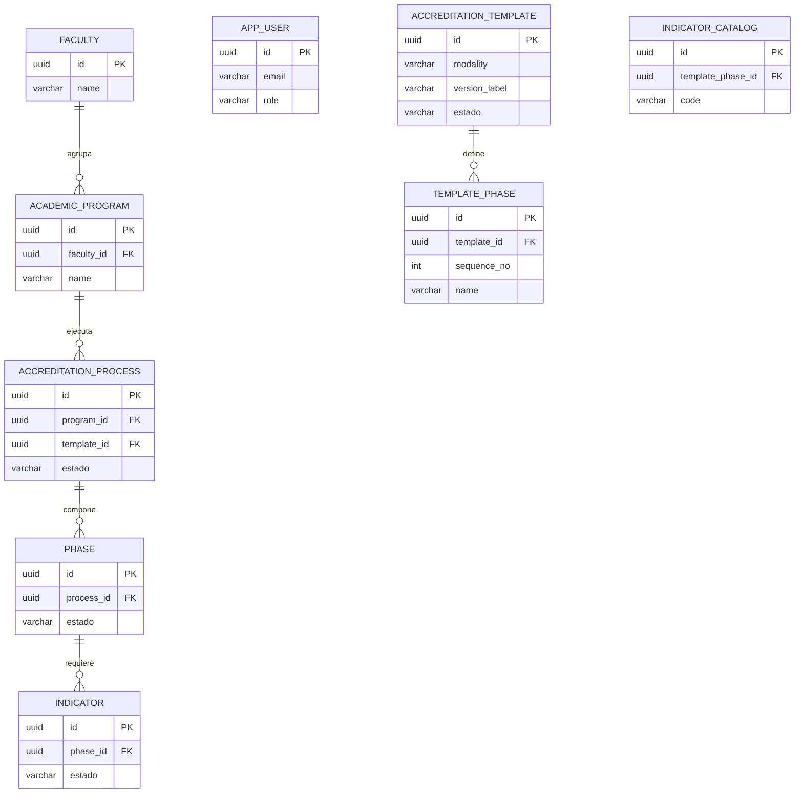
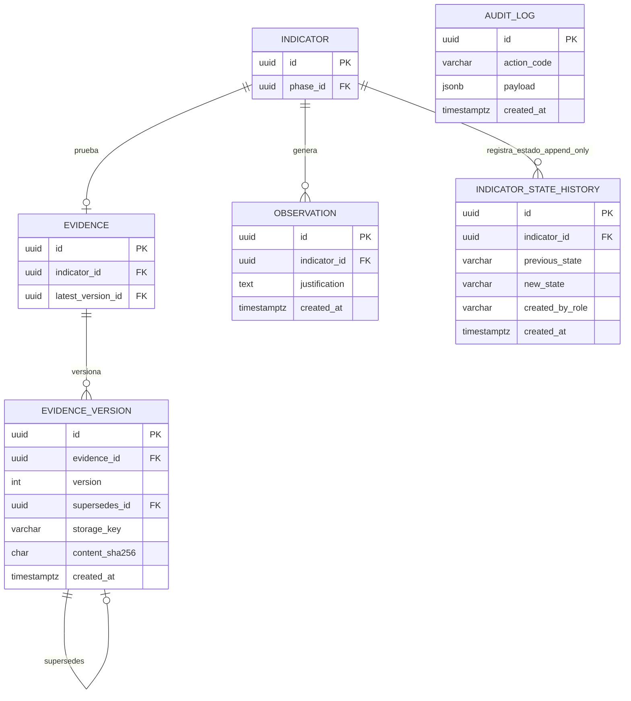

# Documento de Diseño Técnico e Infraestructura (DTI) — SIGESA / AcredIA

## Control de versión

| Campo | Valor |
|-------|-------|
| **Versión** | Dorada v1.0 (borrador compilado) |
| **Timestamp** | `2026-05-17T18:00:00-04:00` |
| **Contrato** | [PC-SIG-13] Arquitecto de Infraestructura y DTI · [PC-SIG-14] Arquitecto Cloud Distribuido |
| **Skills** | [`dti-author`](dti-author.md) · `sigesa-generacion-documentos-tecnicos` · `sigesa-auditor-trazabilidad-dti` · `sigesa-db-architect-append-only` |
| **Plantilla estructura** | [`templates/dti.md`](../../templates/dti.md) (§0–§21) |
| **Gate trazabilidad** | [`docs/09_trazabilidad/report_findings.md`](../09_trazabilidad/report_findings.md) — **APTO** |
| **Estado** | En revisión — primera versión integrada |

### Fuentes canónicas de negocio

| Artefacto | Ruta |
|-----------|------|
| BRD | [`docs/01_brd/BRD.md`](../01_brd/BRD.md) |
| MRD | [`docs/02_mrd/MRD.md`](../02_mrd/MRD.md) |
| PRD | [`docs/03_prd/PRD.md`](../03_prd/PRD.md) |
| FSD | [`docs/04_fsd/FSD.md`](../04_fsd/FSD.md) |
| NFR | [`docs/05_nfr/NFR_ISO25010.md`](../05_nfr/NFR_ISO25010.md) |
| Glosario | [`context/03_domain_glossary.md`](../../context/03_domain_glossary.md) |
| Máquina de estados | [`team/alexAlvarez/docs/context/04_state_machine.md`](../../team/alexAlvarez/docs/context/04_state_machine.md) |
| **Diagramas C4 (fuente única)** | [`docs/07_diagramas/`](../07_diagramas/README.md) — MVP runtime: [`c4-006`](../07_diagramas/c4-006-06-contexto-sistema.mmd) · [`c4-007`](../07_diagramas/c4-007-07-contenedores-sistema.mmd) · Target prod: [`c4-008`](../07_diagramas/c4-008-08-contenedores-produccion.mmd) |

### Fuentes de trabajo equipo (consolidadas en esta versión)

| Equipo | DTI / ADR |
|--------|-----------|
| AcredIA (Aylen) | [`team/aylenGonzales/09_dti/DTI_v1.md`](../../team/aylenGonzales/09_dti/DTI_v1.md) · `09_dti/adr/ADR-001…006` |
| AcredIA (Boris) | [`team/borisAngulo/docs/09_dti/DTI_v1.md`](../../team/borisAngulo/docs/09_dti/DTI_v1.md) |

> **Regla de oro:** si una decisión arquitectónica significativa no está en este DTI o en un [ADR de `docs/05_dti/adrs/`](adrs/README.md) / [`docs/adr/`](../adr/README.md), no existe para implementación v1.0.

---

## 1. Resumen ejecutivo

SIGESA es el sistema de **automatización** del ciclo de acreditación CEUB/ARCU-SUR en la UMSS. El DTI traduce el FSD Dorado en arquitectura desplegable **cloud distribuida**: SPA web, API Gateway, servicios hexagonales desacoplados (Evidence Service, Audit Service, Orchestration Service, Notification Service), PostgreSQL/RDS append-only, S3 para blobs de Evidencia, EventBridge para coreografía y SQS FIFO para cierre concurrente de Phase. La regla central es estricta: **Evidencia y transiciones de estado se registran por inserción, no por actualización destructiva**.

---

<!-- avance: iteración 1 -->
## 2. Vistas del DTI (Richardson, Cap. 1)

> **Dos vistas de despliegue (2026-05-28):** este DTI describe la **arquitectura lógica/target cloud v1.0** (§2.1–§2.5). El **código MVP** en `app/` se documenta en [`c4-007-07-contenedores-sistema.mmd`](../07_diagramas/c4-007-07-contenedores-sistema.mmd) y [`api_contracts_mvp_runtime.md`](api_contracts_mvp_runtime.md): microservicios hexagonales, eventos vía **HTTP webhooks internos** (adaptador dev que imita EventBridge), auth local `@umss.edu.bo`, actores **CC + TD**. Target produccion: [`c4-008-08-contenedores-produccion.mmd`](../07_diagramas/c4-008-08-contenedores-produccion.mmd).

### 2.0 Checklist por vista

| Sección | Estado | ¿Se agrega/mejora en esta iteración? |
|---|---|---|
| 2.1 Logical View | ✅ | Se incorporan decisiones de resiliencia/particionado en dependencias e integración, conectadas a contenedores SIGESA. |
| 2.2 Process View | ✅ | Se modelan puntos de falla y recuperación en flujos de carga/cierre/notificación (circuit breaker) y cómo se particiona trabajo (consistent hashing) a nivel de “orquestación”. |
| 2.3 Development View | ✅ | Se especifican puntos de aplicación de circuit breaker/colas/outbox dentro de puertos y adaptadores hexagonales SIGESA. |
| 2.4 Physical View | ✅ | Se describe el “límite físico” donde se aplican los patrones: reverse proxy, API, worker notificaciones y dependencias externas (SMTP/IdP). |
| 2.5 Scenarios | ✅ | Se agregan escenarios concretos del dominio (upload evidencia, approve/reject, cierre de fase, notificaciones) con decisiones y comportamiento esperado. |

---

<!-- avance: iteración 1 -->
## 2.1 Logical View (vista lógica)

SIGESA en v1.0 adopta una **arquitectura cloud distribuida** con servicios hexagonales. Cada servicio conserva núcleo de dominio y puertos/adaptadores propios; la comunicación entre dominios ocurre por eventos de negocio.

- **Contexto**: Actores [CC], [TD], [JD], [P] y externos (IdP UMSS, SMTP, marco CEUB/ARCU-SUR).
- **Contenedores lógicos**: Frontend SPA, API Gateway, Evidence Service, Audit Service, Orchestration Service, Notification Service, PostgreSQL/RDS, S3, EventBridge y SQS FIFO.
- **Integraciones críticas (puntos de fallo)**:
  - **Auth** contra IdP/infra UMSS (o mecanismo local LDAP según ADR_003).
  - **Notificaciones** por SMTP institucional.

**Coreografía Event-Driven (aplicación lógica)**
- Evidence Service no actualiza estado de Indicator; publica `EvidenceUploaded` / `EvidenceSubsanated`.
- Audit Service consume eventos de Evidence y es el único responsable de insertar transiciones en `indicator_state_history`.
- Orchestration Service consume `IndicatorApproved` mediante SQS FIFO por `phaseId` y emite `PhaseCompleted` solo si `COUNT(APROBADO) == COUNT(TOTAL)`.

**Circuit Breaker (aplicación lógica)**
- Se aplica alrededor de dependencias externas (IdP UMSS, SMTP). El fallback no modifica Evidence ni estados: solo afecta entrega de notificación o reintento operacional.

---

<!-- avance: iteración 1 -->
## 2.2 Process View (vista por procesos)

La vista de procesos se aterriza en flujos ya documentados, con puntos explícitos donde los patrones mejoran resiliencia y escalabilidad:

1) **Carga/Versionado de Evidencia (FSD-UC-004)**
- Secuencia (resumen): API Gateway valida JWT/RBAC → Evidence Service valida que el Indicator permita carga → escribe blob en S3 → inserta Evidence/version metadata → publica `EvidenceUploaded`.
- **Invariante**: Evidence Service no inserta transiciones de estado; Audit Service lo hace al consumir el evento.

2) **Aprobación/Rechazo/Observaciones**
- Audit Service valida la máquina de estados y registra cada transición con `INSERT INTO indicator_state_history`.
- **Comunicación asíncrona**: publica `IndicatorApproved` o `IndicatorObserved` para Notification Service y Orchestration Service.

3) **Notificaciones**
- Notification Service consume eventos de EventBridge y entrega correos vía SMTP institucional.
- **Circuit Breaker**: ante errores repetidos de SMTP, evita saturación; el evento permanece trazable y se reintenta según política.

4) **Cierre de Phase**
- Orchestration Service consume `IndicatorApproved` desde SQS FIFO con `MessageGroupId = phaseId`.
- **Race conditions**: SQS FIFO serializa la evaluación por Phase y evita cierres duplicados u omitidos.

---

<!-- avance: iteración 1 -->
## 2.3 Development View (vista de desarrollo)

DTI sigue arquitectura **hexagonal** (puertos/adaptadores) en cada servicio. Los patrones se ubican en capas específicas:

- **Puertos de salida**
  - `EvidenceRepositoryPort` (append-only, `INSERT` exclusivo)
  - `BlobStoragePort` (S3 para blobs versionados de Evidence)
  - `StateHistoryRepositoryPort` (`INSERT INTO indicator_state_history`)
  - `EventPublisherPort` (EventBridge)
  - `NotificationDeliveryPort` (adaptador SMTP) con circuit breaker.

- **Adaptadores**
  - Cada servicio implementa sus adaptadores de entrada/salida bajo su propio boundary hexagonal.
  - Aplicación del circuit breaker se hace *en el adaptador* SMTP/IdP (no en el dominio), manteniendo invariantes de Evidence y estado.

- **SQS FIFO**
  - En Orchestration Service, `MessageGroupId = phaseId` garantiza orden total para cierre de Phase.

---

<!-- avance: iteración 1 -->
## 2.4 Physical View (vista física / despliegue)

Contenedores físicos / servicios en v1.0 cloud:

- `sigesa-web` (SPA)
- API Gateway
- Evidence Service
- Audit Service
- Orchestration Service
- Notification Service
- PostgreSQL/RDS
- S3 para blobs de Evidence
- EventBridge
- SQS FIFO para cierre de Phase

Aplicación física de patrones:

- **Circuit Breaker**: en el proceso donde ocurre la llamada externa (worker para SMTP; API/adaptador para IdP/LDAP). Límites:
  - No se protege escritura append-only, se protege la *entrega*.
- **SQS FIFO**: ordena eventos `IndicatorApproved` por `phaseId` antes de evaluar cierre de Phase.

---

<!-- avance: iteración 1 -->
## 2.5 Scenarios (escenarios del sistema)

1) **S1 — Subida de Evidencia con IdP/SMTP inestable**
- Entrada: [CC] hace `POST /api/v1/indicators/{id}/evidences`.
- Comportamiento esperado:
  - La operación principal no depende de SMTP; se conserva append-only (no DELETE).
  - La notificación posterior la entrega Notification Service; el delivery usa circuit breaker y reintentos.

2) **S2 — Aprobación de Indicator → notificación diferida**
- Entrada: [TD] hace `POST /api/v1/indicators/{id}/approve`.
- Comportamiento esperado:
  - Audit Service inserta transición en `indicator_state_history`.
  - Se publica `IndicatorApproved` en EventBridge.
  - Notification Service entrega con circuit breaker sobre SMTP.

3) **S3 — Cierre de Phase con aprobación concurrente**
- Entrada: evento `IndicatorApproved` producido por Audit Service.
- Comportamiento esperado:
  - Orchestration Service evalúa cierre tras eventos `IndicatorApproved` serializados por SQS FIFO.
  - Si hay pendientes, no se emite `PhaseCompleted` y no hay mutaciones destructivas.

4) **S4 — Reportes PDF (FSD-UC-014) bajo fallo parcial**
- Entrada: solicitud de reporte.
- Comportamiento esperado:
  - El motor de reportes se aisla como “tarea” (si aplica) y usa circuit breaker para dependencias externas (si existen en el camino).
  - La evidencia base permanece consistente por append-only.

---

## 3. Arquitectura interna (hexagonal)

| Capa | Contenido | Ubicación sugerida en código |
|------|-----------|------------------------------|
| Dominio | Agregados, reglas FSD-BR-*, máquina de estados | `backend/src/domain/` |
| Puertos entrada | Casos de uso (upload, approve, close phase) | `backend/src/domain/port/in/` |
| Puertos salida | Repositorios, `BlobStoragePort`, `StateHistoryRepositoryPort`, `EventPublisherPort` | `services/*/src/domain/port/out/` |
| Adaptadores entrada | Controllers HTTP, consumidores EventBridge/SQS, middleware JWT | `services/*/src/adapter/in/` |
| Adaptadores salida | PostgreSQL/RDS, S3, EventBridge, SQS FIFO, Nodemailer | `services/*/src/adapter/out/` |

| Puerto | ADR / UC |
|--------|----------|
| `BlobStoragePort` | ADR_004 · FSD-UC-004 |
| `EvidenceRepositoryPort` | ADR_001 · FSD-UC-004/005 |
| `StateHistoryRepositoryPort` | ADR_012 · FSD-UC-008/009/010 |
| `EventPublisherPort` | ADR_010 · eventos de dominio |
| `AuthPort` | ADR_003 · FSD-UC-001 |
| JWT middleware | ADR_007 · todos los endpoints privados |

---

## 4. Modelo físico de datos

Detalle completo: [`modelo_datos.md`](modelo_datos.md). DDL ejecutable base: [`ddl_sigesa_append_only.sql`](ddl_sigesa_append_only.sql). La arquitectura cloud v1.0 agrega el historial de estados de Indicator definido en [ADR_012](adrs/ADR_012_ddl_indicator_state_history.md).

### 4.1 ER — Maestros y plantilla normativa

Taxonomías CEUB/ARCU-SUR: [ADR_008](adrs/ADR_008_taxonomias_ceub_arcu.md).

### 4.2 ER — Evidencia, observaciones y auditoría

**Prohibido en esquemas SIGESA:** columnas residuales de importación (`Unnamed: 0`, `gtin`, etc.) y `deleted_at` / `is_deleted` en tablas normativas.

---

## 5. Contratos de integración (API)

Especificación lógica completa: [`docs/04_fsd/api_contracts.md`](../04_fsd/api_contracts.md). Contratos cloud v1.0: [`api_contracts_cloud.md`](api_contracts_cloud.md). **Runtime MVP local (gateway, auth, dashboard, health):** [`api_contracts_mvp_runtime.md`](api_contracts_mvp_runtime.md). OpenAPI físico: pendiente `docs/05_dti/openapi.yaml`.

### 5.1 Convenciones

| Aspecto | Valor |
|---------|-------|
| Base URL | `/api/v1` |
| Auth | `Authorization: Bearer {jwt}` |
| RBAC | Header documental `x-allowed-roles` por endpoint; middleware valida `role` y `programScope` del token |
| Estados | El cliente **no** envía `estado` en body; el backend aplica la máquina de estados |

### 5.2 Endpoints críticos y roles

| ID | Método | Ruta | Roles | UC | Notas |
|----|--------|------|-------|-----|-------|
| API-AUTH-01 | POST | `/auth/login` | — | UC-001 | Dominio `@umss.edu.bo` |
| API-EVD-01 | POST | `/indicators/{id}/evidences` | [CC] | UC-004 | multipart; hash SHA-256; publica `EvidenceUploaded` |
| API-EVD-02 | GET | `/evidences/search` | [CC], [TD] | UC-007 | [CC] filtrado por carrera |
| API-EVD-04 | DELETE | `/evidences/{id}` | [CC], [TD] | UC-005 | **409** si aprobado |
| API-EVD-05 | POST | `/evidences/{id}/versions` | [CC] | UC-006 | subsanación |
| API-WF-01 | POST | `/indicators/{id}/reject` | [TD] | UC-008 | inserta `observation` + `indicator_state_history` |
| API-WF-02 | POST | `/indicators/{id}/approve` | [TD] | UC-009 | inserta `indicator_state_history`; publica `IndicatorApproved` |
| API-WF-03 | Evento | `IndicatorApproved` → SQS FIFO | sistema | UC-010 | Orchestration Service evalúa cierre |

### 5.3 Matriz RBAC resumida

| Recurso | [CC] | [TD] | [JD] | [P] |
|---------|------|------|------|-----|
| Evidencia de su carrera | CR (versiones) | R + validar | R | — |
| Indicadores / Fases | R | Aprobar / observar / cerrar | R | — |
| Plantillas / usuarios | — | R limitado | CRUD normativo | — |
| Portal publicado | — | — | publicar | R |

Autenticación: [ADR_003](adrs/ADR_003_adapter_autenticacion.md) + [ADR_007](adrs/ADR_007_jwt_rbac.md).

---

## 6. Justificación del producto — patrones (1 línea por patrón)

- Event-Driven: **SÍ** — EventBridge desacopla Evidence Service, Audit Service, Orchestration Service y Notification Service; ver [ADR_010](adrs/ADR_010_event_driven_choreography.md).
- SQS FIFO: **SÍ** — ordena cierres de Phase por `phaseId` y evita race conditions; ver [ADR_011](adrs/ADR_011_sqs_fifo_phase_closure.md).
- Estado append-only: **SÍ** — `indicator_state_history` reemplaza actualizaciones destructivas de estado; ver [ADR_012](adrs/ADR_012_ddl_indicator_state_history.md).
- Circuit Breaker: **SÍ** — aplica a dependencias externas (SMTP/IdP) en adaptadores para evitar cascada de fallos.

---

## 7. Registro de decisiones arquitectónicas

| DTI | Canónico | Tema |
|-----|----------|------|
| [ADR_001](adrs/ADR_001_append_only_evidencia.md) | ADR-0001 | Versionado Evidencia |
| [ADR_002](adrs/ADR_002_monolito_modular.md) | ADR-0002 | Monolito modular |
| [ADR_003](adrs/ADR_003_adapter_autenticacion.md) | ADR-0003 | Auth local → LDAP |
| [ADR_004](adrs/ADR_004_almacenamiento_blobs_docker.md) | ADR-0004 | Blobs Docker |
| [ADR_005](adrs/ADR_005_audit_log_postgresql.md) | ADR-0005 | audit_log append-only |
| [ADR_006](adrs/ADR_006_postgresql_16.md) | ADR-0006 | PostgreSQL 16 |
| [ADR_007](adrs/ADR_007_jwt_rbac.md) | ADR-0007 | JWT + RBAC |
| [ADR_008](adrs/ADR_008_taxonomias_ceub_arcu.md) | ADR-0008 | Taxonomías en BD |
| [ADR_009](adrs/ADR_009_backend_nodejs_express.md) | ADR-0009 | Node + Express |
| [ADR_010](adrs/ADR_010_event_driven_choreography.md) | [ADR-0010](../adr/ADR-0010-event-driven-choreography.md) | EventBridge y coreografía de servicios |
| [ADR_011](adrs/ADR_011_sqs_fifo_phase_closure.md) | [ADR-0011](../adr/ADR-0011-sqs-fifo-phase-closure.md) | SQS FIFO para cierre concurrente de Phase |
| [ADR_012](adrs/ADR_012_ddl_indicator_state_history.md) | [ADR-0012](../adr/ADR-0012-indicator-state-history-append-only.md) | Historial append-only de estados de Indicator |
| — | [ADR-0013](../adr/ADR-0013-s3-evidence-blob-storage.md) | S3 para blobs de Evidence en cloud v1.0 |
| — | [ADR-0014](../adr/ADR-0005-cloud-provider-y-estilo-de-despliegue.md) | Proveedor AWS + estilo despliegue (Fargate / Compose) |

Índice y reglas de edición: [`adrs/README.md`](adrs/README.md).

---

## 8. Despliegue y operaciones (v1.0)

### 8.1 MVP runtime local (`app/` — ver `c4-007`)

| Componente | Imagen / artefacto | Notas |
|------------|-------------------|-------|
| `sigesa-front` | Next.js 16 | CC/TD; `NEXT_PUBLIC_API_URL` → gateway :8080 |
| `api-gateway` | `node:22-alpine` | Proxy `/api/v1` → Evidence + Audit |
| `evidence-service` | `node:22-alpine` | :3001; S3/MinIO — ADR-0013 |
| `audit-service` | `node:22-alpine` | :3002; auth JWT, dashboards, `/internal/events` |
| `orchestration-service` | `node:22-alpine` | :3003; PhaseCloseRule vía webhook (SQS FIFO en prod) |
| `postgres` | `postgres:16` | Volume `pg_data`; append-only DDL |
| `minio` | MinIO | Emula S3 en dev |

Eventos entre servicios: `HttpWebhookEventPublisher` → `POST /internal/events` (no EventBridge en dev). Ver [`app/sigesa-backend/README.md`](../../app/sigesa-backend/README.md).

### 8.2 Target produccion cloud (`c4-008`)

| Componente | Imagen / artefacto | Notas |
|------------|-------------------|-------|
| `sigesa-web` | build estático React/Next | Nginx o reverse proxy |
| Servicios hexagonales | ECS/Lambda según runbook | EventBridge + SQS FIFO + Notification Service |
| `sigesa-db` | RDS PostgreSQL 16 | Snapshots diarios |
| Blobs Evidence | Amazon S3 | ADR-0013; sin volumen Docker (ADR-0004 supersedido) |

Respaldo diario: snapshots RDS + retención S3. TLS 1.2+ en API Gateway (NFR-006).

---

## 9. NFRs y trazabilidad

| Referencia | Ubicación |
|------------|-----------|
| NFR ISO 25010 | [`docs/05_nfr/NFR_ISO25010.md`](../05_nfr/NFR_ISO25010.md) |
| Matriz Dorada | [`docs/09_trazabilidad/matriz_trazabilidad.md`](../09_trazabilidad/matriz_trazabilidad.md) |
| Métricas AI-SDLC | [`docs/09_trazabilidad/metricas_ai_sdlc.md`](../09_trazabilidad/metricas_ai_sdlc.md) |

NFRs con impacto directo en este DTI: NFR-001 (latencia búsqueda), NFR-003 (TLS), NFR-004 (no repudio / audit), NFR-017 (inmutabilidad Evidencia).

---

## 10. Pendientes v1.1+

| Ítem | Acción |
|------|--------|
| `openapi.yaml` | Generar desde `api_contracts.md` y `api_contracts_cloud.md` |
| LDAP / SSO UMSS | Implementar `LdapAuthAdapter` (ADR_003) |
| Runbooks AWS | Documentar alarmas EventBridge/SQS FIFO, DLQ y restore RDS/S3 |
| Sincronizar DDL cloud | Generar `ddl_cloud_hybrid.sql` desde ADR_012 |

---

## 19. Roadmap técnico — [humano]

> **Vista estratégica para stakeholders:** consolida lecciones del ciclo M4, comunica el *por qué* de la arquitectura y traza la ruta hacia el siguiente módulo de la maestría. Prosa, trade-offs y horizonte — no sustituye Tasks ni contratos API.

**Documento canónico:** [`docs/roadmap.md`](../roadmap.md) (v2.0, audiencia **`[humano]`**).

| Contenido del roadmap | Sección |
|-----------------------|---------|
| Semilla (BRD) → arquitectura (DTI) → sistema | `docs/roadmap.md` §2 |
| Por qué estratégico de decisiones (append-only, hexagonal, POCs, AI-SDLC) | §3 |
| Lecciones aprendidas del ciclo de desarrollo | §4 |
| Trazabilidad objetivo → ADR → MOD | §5 |
| Hoja de ruta siguiente módulo maestría + Gantt | §6–§7 |
| Gates de transición M4 → Implement | §8 |

**Roadmap de releases de producto** (oleadas 0.9→2.0, audiencia PM/sponsor): [`docs/03_prd/roadmap.md`](../03_prd/roadmap.md).

---

## 11. Historial

| Versión | Fecha | Cambio |
|---------|-------|--------|
| v1.0-borrador | 2026-05-17 | Primera compilación DTI + carpeta `adrs/` desde `docs/` canónico y `team/aylenGonzales/09_dti/` |
| v1.0-cloud | 2026-05-25 | Promoción de arquitectura cloud distribuida: EventBridge, SQS FIFO, S3 y estado append-only vía ADR_010–012 + ADR-0013 |
| v1.0-roadmap | 2026-05-25 | §19 Roadmap técnico [humano] → enlace a `docs/roadmap.md` v2.0 |

