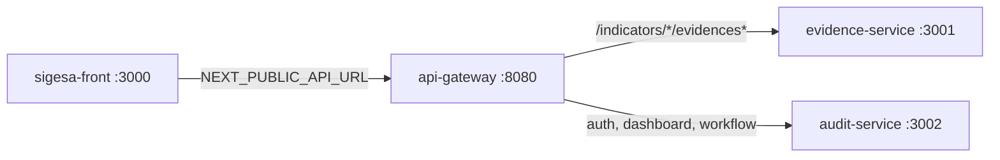

# API Contracts — MVP Runtime (Mode A local)

| Metadato | Valor |
|----------|-------|
| **Ámbito** | Desarrollo local Mode A + gateway único para el front MVP |
| **Complementa** | [`api_contracts_cloud.md`](api_contracts_cloud.md) (Evidence/Audit mutations), [`docs/04_fsd/api_contracts.md`](../04_fsd/api_contracts.md) (MOD-AUTH, MOD-DASH) |
| **Base URL** | `http://localhost:8080/api/v1` (gateway) |
| **Audiencia** | `[máquina]` — implementación front/back MVP |

> **Regla de oro:** si un endpoint no aparece aquí, en `api_contracts_cloud.md` o en `docs/04_fsd/api_contracts.md`, no existe para implementación v1.0.

---

## 1. Alcance

Este documento cubre rutas **no detalladas** en `api_contracts_cloud.md`:

- API Gateway (proxy y path rewrite)
- Autenticación (`POST /auth/login`)
- Dashboards coordinador y técnico
- Health checks
- Webhooks internos dev (`POST /internal/events`)

**Exclusiones MVP (documentadas, no implementadas en front):**

| ID FSD | Ruta | Notas |
|--------|------|-------|
| API-EVD-02 | `GET /evidences/search` | Front filtra client-side en bandeja/coordinator table |
| API-DASH-03 | `GET /dashboard/executive` | Portal [JD] fuera de MVP |
| API-USER-01 | `POST /admin/users` | Fuera de MVP |

---

## 2. API Gateway

| Metadato | Valor |
|----------|-------|
| **Puerto host (Mode A)** | `8080` |
| **Health** | `GET /health` → `{ "status": "ok", "service": "api-gateway" }` |
| **Env** | `EVIDENCE_SERVICE_URL` (default `http://localhost:3001`), `AUDIT_SERVICE_URL` (default `http://localhost:3002`) |

### 2.1 Regla de enrutamiento

Express monta el proxy en `/api/v1`. El proxy **reescribe** el path a `/api/v1{path}` porque Express elimina el prefijo antes del proxy.

| Condición (`req.originalUrl`) | Servicio destino | Puerto |
|-------------------------------|------------------|--------|
| `/api/v1/indicators/{id}/evidences` o sub-rutas | Evidence Service | 3001 |
| Cualquier otro `/api/v1/*` | Audit Service | 3002 |

Rutas en Audit vía gateway: `/auth/login`, `/dashboard/*`, `/indicators/{id}/approve`, `/indicators/{id}/reject`, `/indicators/{id}/observations`, `/indicators/{id}/state-history`.

### 2.2 Diagrama



---

## 3. MOD-AUTH — `POST /api/v1/auth/login`

| Campo | Valor |
|-------|-------|
| **ID** | API-AUTH-01 |
| **UC** | FSD-UC-001 |
| **Servicio** | Audit Service (expuesto vía gateway) |
| **Auth** | — (público) |
| **Body** | `{ "email": "user@umss.edu.bo", "password": "string" }` |

### Respuestas

| HTTP | Body / código |
|------|----------------|
| **201** | `{ "userId", "email", "role", "programScope", "accessToken", "expiresIn" }` |
| **400** | `VALIDATION_ERROR` — email o password ausentes |
| **401** | `AUTH_INVALID_CREDENTIALS` — credenciales inválidas o dominio distinto de `@umss.edu.bo` |

### JWT claims (MVP dev)

| Claim | Descripción |
|-------|-------------|
| `sub` | UUID usuario |
| `email` | Correo institucional |
| `role` | `ProgramCoordinator` \| `DueaTechnician` \| `DueaDirector` |
| `programScope` | UUID carrera ([CC] scoped; null [TD] global) |

### Usuarios demo (seed)

| Email | Rol | Password |
|-------|-----|----------|
| `cc.demo@umss.edu.bo` | `ProgramCoordinator` | `Password123!` |
| `td.demo@umss.edu.bo` | `DueaTechnician` | `Password123!` |

---

## 4. MOD-DASH

### 4.1 `GET /api/v1/dashboard/coordinator`

| Campo | Valor |
|-------|-------|
| **ID** | API-DASH-01 |
| **UC** | FSD-UC-011 |
| **Roles** | `[CC]` — `ProgramCoordinator` |
| **Auth** | Bearer JWT |
| **Scope** | `programScope` del token (403 si ausente) |

**200 — wire schema (implementado):**

```json
{
  "programId": "uuid",
  "programName": "string",
  "phases": [{ "id": "uuid", "name": "string", "status": "ABIERTA|..." }],
  "indicators": [{
    "id": "uuid",
    "code": "IND-1.2",
    "description": "requirement_text from indicator_catalog",
    "status": "PENDIENTE|SUBIDO|OBSERVADO|SUBSANADO|APROBADO"
  }],
  "openObservations": [{
    "id": "uuid",
    "indicatorId": "uuid",
    "reason": "string",
    "createdAt": "ISO-8601"
  }]
}
```

Front mapea `id` → `indicatorId`, `status` → `currentState`.

### 4.2 `GET /api/v1/dashboard/technician`

| Campo | Valor |
|-------|-------|
| **ID** | API-DASH-02 |
| **UC** | FSD-UC-012 |
| **Roles** | `[TD]` — `DueaTechnician` |
| **Query params** | `programId?`, `phaseId?`, `status?` |

**Query `status`:** lista separada por comas (`SUBIDO,SUBSANADO`). Backend parsea a `= ANY(...)`. Si se omite, default `IN ('SUBIDO','SUBSANADO')`.

**200 — wire schema:**

```json
{
  "pendingIndicators": [{
    "id": "uuid",
    "code": "IND-1.2",
    "description": "string",
    "status": "SUBIDO|SUBSANADO"
  }],
  "total": 1
}
```

---

## 5. Health checks

| Servicio | URL | Respuesta |
|----------|-----|-----------|
| Gateway | `GET http://localhost:8080/health` | `{ "status": "ok", "service": "api-gateway" }` |
| Evidence | `GET http://localhost:3001/health` | `{ "status": "ok", "service": "evidence-service" }` |
| Audit | `GET http://localhost:3002/health` | `{ "status": "ok", "service": "audit-service" }` |
| Orchestration | `GET http://localhost:3003/health` | `{ "status": "ok", "service": "orchestration-service" }` |

Smoke script: `npm run dev:check` en `app/sigesa-backend`.

---

## 6. Webhooks internos (dev — no expuestos al front)

### 6.1 Evidence → Audit

| Campo | Valor |
|-------|-------|
| **URL** | `POST http://localhost:3002/internal/events` (Mode A) |
| **Header** | `X-Internal-Events-Secret: {INTERNAL_EVENTS_SECRET}` |
| **Env Evidence** | `AUDIT_INTERNAL_EVENTS_URL` |
| **Evento** | `EvidenceUploaded` → transición indicador a `SUBIDO` / `SUBSANADO` |

**202:** `{ "accepted": true }`  
**403:** secret inválido

### 6.2 Audit → Orchestration

| Campo | Valor |
|-------|-------|
| **URL** | `POST http://localhost:3003/internal/events` |
| **Evento** | `IndicatorApproved` → evaluación cierre de fase (stub MVP) |

---

## 7. Front env contract

| Variable | Obligatorio | Valor Mode A |
|----------|-------------|--------------|
| `NEXT_PUBLIC_API_URL` | Sí | `http://localhost:8080/api/v1` |

- Usar `http://` (no `https://` en local).
- Sin barra final.
- Archivo: `app/sigesa-front/.env.local` (copiar desde `.env.example`).

---

## 8. Matriz FE → BE (MVP)

| Front module | HTTP | Backend |
|--------------|------|---------|
| `authApi.login` | `POST /auth/login` | Audit |
| `dashboardApi.getCoordinatorDashboard` | `GET /dashboard/coordinator` | Audit |
| `dashboardApi.getTechnicianDashboard` | `GET /dashboard/technician` | Audit |
| `evidenceApi.upload/list/get` | `POST/GET /indicators/{id}/evidences[...]` | Evidence (gateway) |
| `auditApi.approveIndicator` | `POST /indicators/{id}/approve` | Audit |
| `auditApi.rejectIndicator` | `POST /indicators/{id}/reject` | Audit |
| `auditApi.listObservations` | `GET /indicators/{id}/observations` | Audit |
| `auditApi.getStateHistory` | `GET /indicators/{id}/state-history` | Audit (UI no consume aún) |

---

## 9. Docker Compose — perfiles (Mode A vs B)

| Perfil | Servicios | Puertos app |
|--------|-----------|-------------|
| *(default, sin perfil)* | `postgres`, `minio`, `minio-init` | Solo 5432, 9000, 9001 |
| `full-stack` | + `evidence-service`, `audit-service`, `orchestration-service`, `api-gateway` | 3001–3003, 8080 |

Mode A: `npm run compose:infra` + `npm run dev:*` en host.  
Mode B: `npm run compose:full`.

---

## 11. Alineación C4 y secuencia MVP (UC-004 → UC-009)

### 11.1 Contenedores C4 vs Mode A

| [`c4-007-07-contenedores-sistema.mmd`](../07_diagramas/c4-007-07-contenedores-sistema.mmd) | MVP Mode A (código) |
|-------------------------------------------------------------------------------------------|---------------------|
| Frontend | `sigesa-front` Next.js 16 (:3000) — CC + TD |
| API Gateway | `:8080` proxy único |
| Evidence / Audit / Orchestration | `:3001` / `:3002` / `:3003` hexagonal |
| Bus eventos dev | HTTP webhooks `POST /internal/events` (imita EventBridge) |
| Object storage | MinIO (dev) / S3 (prod) — ADR-0013 |
| PostgreSQL 16 | Docker `postgres` |
| Notification Service | **No implementado** — solo tabla `notification_outbox`; UI usa `NotificationBar` |
| Target cloud completo | [`c4-008`](../07_diagramas/c4-008-08-contenedores-produccion.mmd) |

Contexto [`c4-006`](../07_diagramas/c4-006-06-contexto-sistema.mmd): solo [CC] y [TD] en MVP; auth `@umss.edu.bo` (dev) / LDAP prod (ADR-0003). Rutas `/cc/fases/*` y `/td/indicators/*/review`.

### 11.2 Secuencia canónica MVP (endpoints reales)

| Paso | Actor | HTTP | Servicio |
|------|-------|------|----------|
| 1 | CC | `POST /indicators/{id}/evidences` | Evidence → event → Audit `SUBIDO` |
| 2 | TD | `GET /dashboard/technician` | Audit |
| 3 | TD | `POST /indicators/{id}/reject` | Audit `OBSERVADO` |
| 4 | CC | `GET /indicators/{id}/observations` | Audit |
| 5 | CC | `POST /indicators/{id}/evidences` + `observationId` | Evidence → `SUBSANADO` |
| 6 | TD | `POST /indicators/{id}/approve` | Audit `APROBADO` |

**Drift vs `docs/07_diagramas/seq-*` (no modificar en MVP):**

| Diagrama legacy | MVP usa |
|-----------------|---------|
| `GET /audit-queue` | `GET /dashboard/technician` |
| `POST /observe` | `POST /reject` |
| `POST /evidences/{id}/versions` | `POST /indicators/{id}/evidences` + `observationId` |

### 11.3 Rutas front MVP (evidence cycle)

| Ruta | Rol | UC |
|------|-----|-----|
| `/cc/fases/[phaseId]` | CC | UC-004, UC-006 |
| `/td/dashboard` | TD | UC-012 |
| `/td/indicators/[id]/review` | TD | UC-008, UC-009 |

---

## 10. Referencias

- [`api_contracts_cloud.md`](api_contracts_cloud.md) — Evidence upload, approve/reject, observations
- [`docs/04_fsd/api_contracts.md`](../04_fsd/api_contracts.md) — contratos funcionales MOD-AUTH, MOD-DASH
- [`hybrid_architecture.md`](hybrid_architecture.md) — coreografía event-driven
- [`app/sigesa-backend/README.md`](../../app/sigesa-backend/README.md) — arranque Mode A/B
- [`app/sigesa-front/README.md`](../../app/sigesa-front/README.md) — front env y rutas MVP
