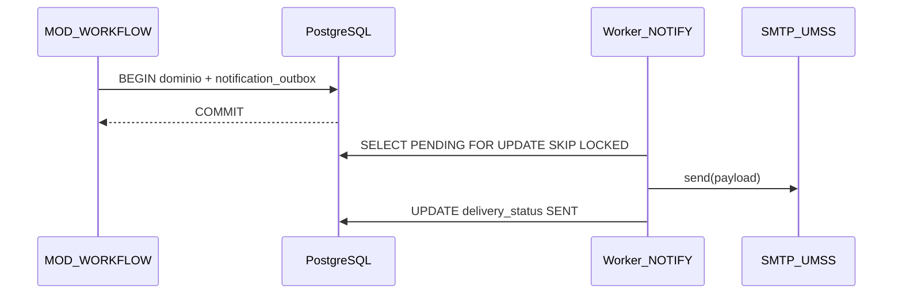
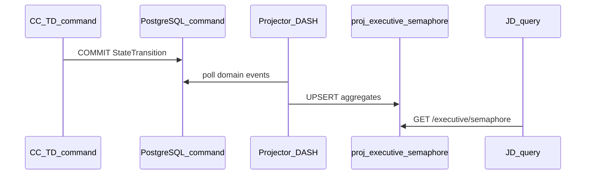
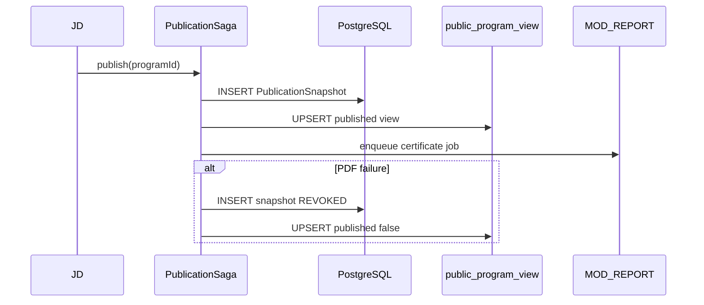

# Análisis de arquitectura distribuida — Flujos asíncronos críticos (SIGESA / AcredIA)

## Control de versión del documento

| Campo | Valor |
|-------|-------|
| **Versión** | **Dorada v1.0** |
| **Última actualización (timestamp)** | `2026-05-20T12:00:00-04:00` |
| **Resumen de cambios** | Primera consolidación: tres flujos asíncronos (Outbox, CQRS, Saga orquestada) derivados de PRD/FSD/DTI; filtro anti sobre-ingeniería (PASO 0); esquemas de datos sin columnas residuales ETL. |
| **Autor / perspectiva** | Lead Distributed Systems Architect (análisis agéntico) |
| **Skill aplicada** | [`sigesa-distributed-architect`](../../.cursor/skills/sigesa-distributed-architect/skill.md) · copia Claude: [`.claude/skills/sigesa-distributed-architect/skill.md`](../../.claude/skills/sigesa-distributed-architect/skill.md) |
| **Contrato** | [PC-SIG-14] Creador de Skill de Arquitectura Distribuida |
| **BRD** | [`docs/01_brd/BRD.md`](../01_brd/BRD.md) v2.2 |
| **MRD** | [`docs/02_mrd/MRD.md`](../02_mrd/MRD.md) v1.1 |
| **PRD** | [`docs/03_prd/PRD.md`](../03_prd/PRD.md) v1.0 |
| **FSD** | [`docs/04_fsd/FSD.md`](../04_fsd/FSD.md) v1.0 |
| **DTI** | [`docs/05_dti/DTI.md`](DTI.md) v1.0 |
| **NFRs** | [`docs/05_nfr/NFR_ISO25010.md`](../05_nfr/NFR_ISO25010.md) |
| **Estado** | Antecedente supersedido — las decisiones vigentes están en `DTI.md`, `hybrid_architecture.md` y ADR-0010–0013 |

> **Propósito histórico:** este documento conserva el análisis previo de flujos asíncronos. No es fuente de implementación vigente. Para cloud v1.0 prevalecen EventBridge, SQS FIFO, S3 e `indicator_state_history` según `DTI.md` y ADR-0010–0013.

---

## 0. Metadatos

| Campo | Valor |
|-------|-------|
| Producto | SIGESA / AcredIA — Automatización del ciclo de acreditación CEUB/ARCU-SUR (UMSS) |
| Ámbito | `docs/05_dti/` (capa técnica — Golden Folder) |
| Actores | [CC] Coordinador de Carrera · [TD] Técnico DUEA · [JD] Jefatura DUEA · [P] Público · Sistema |
| Módulos involucrados | `MOD-WORKFLOW`, `MOD-EVIDENCE`, `MOD-NOTIFY`, `MOD-DASH`, `MOD-REPORT`, `MOD-PUBLIC`, `MOD-AUDIT` |
| Estilo arquitectónico base | Monolito modular ([ADR-0002](../adr/ADR-0002-modular-monolith.md), FSD §2.4) |
| Máquina de estados | [`team/alexAlvarez/docs/context/04_state_machine.md`](../../team/alexAlvarez/docs/context/04_state_machine.md) · FSD §4 |
| Glosario | [`context/03_domain_glossary.md`](../../context/03_domain_glossary.md) · [`docs/04_fsd/glosario.md`](../04_fsd/glosario.md) |
| Modelo de datos funcional | [`docs/04_fsd/modelo_datos.md`](../04_fsd/modelo_datos.md) |
| Modelo físico / DDL | [`docs/05_dti/modelo_datos.md`](modelo_datos.md) · [`ddl_sigesa_append_only.sql`](ddl_sigesa_append_only.sql) |
| Contratos API | [`docs/04_fsd/api_contracts.md`](../04_fsd/api_contracts.md) |
| Reglas de negocio | [`docs/04_fsd/reglas_negocio.md`](../04_fsd/reglas_negocio.md) (FSD-BR-02, BR-04, BR-07, BR-10, BR-13, BR-14) |

### Artefactos relacionados (salida prevista)

| Artefacto | Ruta sugerida | Estado |
|-----------|---------------|--------|
| ADR Outbox notificaciones | `docs/adr/ADR-0010-transactional-outbox-notifications.md` | Pendiente |
| ADR CQRS panel ejecutivo | `docs/adr/ADR-0011-cqrs-executive-read-model.md` | Pendiente |
| ADR Saga publicación portal | `docs/adr/ADR-0012-saga-orchestrated-publication.md` | Pendiente |
| Secuencias Mermaid | `docs/07_diagramas/` | Pendiente |

---

## 1. Resumen ejecutivo

En la versión analizada originalmente, SIGESA permanecía como **monolito modular** con workers y proyecciones internas. Esa premisa quedó supersedida por cloud v1.0: servicios desacoplados, EventBridge, SQS FIFO y `indicator_state_history`. El valor histórico de esta sección es explicar por qué la comunicación asíncrona y las proyecciones eran necesarias.

Este documento fija **tres flujos críticos** que superan el filtro anti sobre-ingeniería (skill `sigesa-distributed-architect`, PASO 0):

| # | Flujo | Patrón | UC / REQ principal |
|---|-------|--------|-------------------|
| 1 | Notificaciones tras transiciones de workflow | Transactional Outbox | FSD-UC-015 · FSD-BR-13 · NFR-004 |
| 2 | Panel semáforo y agregados ejecutivos | CQRS (proyección de lectura) | FSD-UC-013 · PRD-REQ-011 · BRD-REQ-010 |
| 3 | Publicación institucional al portal [P] | Saga orquestada | FSD-UC-016 · FSD-BR-10 · v1.1 |

**Veredicto PASO 0:** el sistema no es “demasiado simple” para tres patrones distintos; los tres responden a dolores documentados (correo informal, Excel gerencial, transparencia pública sin filtrar borradores). Lo que se rechaza es **distribuir el monolito** o aplicar CQRS a CRUD acotado solo [TD].

---

## 2. Filtro anti sobre-ingeniería (PASO 0)

Evaluación global antes de adoptar patrones:

| Pregunta | Flujo 1 (Outbox) | Flujo 2 (CQRS) | Flujo 3 (Saga) |
|----------|------------------|----------------|----------------|
| ¿Hay más de un consumidor eventual del mismo hecho de dominio? | Sí (SMTP, métricas SLA, enlaces profundos) | Sí (UI semáforo, PDF UC-014, futuros exports) | Sí (BD snapshot, vista pública, PDF cert., auditoría) |
| ¿Lecturas masivas compiten con escrituras en la misma tabla? | No (cola separada) | **Sí** (agregados JD vs mutaciones CC/TD) | Parcial (lectura pública desacoplada) |
| ¿Cruza límites ACID entre sistemas externos? | **Sí** (PostgreSQL + SMTP) | No | **Sí** (BD + capa pública + almacenamiento PDF) |
| ¿Único actor [TD] en CRUD simple? | No | No | No ([JD] publica, [P] consume) |

**Flujos descartados para patrones distribuidos (permanecen síncronos / transacción local):**

- Mantenimiento de catálogo o usuarios solo [TD]/[JD] sin proyección masiva.
- Dashboard [CC] acotado por `academic_program_id` (UC-011, FSD-BR-09): índices y vistas materializadas locales bastan.
- Bandeja [TD] por carrera (UC-012): volumen acotado, sin CQRS institucional.

---

## 3. Flujos asíncronos críticos

### 3.1 Flujo 1 — Notificaciones tras eventos de workflow del Indicador

#### Nombre del flujo y patrón seleccionado

**Flujo de notificaciones institucionales (aprobación, rechazo, carga, plazos) — Transactional Outbox**

#### Trazabilidad

| Capa | Referencia |
|------|------------|
| UC | FSD-UC-015 (disparadores: UC-004, UC-006, UC-008, UC-009) |
| Reglas | FSD-BR-13 (SLA ≤ 15 min), FSD-BR-04, FSD-BR-05, FSD-BR-06 |
| NFR | PRD-NFR-004 |
| Entidad | `NotificationOutbox` — [`modelo_datos.md`](../04_fsd/modelo_datos.md) §3.4 |
| Integración | FSD §14 · DTI §2.2 (Worker notificaciones, cola `notification_outbox`) |
| Task FSD | T-008 Notificaciones outbox |

#### Justificación arquitectónica

Cada transición relevante de la máquina de estados del `Indicator` (`PENDIENTE` → `SUBIDO`, `SUBIDO` → `OBSERVADO`, `APROBADO`, `OBSERVADO` → `SUBSANADO`, etc., según `04_state_machine.md` y FSD §4.1) debe cumplir dos compromisos simultáneos: **persistencia ACID en PostgreSQL** (`StateTransition`, `Observation`, `EvidenceVersion` append-only) y **entrega eventual al canal SMTP institucional UMSS** con SLA ≤ 15 minutos (FSD-BR-13, alineado a PRD-NFR-004 y Gherkin UC-008: notificación al [CC] en ≤ 15 min).

Eso constituye un **dual-write** clásico entre base de datos transaccional y broker/servicio de mensajería externo. Si el correo se envía antes del `COMMIT`, puede notificar un rechazo que luego no existió en el sistema de auditoría; si el `COMMIT` ocurre y el worker SMTP falla, [CC] no subsana a tiempo y el proceso de acreditación recae en llamadas y correos informales — el dolor central del PRD (dispersión documental, 20+ minutos por búsqueda, observaciones fuera del canal único PRD-OP-07).

El Transactional Outbox resuelve la **atomicidad local** sin two-phase commit con el servidor de correo, coherente con ADR-0002 (evitar sagas distribuidas donde basta cola en BD + cron) y con la decisión DTI de no introducir Kafka en v1.0.

**Alternativas descartadas:** envío SMTP síncrono en el request HTTP (bloquea UX de [CC] en carga de evidencias y viola SLA bajo picos); publicar primero al broker y luego persistir dominio (anti-patrón explícito de la skill — riesgo de mensajes huérfanos).

#### Mecánica del patrón en SIGESA

**Orden atómico (invariante):**

1. `BEGIN` transacción PostgreSQL.
2. Mutación de dominio según UC (ej. `RejectIndicatorUseCase`: `Indicator` → `OBSERVADO`, `INSERT Observation`, `INSERT StateTransition`).
3. `INSERT notification_outbox` con `event_type`, `aggregate_id`, `recipient_id`, `payload` (deep link a bandeja/dashboard — PRD-US-017).
4. `INSERT audit_log` cuando aplique.
5. `COMMIT`.
6. Worker cron (`MOD-NOTIFY`) selecciona `delivery_status = 'PENDING'`, envía vía adaptador SMTP, actualiza `delivery_status = 'SENT'` y `delivered_at` **sin eliminar** la fila origen.

**Eventos de dominio encolados (catálogo cerrado UC-015):**

| `event_type` | Disparador | Destinatario |
|--------------|------------|--------------|
| `IndicatorRejected` | UC-008 | [CC] |
| `IndicatorApproved` | UC-009 | [CC] |
| `EvidenceUploaded` | UC-004 | [TD] |
| `DeadlineApproaching` | Job programado | [CC] |

**Carga de Evidencia y anexo (UC-004):** el blob (volumen Docker, ADR-0004) y los metadatos (`EvidenceVersion`) deben confirmarse antes de insertar el outbox. Si el commit de metadatos + outbox falla tras escribir el blob, la compensación operativa **no** es `DELETE` del archivo: se registra `audit_log` con acción `BLOB_ORPHAN_DETECTED` y un job de higiene documenta el blob no referenciado mediante **nuevo** registro de auditoría (FSD §15 riesgo “pérdida blob sin versión BD”).

#### Higiene de datos

Tabla `notification_outbox`:

| Columna | Tipo | Notas |
|---------|------|-------|
| `id` | UUID PK | |
| `event_type` | varchar | Catálogo UC-015 |
| `aggregate_type` | varchar | `Indicator`, `Evidence`, `Phase` |
| `aggregate_id` | UUID | |
| `recipient_id` | UUID FK `app_user` | |
| `payload` | jsonb | `deepLink`, `programId`, `phaseId` |
| `delivery_status` | enum | `PENDING`, `SENT`, `FAILED` |
| `created_at` | timestamptz | |
| `created_by` | UUID | [CC]/[TD]/[JD] |
| `delivered_at` | timestamptz nullable | |

**Prohibido:** columnas `Unnamed: 0`, `gtin`, índices pandas serializados o metadatos de importación CSV (UC-018) en esta tabla.

#### ADR derivado propuesto

`ADR-0010-transactional-outbox-notifications.md` — formalizar relay, idempotencia `(event_type, aggregate_id, recipient_id, correlation_id)` y métrica `outbox_lag_seconds` para FSD-BR-13.

---

### 3.2 Flujo 2 — Panel semáforo y agregados ejecutivos para Jefatura DUEA

#### Nombre del flujo y patrón seleccionado

**Flujo de visibilidad gerencial multi-carrera/facultad — CQRS (proyección de lectura)**

#### Trazabilidad

| Capa | Referencia |
|------|------------|
| UC | FSD-UC-013 |
| PRD | PRD-US-013 · PRD-REQ-011 · PRD-OP-04 (reporte ≤ 5 min, lectura ejecutiva) |
| BRD | BRD-REQ-010 · BRD-CA-03 · dolor MRD (sin semáforo confiable) |
| SLA | Vista consolidada ≤ 2 min sin soporte ad-hoc (casos_uso UC-013) |
| Módulo | MOD-DASH (lectura); MOD-WORKFLOW / MOD-EVIDENCE (escritura) |

#### Justificación arquitectónica

[JD] necesita, en ≤ 2 minutos, una vista **consolidada** de decenas de carreras y cientos de indicadores por facultad, con semáforo Rojo/Amarillo/Verde derivado de completitud, vencimientos de `TemplatePhase.normativeDeadline` y concentración de estados `OBSERVADO` / `SUBSANADO`. Eso implica agregaciones del tipo `COUNT(*) GROUP BY faculty_id, program_id, indicator_status` a escala institucional.

En paralelo, [CC] ejecuta escrituras transaccionales frecuentes en semanas de cierre: `POST /evidences`, subsanaciones (UC-006), transiciones que mutan la misma tabla `indicator` que alimentaría el panel si se consultara en caliente. Servir el semáforo con joins en vivo (`Phase` → `Indicator` → `EvidenceVersion`) en el modelo de escritura normalizado genera **contención lectura/escritura** y pone en riesgo el SLA ejecutivo exactamente en el pico de acreditación que el PRD y el BRD describen.

CQRS aquí significa **separar el modelo de consulta** en tablas `proj_*` actualizadas por un projector asíncrono que consume hechos ya persistidos (`StateTransition`, eventos de dominio u outbox de proyección). No implica microservicio separado: el projector corre en el mismo despliegue (worker sidecar o cron), coherente con ADR-0002 alternativa D (“dos monolitos” solo como evolución; v1.0 = proyección + cola).

**Invariante de autorización:** FSD-BR-04 — [JD] **no** aprueba ni rechaza Indicadores desde la proyección; solo consume lectura. El command side conserva la máquina de estados.

**Alternativas descartadas:** CQRS para dashboard [CC] (UC-011) o bandeja [TD] (UC-012) — volumen acotado por carrera; índices compuestos y vista materializada local. Cache HTTP sin invalidación estructurada — inconsistente bajo picos de escritura.

#### Mecánica del patrón en SIGESA

**Command side (sin cambio de responsabilidad):**

- `MOD-EVIDENCE` / `MOD-WORKFLOW`: mutan `Indicator`, `EvidenceVersion`, `Observation`.
- Tras `COMMIT`, además del outbox SMTP (Flujo 1), emitir evento interno `IndicatorStatusChanged` (misma transacción o fila en `domain_event_outbox` unificada).

**Query side (proyección):**

Worker `ProjectionExecutiveSemaphore` — upsert idempotente:

**`proj_executive_semaphore`** — grain: `(management_year, faculty_id, program_id)`

| Columna | Fuente de negocio |
|---------|-------------------|
| `management_year` | `AccreditationProcess.managementYear` |
| `faculty_id` | `Faculty.id` |
| `program_id` | `AcademicProgram.id` |
| `total_indicators` | Conteo en fase activa |
| `approved_count` | `indicator_current_view.current_state = APROBADO` |
| `observed_count` | `OBSERVADO` |
| `pending_review_count` | `SUBIDO` + `SUBSANADO` |
| `semaphore_color` | Regla BRD completitud / plazos |
| `last_event_at` | Watermark consistencia eventual |
| `projected_at` | Timestamp de proyección |

**`proj_indicator_summary_by_phase`** — grain: `(program_id, phase_id, indicator_current_state)` — alimenta reporte PDF (UC-014) sin recomputar joins pesados en el job de generación.

**Consistencia:** [JD] acepta eventualidad de segundos a minutos; la UI expone `last_event_at`. Cierre de Fase (UC-010, FSD-BR-07) sigue validando `COUNT(APROBADO) = COUNT(total)` en command side, no en proyección.

#### Higiene de datos

- Solo atributos del diccionario FSD / glosario (`management_year`, `faculty_id`, `program_id`, conteos por estado).
- **Prohibido** arrastrar columnas de plantilla CSV de importación masiva (UC-018): `Unnamed: 0`, `gtin`, etc.
- Esquema físico sugerido: prefijo `proj_` o schema `read` en PostgreSQL (DTI §4).

#### ADR derivado propuesto

`ADR-0011-cqrs-executive-read-model.md` — grains, lag aceptable, métrica `projection_lag_seconds`, relación con API-REP-01.

---

### 3.3 Flujo 3 — Publicación institucional al portal público y certificado

#### Nombre del flujo y patrón seleccionado

**Flujo de publicación [JD] → consulta [P] (portal y certificado) — Saga orquestada**

#### Trazabilidad

| Capa | Referencia |
|------|------------|
| UC | FSD-UC-016 |
| PRD | PRD-US-016, PRD-US-020 |
| Reglas | FSD-BR-10 (portal sin borradores) |
| Entidad | `PublicationSnapshot` — modelo funcional §3.4 |
| API | API-PUB-01 — [`api_contracts.md`](../04_fsd/api_contracts.md) |
| Release | v1.1 (ROADMAP) |
| Módulo | MOD-PUBLIC, MOD-REPORT, MOD-AUDIT, MOD-NOTIFY |

#### Justificación arquitectónica

Publicar el estado de acreditación al portal [P] no es un único `UPDATE published = true`. Involucra **varios participantes con SLAs y garantías distintas**:

1. Validación normativa: proceso publicable; cero borradores u observaciones internas (FSD-BR-10).
2. Persistencia del snapshot inmutable (`PublicationSnapshot`).
3. Materialización de vista pública (`public_program_view` o cache CDN).
4. Generación opcional de PDF oficial (US-020, enlace UC-014).
5. Registro de auditoría y notificación interna.

Si el paso 4 falla después de exponer contenido en el paso 3, o si [JD] revoca la publicación, se requiere **orquestación con compensación documental** sin 2PC entre PostgreSQL, almacenamiento de artefactos y capa pública. La skill recomienda **Saga orquestada** para 4+ pasos y visibilidad centralizada (frente a coreografía, riesgo de ciclos de eventos).

**Alternativas descartadas:** Saga para rechazo aislado de indicador (UC-008) — dos pasos, un módulo; Outbox basta. Publicación síncrona monolítica sin estado de saga — opaca ante fallos parciales en v1.1.

#### Mecánica del patrón en SIGESA

**Orquestador `PublicationSaga` (`MOD-PUBLIC`):**

| Paso | Acción | Participante |
|------|--------|--------------|
| 1 | Verificar elegibilidad (estados, autorización [JD]) | MOD-PROCESS / MOD-WORKFLOW |
| 2 | `INSERT PublicationSnapshot` (payload JSON con IDs y hashes de evidencias aprobadas) | PostgreSQL |
| 3 | `UPSERT public_program_view` desde snapshot | Proyector público |
| 4 | Encolar job PDF certificado | MOD-REPORT |
| 5 | `INSERT audit_log` + outbox notificación interna | MOD-AUDIT / MOD-NOTIFY |

Estado de instancia en `publication_saga_instance`: `id`, `program_id`, `snapshot_id`, `current_step`, `saga_status`, `started_at`, `completed_at`, `failure_reason`.

**Compensación (append-only — prohibido `DELETE`):**

| Escenario | Compensación |
|-----------|--------------|
| Fallo paso 4 tras paso 3 visible | `INSERT PublicationSnapshot` con `snapshot_status = REVOKED`, `supersedes_snapshot_id`, `revocation_reason`, actor [JD] |
| Vista pública | `UPSERT public_program_view` con `published = false`, `revoked_at` — nuevo estado, no borrado histórico |
| PDF parcial | `INSERT report_artifact` con `status = INVALIDATED`, `supersedes_artifact_id`; blob en volumen con referencia de anulación (análogo `EvidenceVersion`) |
| Revocación voluntaria [JD] | Misma cadena; [P] recibe 404 en slug (API-PUB-01) |

Evento outbox: `PortalPublicationRevoked` para trazabilidad. La Saga **no** otorga a [P] transiciones de `Indicator` (FSD-BR-04).

#### Higiene de datos

**`PublicationSnapshot`:** `id`, `program_id`, `published_at`, `published_by`, `snapshot_payload` (jsonb con IDs de negocio), `snapshot_status`, `supersedes_snapshot_id`.

**`public_program_view`:** `program_slug`, `display_name`, `accreditation_status`, `published_at`, `snapshot_id`.

Sin columnas residuales de ETL. Payload JSON con claves explícitas del glosario, no columnas dinámicas de importación.

#### ADR derivado propuesto

`ADR-0012-saga-orchestrated-publication.md` — pasos, compensaciones append-only, relación con UC-016 y gate v1.1.

---

## 4. Síntesis: dolor institucional ↔ patrón

| Dolor (PRD / BRD / MRD) | Flujo | Patrón | Actores |
|-------------------------|-------|--------|---------|
| Observaciones fuera del sistema; correo informal | Notificaciones workflow | Transactional Outbox | [CC], [TD], Sistema |
| Jefatura sin semáforo; reportes manuales Excel | Agregados ejecutivos | CQRS | [JD] lectura; [CC]/[TD] escritura |
| Transparencia pública sin filtrar borradores | Publicación portal | Saga orquestada | [JD], [P] |

---

## 5. Mejoras recomendadas en comunicación asíncrona

| # | Mejora | Impacto |
|---|--------|---------|
| 1 | Unificar relay: un worker lee `notification_outbox` y opcionalmente eventos de proyección (`channel`: `email` \| `projection`) | Menos workers ad hoc |
| 2 | Idempotencia: claves compuestas en outbox y grains en `proj_*` | Reintentos seguros |
| 3 | Observabilidad: `outbox_lag_seconds`, `projection_lag_seconds` enlazados a FSD-BR-13 y BRD-REQ-010 | Cumplimiento SLA auditable |
| 4 | Actualizar DTI §2.2 C4: contenedor **Projector ejecutivo** junto a Worker notificaciones | Paridad documental |

---

## 6. Verificación (checklist — skill distribuida)

- [x] PASO 0 documentado con veredicto explícito (no sobre-ingeniería de microservicios).
- [x] Outbox: commit único dominio + outbox; relay posterior; sin dual-write invertido.
- [x] Saga: compensaciones append-only; sin `DELETE` en diseño.
- [x] CQRS: proyección no muta estados; lee desde `indicator_current_view`.
- [x] Esquemas sin `Unnamed: 0` / `gtin`.
- [x] Explicaciones fundamentadas con trazabilidad PRD/FSD/BRD.
- [ ] ADR-0010…0012 creados en `docs/adr/`.
- [ ] DTI §2.2 y matriz `docs/09_trazabilidad/` actualizados.

---

## 7. Invariantes del dominio (recordatorio)

1. **Append-only:** Evidencia aprobada y compensaciones de Saga = registros nuevos (`EvidenceVersion`, `StateTransition`, `PublicationSnapshot` sucesor).
2. **Máquina de estados:** solo [TD] aprueba/rechaza Indicador; [JD] no sustituye dictamen técnico (FSD-BR-04).
3. **Cierre de Fase:** `COUNT(APROBADO) = COUNT(total)` en command side (FSD-BR-07).
4. **Monolito modular v1.0:** patrones internos, no Kafka/mesh sin justificación de carga (ADR-0002).

---

## 8. Registro de cambios

| Versión | Timestamp | Cambio |
|---------|-----------|--------|
| Dorada v1.0 | `2026-05-20T12:00:00-04:00` | Alta inicial: análisis tres flujos (Outbox, CQRS, Saga); PASO 0; esquemas; ADRs propuestos |

---

*Próximo paso en la cadena: derivar `docs/adr/ADR-0010` … `ADR-0012` y sincronizar [`DTI.md`](DTI.md) §2.2 (contenedores C4).*
