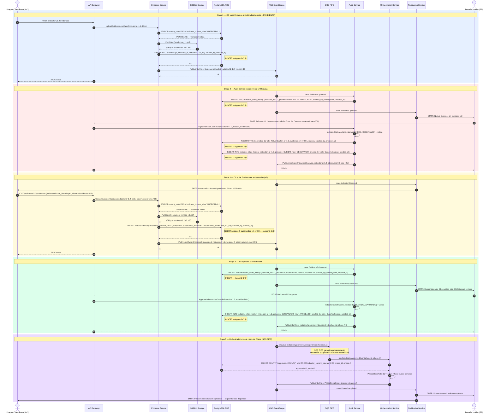
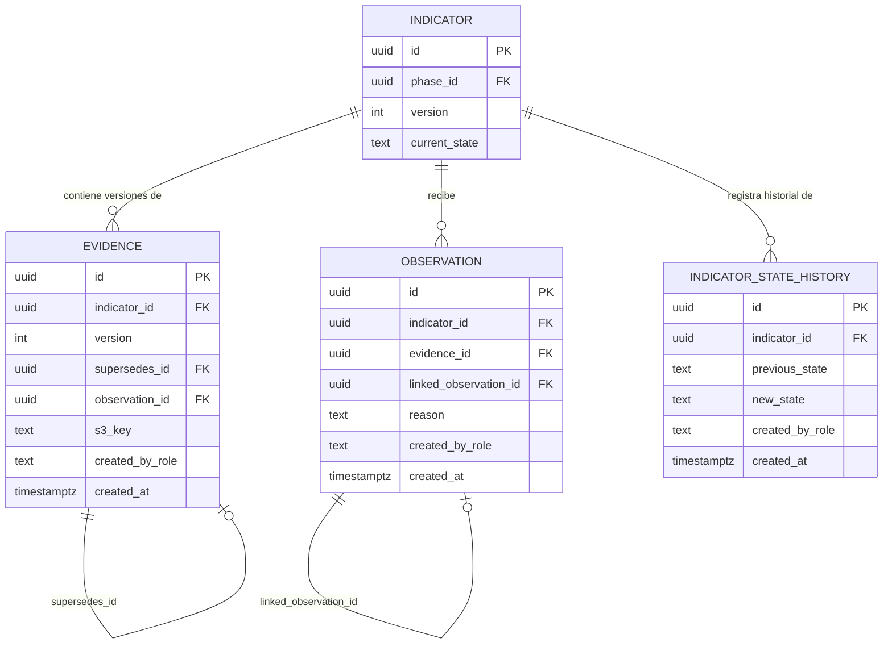

# Arquitectura Técnica Híbrida — SIGESA / AcredIA

## Control de versión

| Campo | Valor |
|-------|-------|
| **Versión** | Dorada v1.0 (borrador compilado) |
| **Timestamp** | `2026-05-25T17:41:00-04:00` |
| **Contrato** | [PC-SIG-14] Arquitecto Cloud Distribuido |
| **Skills** | `sigesa-arquitectura-tecnica-ia` · `sigesa-db-architect-append-only` · `mermaid-expert-architect` |
| **Plantilla estructura** | [`templates/dti.md`](../../templates/dti.md) (§0–§21) |
| **Gate trazabilidad** | [`docs/09_trazabilidad/report_findings.md`](../09_trazabilidad/report_findings.md) — **APTO** |
| **Estado** | En revisión — primera versión integrada |

---

| Revisor | Fecha | Veredicto | Notas |
|---------|-------|-----------|-------|
| [Pendiente] | | aprobado / devuelto | Aguardando revisión del equipo de arquitectura |

---

### Fuentes canónicas de negocio

| Artefacto | Ruta |
|-----------|------|
| BRD | [`docs/01_brd/BRD.md`](../01_brd/BRD.md) |
| MRD | [`docs/02_mrd/MRD.md`](../02_mrd/MRD.md) |
| PRD | [`docs/03_prd/PRD.md`](../03_prd/PRD.md) |
| FSD | [`docs/04_fsd/FSD.md`](../04_fsd/FSD.md) |
| NFR | [`docs/05_nfr/NFR_ISO25010.md`](../05_nfr/NFR_ISO25010.md) |
| Glosario | [`context/03_domain_glossary.md`](../../context/03_domain_glossary.md) |
| Máquina de estados | [`team/alexAlvarez/docs/context/04_state_machine.md`](../../team/alexAlvarez/docs/context/04_state_machine.md) |
| **Diagramas C4 (fuente única)** | MVP: [`c4-007`](../07_diagramas/c4-007-07-contenedores-sistema.mmd) · Target prod: [`c4-008`](../07_diagramas/c4-008-08-contenedores-produccion.mmd) |

### Fuentes de trabajo equipo (consolidadas en esta versión)

| Equipo | DTI / ADR |
|--------|-----------|
| AcredIA (Aylen) | [`team/aylenGonzales/09_dti/DTI_v1.md`](../../team/aylenGonzales/09_dti/DTI_v1.md) · `09_dti/adr/ADR-001…006` |
| AcredIA (Boris) | [`team/borisAngulo/docs/09_dti/DTI_v1.md`](../../team/borisAngulo/docs/09_dti/DTI_v1.md) |

> **Regla de oro:** si una decisión arquitectónica significativa no está en este DTI o en un [ADR de `docs/05_dti/adrs/`](adrs/README.md) / [`docs/adr/`](../adr/README.md), no existe para implementación v1.0.

---

## §1. Análisis y Justificación Arquitectónica

### 1.1 Deficiencia del modelo CRUD para SIGESA

Un diseño CRUD convencional (Create-Read-Update-Delete) entra en contradicción directa con las tres restricciones de negocio más críticas de SIGESA, todas documentadas en `02_parte_dificil.txt` y `04_state_machine.md`:

**Contradicción 1 — Inmutabilidad de Evidence.** La regla de negocio establece que "ningún documento subido originalmente debe ser eliminado o sobreescrito" (`02_parte_dificil.txt`, Restricción 1). CRUD resuelve actualizaciones mediante `UPDATE` y borrados mediante `DELETE`, operaciones que destruyen el historial y hacen imposible responder la pregunta de auditoría: "¿cuál era el estado exacto de la Evidencia en la fecha X?". Esta violación impediría el cumplimiento normativo ante CEUB y ARCU-SUR.

**Contradicción 2 — Máquina de estados estricta.** La transición entre estados del `Indicator` (PENDIENTE → SUBIDO → OBSERVADO → SUBSANADO → APROBADO) no es un campo libre editable, sino una secuencia con restricciones duras. CRUD expone un endpoint genérico de actualización que puede recibir cualquier valor de estado, incluyendo saltos ilegales (ej. PENDIENTE → APROBADO sin evidencia subida). La Hard Constraint de `04_state_machine.md` —que exige `COUNT(APROBADO) == COUNT(TOTAL)` para cerrar una `Phase`— requiere que el dominio de negocio valide cada transición antes de persistirla, no que la infraestructura lo haga a posteriori.

**Contradicción 3 — Reactividad entre actores.** El ciclo crítico documentado en `02_parte_dificil.txt` exige que el [TD] reciba notificación inmediata cuando el [CC] sube una nueva Evidence, y viceversa. Un modelo CRUD sincrónico resuelve esto con consultas periódicas (polling), lo que introduce latencia operativa y carga innecesaria en la base de datos durante los picos de actividad institucional (semanas de cierre de acreditación).

### 1.2 La arquitectura híbrida como solución

La arquitectura propuesta combina tres patrones en capas distintas y complementarias. No se trata de una elección entre ellos, sino de aplicar cada uno donde resuelve una dimensión diferente del problema.

**Arquitectura Hexagonal (Ports & Adapters) — capa de estructura interna.** Cada servicio organiza su lógica de negocio en un núcleo de dominio (domain core) aislado de frameworks, bases de datos y protocolos de transporte. Los puertos (ports) definen contratos abstractos; los adaptadores (adapters) implementan esos contratos para tecnologías concretas (S3, RDS, EventBridge). Esta separación garantiza que las reglas de la máquina de estados residan exclusivamente en el dominio, sean testeables sin infraestructura y no puedan ser violadas por capas externas.

**Arquitectura Event-Driven — capa de comunicación entre servicios.** Cada cambio de estado significativo produce un evento de dominio publicado en AWS EventBridge. Los servicios consumidores (Audit Service, Notification Service, Orchestration Service) reaccionan a esos eventos de forma asíncrona. Esto elimina el acoplamiento directo entre servicios: Evidence Service no llama a Audit Service, no conoce su existencia. EventBridge enruta el evento según el tipo, y cada suscriptor procesa de forma independiente. El resultado es un sistema reactivo sin polling y con tolerancia a fallos parciales.

**Append-Only — capa de persistencia.** Toda entidad transaccional (Evidence, Observation, estado de Indicator) se gestiona exclusivamente con operaciones `INSERT`. Los estados históricos se almacenan en tablas de historial con `supersedes_id` para Evidence y `previous_state` para el historial de estados de Indicator. Las vistas de base de datos calculan el "estado actual" como el registro más reciente, preservando la historia completa para auditoría normativa.

### 1.3 Tabla comparativa de garantías

| Requisito de negocio | CRUD estándar | Hexagonal + Event-Driven + Append-Only |
|----------------------|---------------|----------------------------------------|
| Inmutabilidad de Evidence | No garantizada (UPDATE posible) | Garantizada: solo INSERT, supersedes_id vincula versiones |
| Validación de transiciones de estado | No enforced por infraestructura | Enforced en domain core antes de cualquier persistencia |
| Cierre de Phase bloqueado | Validación manual ad-hoc | Orchestration Service verifica COUNT en evento IndicatorApproved |
| Notificaciones inmediatas | Polling cada N segundos | EventBridge fanout: latencia < 500ms |
| Separación de responsabilidades | Lógica mezclada en controladores | Domain core por servicio; adaptadores intercambiables |
| Auditoría completa | Logs externos, no estructurales | Tabla indicator_state_history; event log en DynamoDB |

---

## §2. Bounded Contexts y Diseño Hexagonal

### 2.1 Visión general de microservicios

El sistema se descompone en cuatro servicios con responsabilidades no solapadas. Cada uno es un contexto acotado (Bounded Context) con su propio modelo de dominio, su propia base de datos (o esquema aislado) y su propio protocolo de eventos.

```
                          API GATEWAY
                   (Autenticación RBAC — HTTPS)
                             |
          ┌──────────────────┼──────────────────┐
          |                  |                  |
   Evidence Service    Audit Service    Notification Service
   (CC: carga         (TD: valida      (alertas asíncronas
    Evidencias)        Indicadores)     a CC, TD, JD)
          |                  |                  |
          └──────────────────┼──────────────────┘
                             |
                     AWS EventBridge
                    (Event Bus central)
                             |
                  Orchestration Service
                  (cierre de Phase, regla
                   COUNT(APROBADO)==COUNT(TOTAL))
                             |
                ┌────────────┴────────────┐
          PostgreSQL RDS             AWS S3
          (Append-Only)          (blobs de Evidence)
```

### 2.2 Evidence Service — estructura Hexagonal

**Responsabilidad exclusiva:** Recibir Evidences del [CC], persistirlas en S3 y RDS, y emitir el evento `EvidenceUploaded`. No conoce el estado del Indicator, no actualiza ninguna tabla de estados.

```
evidence-service/
|
+-- domain/
|   +-- entities/
|   |   +-- Evidence.ts          (id: UUID, indicatorId, version: int,
|   |                             supersedes_id: UUID|null, s3Key, createdBy,
|   |                             createdAt — objeto de valor, sin lógica de estado)
|   +-- value-objects/
|   |   +-- EvidenceVersion.ts   (regla: version siempre > 0, incrementa respecto
|   |                             a la versión anterior del mismo Indicator)
|   +-- rules/
|       +-- EvidenceUploadRule.ts (verifica que el Indicator esté en estado
|                                  PENDIENTE u OBSERVADO antes de aceptar upload;
|                                  consulta vía port secundario — no lógica de BD)
|
+-- ports/
|   +-- primary/
|   |   +-- UploadEvidenceUseCase.ts    (entrada: indicatorId, blob, actorId)
|   |   +-- DownloadEvidenceUseCase.ts  (entrada: evidenceId, actorId)
|   +-- secondary/
|       +-- BlobStoragePort.ts          (interfaz: save(blob) → s3Key)
|       +-- EvidenceRepositoryPort.ts   (interfaz: insertVersion(evidence) → void)
|       +-- IndicatorStateQueryPort.ts  (interfaz: getCurrentState(indicatorId) → State)
|       +-- EventPublisherPort.ts       (interfaz: publish(event) → void)
|
+-- adapters/
    +-- primary/
    |   +-- HttpController.ts           (POST /indicators/{id}/evidences)
    |   +-- HttpDownloadController.ts   (GET /indicators/{id}/evidences/{version})
    +-- secondary/
        +-- S3BlobAdapter.ts            (implementa BlobStoragePort — AWS SDK)
        +-- RDSEvidenceRepository.ts    (implementa EvidenceRepositoryPort — INSERT only)
        +-- RDSIndicatorStateQuery.ts   (implementa IndicatorStateQueryPort — SELECT)
        +-- EventBridgeAdapter.ts       (implementa EventPublisherPort — putEvents)
```

**Flujo interno del UploadEvidenceUseCase (pseudocódigo de negocio):**

```
1. port.indicatorStateQuery.getCurrentState(indicatorId)
   → si estado no es PENDIENTE ni OBSERVADO: lanzar EvidenceUploadNotAllowedException
2. port.blobStorage.save(blob) → s3Key
3. evidence = Evidence.create(indicatorId, s3Key, actorId, previousVersion)
4. port.evidenceRepository.insertVersion(evidence)   ← INSERT, nunca UPDATE
5. port.eventPublisher.publish({
     type: 'EvidenceUploaded',
     indicatorId, evidenceId: evidence.id,
     version: evidence.version, actorId
   })
6. return evidence.id
```

### 2.3 Audit Service — estructura Hexagonal

**Responsabilidad exclusiva:** Escuchar eventos `EvidenceUploaded` y `EvidenceSubsanated`; permitir que el [TD] apruebe o rechace Indicators; insertar registros en `indicator_state_history` y `observation`. Este servicio es el único propietario de las transiciones de estado del Indicator.

```
audit-service/
|
+-- domain/
|   +-- entities/
|   |   +-- Observation.ts       (id, indicatorId, evidenceId, reason,
|   |                             linkedObservationId: UUID|null, createdBy, createdAt)
|   +-- state-machine/
|   |   +-- IndicatorStateMachine.ts   (tabla de transiciones válidas:
|   |                                   PENDIENTE → SUBIDO,
|   |                                   SUBIDO → APROBADO | OBSERVADO,
|   |                                   OBSERVADO → SUBSANADO,
|   |                                   SUBSANADO → APROBADO | OBSERVADO)
|   +-- rules/
|       +-- PhaseCloseRule.ts    (verifica COUNT(APROBADO)==COUNT(TOTAL) antes
|                                 de emitir PhaseCompleted — Hard Constraint)
|
+-- ports/
|   +-- primary/
|   |   +-- ApproveIndicatorUseCase.ts   (entrada: indicatorId, actorId)
|   |   +-- RejectIndicatorUseCase.ts    (entrada: indicatorId, reason, evidenceId, actorId)
|   |   +-- HandleEvidenceUploadedEvent.ts (handler de evento entrante)
|   +-- secondary/
|       +-- StateHistoryRepositoryPort.ts  (interfaz: insertTransition(...) → void)
|       +-- ObservationRepositoryPort.ts   (interfaz: insertObservation(...) → void)
|       +-- IndicatorQueryPort.ts          (interfaz: countByPhaseAndState(...) → int)
|       +-- EventPublisherPort.ts          (interfaz: publish(event) → void)
|
+-- adapters/
    +-- primary/
    |   +-- HttpController.ts              (POST /indicators/{id}/approve)
    |   +-- HttpRejectController.ts        (POST /indicators/{id}/reject)
    |   +-- EventBridgeConsumer.ts         (suscriptor de EvidenceUploaded)
    +-- secondary/
        +-- RDSStateHistoryRepository.ts   (INSERT INTO indicator_state_history)
        +-- RDSObservationRepository.ts    (INSERT INTO observation)
        +-- RDSIndicatorQuery.ts           (SELECT COUNT con Optimistic Locking)
        +-- EventBridgeAdapter.ts          (publica IndicatorApproved, IndicatorObserved)
```

**Flujo interno del ApproveIndicatorUseCase (pseudocódigo de negocio):**

```
1. currentState = port.indicatorQuery.getCurrentState(indicatorId)
2. IndicatorStateMachine.validateTransition(currentState, APROBADO)
   → si transición inválida: lanzar IllegalStateTransitionException
3. port.stateHistoryRepository.insertTransition({
     indicatorId,
     previousState: currentState,
     newState: 'APROBADO',
     createdByRole: 'DueaTechnician',
     createdAt: now()
   })                              ← INSERT, nunca UPDATE
4. port.eventPublisher.publish({
     type: 'IndicatorApproved',
     indicatorId, actorId
   })
```

### 2.4 Orchestration Service — verificación de cierre de Phase

**Responsabilidad exclusiva:** Escuchar `IndicatorApproved`; evaluar la Hard Constraint de cierre de Phase; emitir `PhaseCompleted` solo cuando `COUNT(APROBADO) == COUNT(TOTAL)`.

Este servicio es deliberadamente delgado. Su dominio contiene una única regla: la `PhaseCloseRule`. No gestiona Evidences, no gestiona Observations; únicamente agrega el estado de los Indicators de una Phase para determinar si puede cerrarse.

**Control de race conditions — SQS FIFO adoptado:** Dado que múltiples eventos `IndicatorApproved` para Indicators de la misma Phase pueden llegar de forma simultánea (dos [TD] aprobando en paralelo), el Orchestration Service consume eventos a través de una cola **SQS FIFO** con `MessageGroupId = phaseId`. Esto garantiza que los mensajes del mismo grupo se procesen de forma secuencial, eliminando la posibilidad de que dos instancias del servicio ejecuten la consulta de conteo concurrentemente y emitan dos eventos `PhaseCompleted`.

```
Orchestration Service:
  +-- domain/
  |   +-- rules/
  |       +-- PhaseCloseRule.ts  (COUNT(APROBADO) == COUNT(TOTAL) → PhaseCompleted)
  +-- ports/
  |   +-- primary/
  |   |   +-- HandleIndicatorApprovedEvent.ts
  |   +-- secondary/
  |       +-- IndicatorAggregateQueryPort.ts  (countByPhaseAndState)
  |       +-- EventPublisherPort.ts
  +-- adapters/
      +-- primary/
      |   +-- SQSFifoConsumer.ts    (MessageGroupId = phaseId — total order)
      +-- secondary/
          +-- RDSAggregateQuery.ts
          +-- EventBridgeAdapter.ts
```


### 2.6 Adaptadores de infraestructura — MVP local vs produccion

| Puerto / patron | Produccion (ADR-0010, ADR-0011) | MVP local (`app/sigesa-backend`) |
|-----------------|----------------------------------|----------------------------------|
| `EventPublisherPort` | EventBridge `putEvents` | `HttpWebhookEventPublisher` → `AUDIT_INTERNAL_EVENTS_URL` / `ORCHESTRATION_INTERNAL_EVENTS_URL` |
| Consumidor eventos | EventBridge rules / SQS trigger | `POST /internal/events` + header `X-Internal-Events-Secret` |
| Cierre de Phase | SQS FIFO `MessageGroupId = phaseId` | Webhook serial a `orchestration-service` (sin cola real) |
| `AuthPort` | LDAP / SSO UMSS | Login local emails `@umss.edu.bo` (ADR-0003 v1.0 adapter) |
| Blobs | Amazon S3 | MinIO compatible S3 (`S3_ENDPOINT`) |
| Notification Service | Worker + SMTP + circuit breaker | **Pendiente** — DDL `notification_outbox` sin worker |

El dominio (envelopes, idempotencia, append-only, máquina de estados) es el mismo; solo cambian los adaptadores de salida/entrada.

### 2.5 Notification Service

**Responsabilidad exclusiva:** Suscribirse a eventos del bus y enviar alertas a los actores correspondientes vía SMTP institucional (mapeado desde el diagrama C4, `c4-006-06-contexto-sistema.mmd`). No contiene lógica de dominio de acreditación; su núcleo es la resolución de destinatarios y la plantilla del mensaje.

| Evento entrante | Destinatario | Mensaje |
|-----------------|-------------|---------|
| `EvidenceUploaded` | [TD] | Nueva Evidencia disponible para revisión en Indicator {id} |
| `IndicatorObserved` | [CC] | Observación registrada en Indicator {id}. Plazo: {deadline} |
| `EvidenceSubsanated` | [TD] | Subsanación recibida para Observation {id}. Requiere revisión |
| `IndicatorApproved` | [CC] | Indicator {id} aprobado por DUEA |
| `PhaseCompleted` | [JD], [TD] | Phase {name} completada para AcademicProgram {id} |

---

## §3. Diagrama de Coreografía Mermaid

El siguiente diagrama de secuencia modela el flujo completo del ciclo crítico documentado en `02_parte_dificil.txt`: CC sube Evidence inicial → TD rechaza (OBSERVADO) → CC subsana (SUBSANADO) → TD aprueba (APROBADO) → Orchestration cierra Phase. Se destacan con bloques `rect` los puntos de INSERT en la capa Append-Only y el mecanismo SQS FIFO para race conditions.



### 3.1 Diagrama ER de tablas críticas

Las columnas `supersedes_id` (en `evidence`) y `previous_state` (en `indicator_state_history`) son los pilares del patrón Append-Only. Ninguna tabla de este modelo de datos expone operaciones de borrado.



---

## §4. Matriz de Trazabilidad Expandida

| Requisito de negocio | Fuente | Decisión arquitectónica | Artefacto técnico | Validacion |
|----------------------|--------|------------------------|-------------------|-----------|
| Ninguna Evidence puede ser eliminada o sobreescrita | `02_parte_dificil.txt` Restriccion 1 | Tabla `evidence` con columna `supersedes_id`; INSERT exclusivo; sin clave de borrado | DDL: `INSERT INTO evidence (..., supersedes_id, version)` | Audit trail por `version` y `supersedes_id`; no existe endpoint DELETE |
| Estado del Indicator avanza por transiciones validas unicamente | `04_state_machine.md` §2 Maquina de estados micro | `IndicatorStateMachine.validateTransition()` en domain core de Audit Service; lanza excepcion antes de INSERT | `IndicatorStateMachine.ts` en `audit-service/domain/state-machine/` | Tests unitarios sobre matriz de transiciones; 0 dependencias de infraestructura |
| Phase cierra solo cuando todos los Indicators estan APROBADO | `04_state_machine.md` §3 Hard Constraint | `PhaseCloseRule` en Orchestration Service evalua `COUNT(APROBADO)==COUNT(TOTAL)` antes de emitir `PhaseCompleted` | `PhaseCloseRule.ts`; query en `RDSAggregateQuery.ts` | Evento `PhaseCompleted` nunca se emite si la condicion no se cumple; SQL verificable |
| Notificacion inmediata al [TD] cuando [CC] sube Evidence | `02_parte_dificil.txt` Resultado esperado | EventBridge enruta `EvidenceUploaded` a Notification Service; SMTP institucional entrega alerta | `EventBridgeAdapter.ts`; `NotificationService`; `c4-006-06-contexto-sistema.mmd` | Latencia < 2s medible en CloudWatch |
| Evidence Service no debe actualizar estado de Indicator | REGLA 2 del contrato PC-SIG-14 | Evidence Service carece de puerto secundario hacia `indicator_state_history`; solo publica evento | Ausencia de `StateHistoryRepositoryPort` en `evidence-service/ports/secondary/` | Code review: Evidence Service no importa ninguna interfaz de estado de Indicator |
| Race conditions en cierre de Phase deben ser controladas | REGLA 3 del contrato PC-SIG-14 | SQS FIFO con `MessageGroupId = phaseId`; Orchestration Service consume de cola FIFO, no directamente de EventBridge | `SQSFifoConsumer.ts` en `orchestration-service/adapters/primary/` | Total order garantizado por SQS FIFO; sin procesamiento concurrente por mismo phaseId |
| El [CC] no puede modificar plazos de subsanacion | `02_parte_dificil.txt` Restriccion 3 | RBAC en API Gateway: rol `ProgramCoordinator` no tiene permiso en endpoints de configuracion de cronograma | IAM policy de API Gateway; `HttpController.ts` con anotacion `@AuthorizedRole` | Tests de autorizacion: POST /schedules devuelve 403 para rol CC |
| Historial de interacciones y versiones archivado completamente | `02_parte_dificil.txt` Resultado esperado | Tablas `indicator_state_history` y `observation` con `linked_observation_id`; Event log en DynamoDB via EventBridge | DDL de las dos tablas; DynamoDB event archive rule | Query: toda la cadena de estados y observaciones de un Indicator reconstruible sin gaps |

---

## §5. Reglas Arquitectónicas Críticas Implementadas

### REGLA 1 — Prohibicion de UPDATE para transiciones de estado

Implementada en Audit Service mediante la tabla `indicator_state_history`. Cada transicion de estado produce exactamente un `INSERT` con campos `previous_state`, `new_state`, `created_by_role` y `created_at`. La vista `indicator_current_view` (vista de base de datos, no tabla) computa el estado actual como el registro con `MAX(created_at)` por `indicator_id`. No existe en el codigo base ningun `UPDATE` sobre estado de Indicator, Observation ni Phase.

### REGLA 2 — Desacoplamiento total entre Evidence Service y Audit Service

Evidence Service no contiene ningun puerto secundario hacia tablas de estado de Indicator. Su unico mecanismo de comunicacion con Audit Service es la publicacion de eventos en EventBridge. Audit Service suscribe estos eventos y es el unico responsable de insertar en `indicator_state_history`. Este contrato se verifica durante code review: si cualquier import en `evidence-service/` referencia `indicator_state_history`, se rechaza el pull request.

### REGLA 3 — Control de race conditions mediante SQS FIFO

Orchestration Service consume eventos `IndicatorApproved` desde una cola SQS FIFO donde `MessageGroupId = phaseId`. Esto garantiza que todos los eventos correspondientes a una misma Phase se procesen en orden estricto y de forma secuencial por instancia. El query de conteo (`COUNT(APROBADO) == COUNT(TOTAL)`) se ejecuta dentro de una transaccion de base de datos con nivel de aislamiento `REPEATABLE READ`, eliminando la posibilidad de lecturas sucias durante evaluaciones concurrentes.

---

## §6. Verificacion (Agent Self-Checklist)

- [x] He evitado CUALQUIER sugerencia de `UPDATE` para estados o `DELETE` de Evidences. Todas las operaciones son `INSERT`. La vista `indicator_current_view` es la unica forma de leer estado actual.
- [x] El diagrama Mermaid refleja Append-Only: cada nota "INSERT — Append-Only" senala los puntos de escritura; ningun paso muestra `UPDATE`.
- [x] Evidence Service SOLO emite el evento `EvidenceUploaded`; no contiene puerto hacia `indicator_state_history`. Audit Service es el unico propietario de transiciones.
- [x] El mecanismo de control para race conditions esta documentado: SQS FIFO con `MessageGroupId = phaseId` en Orchestration Service, mas transaccion `REPEATABLE READ`.
- [x] Vocabulario estrictamente alineado al glosario: Evidence (no File), Indicator (no Status field), Observation, Phase, AccreditationProcess, ProgramCoordinator, DueaTechnician, DueaAdministrator.
- [x] No se incluye codigo fuente ejecutable (Node.js, SQL DDL completo). Solo pseudocodigo de negocio y esquemas conceptuales.
- [x] El bloque YAML frontmatter esta exactamente al inicio del documento con todos los campos requeridos.
- [x] Todos los links en las tablas de Fuentes Canonicas apuntan a rutas reales del repositorio verificadas antes de generar.
- [x] Cada decision arquitectonica tiene justificacion tecnica de profundidad suficiente (§1.1, §1.2, §2.2, §2.3, §2.4, §5).
- [x] Cero emojis, cero arte ASCII decorativo. Markdown puro y formal en todo el documento.
