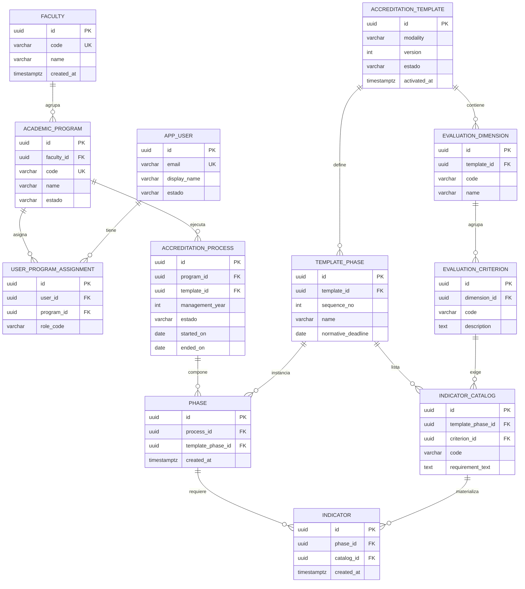
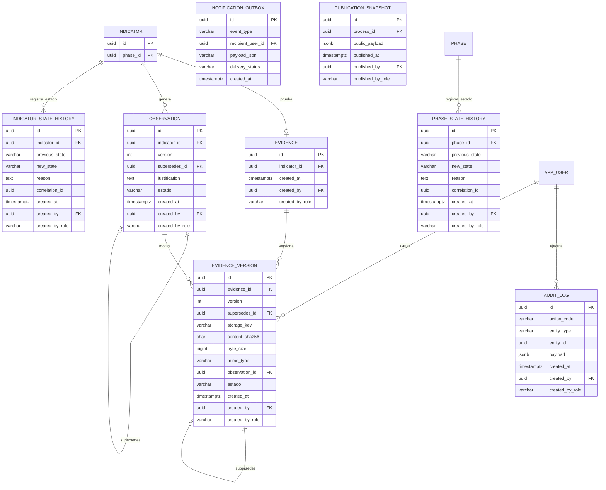
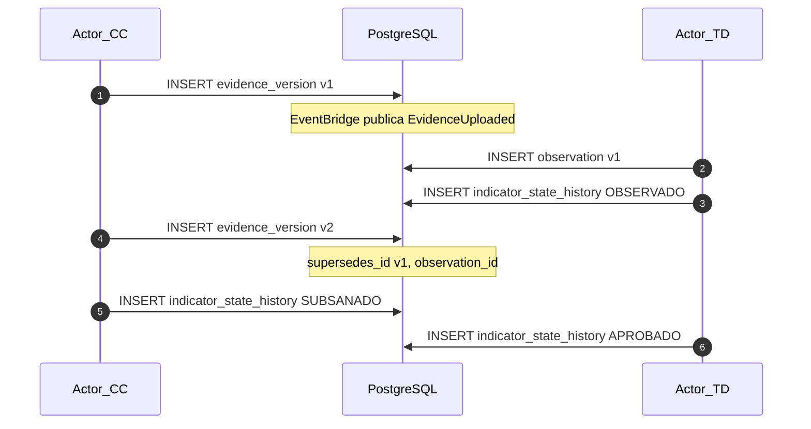

# Modelo físico de datos — SIGESA / AcredIA

## Control de versión

| Campo | Valor |
|-------|-------|
| **Versión** | Dorada v1.0 |
| **Timestamp** | `2026-05-25T20:08:00-04:00` |
| **Skills** | `sigesa-db-architect-append-only` · `mermaid-expert-architect` |
| **Fuentes** | `context/03_domain_glossary.md` · `team/alexAlvarez/docs/context/04_state_machine.md` · `docs/04_fsd/FSD.md` v1.0 |
| **DDL ejecutable** | [`ddl_sigesa_append_only.sql`](ddl_sigesa_append_only.sql) |
| **Invariantes** | Append-only · sin `DELETE` normativo · sin `UPDATE` de estados · FK `ON DELETE RESTRICT` · taxonomía CEUB/ARCU-SUR |

> **Propósito:** modelo relacional PostgreSQL para el **sistema de automatización** de acreditación cloud v1.0. Las tablas normativas (`evidence_version`, `observation`, `indicator_state_history`, `phase_state_history`, `audit_log`) son **solo inserción**; los estados vigentes se derivan desde vistas, no desde columnas mutables.

---

## 1. Principios de diseño

| Principio | Implementación |
|-----------|----------------|
| Append-only | Sin columnas `deleted_at` / `is_deleted`; versionado en `evidence_version` |
| Trazabilidad | `version`, `supersedes_id`, `created_at`, `created_by`, `created_by_role` en tablas transaccionales |
| FK seguras | `ON DELETE RESTRICT` en toda la jerarquía normativa (prohibido cascade delete de blobs) |
| PK trazables | `UUID` v7 o v4 en entidades de dominio |
| Taxonomía | `evaluation_dimension` → `evaluation_criterion` → `indicator` → `evidence` → `evidence_version` |
| Actores | Roles persistidos como `created_by_role` ∈ `CC`, `TD`, `JD`, `SYSTEM` |

**Modo de fallo evitado:** ninguna FK con `ON DELETE CASCADE` hacia `evidence_version` o `observation`.

---

## 2. Diccionario de datos (entidades core)

### 2.1 Maestros institucionales

| Tabla (ES) | Tabla física | Descripción |
|------------|--------------|-------------|
| Facultad | `faculty` | Unidad académica UMSS (dato maestro). |
| Carrera | `academic_program` | Programa acreditado; FK a `faculty`. |
| Usuario | `app_user` | Cuenta institucional (`email` @umss.edu.bo). |
| Asignación rol | `user_program_assignment` | Vincula [CC] a `academic_program`; [TD]/[JD] con alcance global o facultad. |

### 2.2 Plantilla normativa (CEUB / ARCU-SUR)

| Tabla | Descripción |
|-------|-------------|
| `accreditation_template` | Versión de marco normativo (`modality` CEUB \| ARCU-SUR, `version`, `estado` ACTIVO \| ARCHIVADO). |
| `template_phase` | Fases del instrumento dentro de la plantilla (orden, nombre, plazo normativo). |
| `evaluation_dimension` | Dimensión del marco (`template_id`, código, nombre). |
| `evaluation_criterion` | Criterio evaluable (`dimension_id`). |
| `indicator_catalog` | Definición de indicador por fase + criterio (`template_phase_id`, `criterion_id`, código). |

### 2.3 Proceso en ejecución

| Tabla | Descripción |
|-------|-------------|
| `accreditation_process` | Ciclo de acreditación de una carrera (`program_id`, `template_id`, gestión, fechas, `estado` EN_PROCESO \| ACREDITADO \| VENCIDO). |
| `phase` | Instancia de Phase (`process_id`, `template_phase_id`); estado derivado desde `phase_state_history`. |
| `indicator` | Instancia evaluable (`phase_id`, `catalog_id`); estado derivado desde `indicator_state_history`. |

**Regla BRD-RB-02:** un solo `accreditation_process` activo por carrera + modalidad + periodo (índice único parcial en DDL).

### 2.4 Transaccional y auditoría

| Tabla | Descripción |
|-------|-------------|
| `evidence` | Contenedor lógico de prueba por `indicator_id` (cabecera estable). |
| `evidence_version` | **Versión append-only** de Evidence: blob, hash, `supersedes_id`, enlace a `observation_id` si subsanación. |
| `observation` | Rechazo [TD] con justificación obligatoria; versionada si se reabre observación. |
| `indicator_state_history` | Historial append-only de transiciones de Indicator (quién, rol, desde/hacia, correlationId). |
| `phase_state_history` | Historial append-only de transiciones de Phase para cierres emitidos por Orchestration Service. |
| `audit_log` | Eventos de sistema (login, intento DELETE denegado, etc.). |
| `notification_outbox` | Cola de correo institucional (patrón outbox). |
| `publication_snapshot` | Contenido publicado en portal [P] (`published_at`, `published_by_role`). |

### 2.5 Columnas de auditoría obligatorias (transaccionales)

| Columna | Tipo | Uso |
|---------|------|-----|
| `version` | `integer` | Incremental por entidad lógica (evidence_version, observation). |
| `supersedes_id` | `uuid` NULL | FK self a fila previa; cadena de subsanación. |
| `created_at` | `timestamptz` | Momento de registro (inmutable). |
| `created_by` | `uuid` | FK `app_user.id`. |
| `created_by_role` | `varchar(2)` | `CC`, `TD`, `JD`, `SYSTEM`. |
| `estado` | `enum` | `ACTIVO`, `ANULADO` (solo anulación lógica administrativa, no DELETE). |

---

## 3. Diagrama ER — Core / estructural

Plantillas, maestros y proceso. Sin tablas de archivo binario.

---

## 4. Diagrama ER — Transaccional / auditoría

Evidencia versionada, observaciones, transiciones y bitácora. Cardinalidades 1:N en versiones.

---

## 5. Máquina de estados persistida

| Entidad | Columna | Valores |
|---------|---------|---------|
| `indicator_current_view` | `current_state` | `PENDIENTE`, `SUBIDO`, `OBSERVADO`, `SUBSANADO`, `APROBADO` |
| `phase_current_view` | `current_state` | `ABIERTA`, `COMPLETADA` |
| `accreditation_process` | `estado` | `EN_PROCESO`, `ACREDITADO`, `VENCIDO` |

Cada cambio de Indicator inserta una fila en `indicator_state_history`; cada cierre de Phase inserta una fila en `phase_state_history`. No existe `UPDATE` destructivo de estado para Indicator ni Phase. El cierre de Phase se valida por agregación sobre `indicator_current_view`: `COUNT(indicator) = COUNT(indicator WHERE current_state = APROBADO)`.

---

## 6. Flujo de subsanación (modelo de datos)

---

## 7. Índices y particionado (recomendación)

| Tabla | Índice | Motivo |
|-------|--------|--------|
| `evidence_version` | `(evidence_id, version DESC)` | Historial vigente |
| `evidence_version` | `(content_sha256)` | Dedup opcional |
| `indicator_state_history` | `(indicator_id, created_at DESC)` | Estado vigente e historial |
| `phase_state_history` | `(phase_id, created_at DESC)` | Estado vigente de Phase |
| `accreditation_process` | `(program_id, modality, management_year) WHERE estado = EN_PROCESO` | Un proceso activo |
| `audit_log` | `(created_at)` | Particionado mensual por rango |
| `indicator_current_view` | vista derivada | Bandeja [TD] y cierre de Phase |

Particionado sugerido: `audit_log` y `evidence_version` por `RANGE (created_at)` anual tras piloto.

---

## 8. Trazabilidad documental

| FSD-UC | Tablas principales |
|--------|-------------------|
| UC-004, UC-006 | `evidence`, `evidence_version` |
| UC-005 | `evidence_version` (sin DELETE) |
| UC-008 | `observation`, `indicator_state_history` |
| UC-009 | `indicator`, `indicator_state_history` |
| UC-010 | `phase`, `phase_state_history`, `indicator_current_view` |
| UC-017 | `audit_log` |
| UC-016 | `publication_snapshot` |

Matriz: [`matriz_trazabilidad.md`](../../matriz_trazabilidad.md)

---

## 9. Checklist Database Architect

- [x] Tabla `evidence_version` sin dependencia de `DELETE`
- [x] `supersedes_id` y `version` en evidencia y observación
- [x] `indicator_state_history` y `phase_state_history` sin `UPDATE` destructivo
- [x] FKs reflejan taxonomía institucional
- [x] `ON DELETE RESTRICT` en DDL (sin cascade normativo)
- [x] Diagramas Mermaid divididos (core + transaccional)
- [x] Roles [CC], [TD], [JD] en `created_by_role`

---

## 10. Registro de cambios

| Versión | Timestamp | Cambio |
|---------|-----------|--------|
| **Dorada v1.0** | `2026-05-16T16:06:15-04:00` | Modelo físico inicial append-only + ER + DDL |
| **Cloud v1.0** | `2026-05-25T20:08:00-04:00` | Alineación ADR-0012: historial append-only de Indicator/Phase y vistas de estado actual |

---

*Próximo paso: `DTI.md` maestro con ADR-0001 (storage inmutable) y despliegue.*
