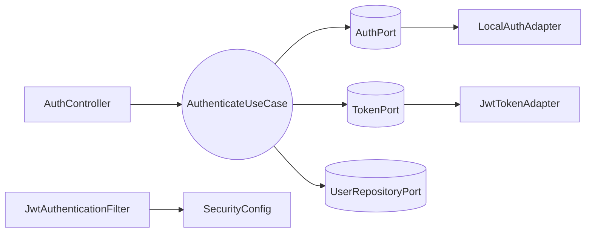

# Design Doc `DD-UC-001` — Autenticación y sesión (MOD-AUTH)

> **Qué es**: documento de diseño de **FSD-UC-001** para SIGESA v1.0. Describe **cómo** implementar login JWT, sesión stateless, perímetro de acceso y validación de credenciales con arquitectura hexagonal estricta.
>
> **Relación con otros documentos**:
> - **Trazabilidad obligatoria al FSD**: [`FSD-UC-001`](../product/uc/FSD-UC-001.md).
> - **Implementa** [`ADR-0003`](../adr/ADR-0003-authentication-adapter.md) (`AuthPort` + `LocalAuthAdapter` v1.0).
> - Complementa JWT/RBAC (ADR_007 baseline); no reemplaza el ADR.
> - Alimenta el **DTP** vía `@dtp-sync` tras implementar.

## Dependencias

- Este DD **consume** el modelo de identidad (`AppUser`, `Role`, `UserStatus`, `Email`, `UserProgramAssignment`) y los puertos de persistencia de usuario definidos en [`DD-UC-002`](./DD-UC-002.md). No redefine esas entidades ni el DDL de `app_user` / `user_program_assignment`.
- La transición `INACTIVE` → `ACTIVE` en primer login exitoso **aplica** la regla de ciclo de vida definida en [`DD-UC-002`](./DD-UC-002.md) §2.
- El perímetro JWT (`Authorization: Bearer` en `/api/v1/**`) habilita **US-003** (FSD-UC-001 E3) para todo el backend v1.0, incluidos endpoints de [`DD-UC-002`](./DD-UC-002.md).

## 1. Objetivo y contexto

- **Qué resuelve este feature**: Sesión segura stateless mediante JWT con claims `role` y `programScope`; validación de credenciales sin revelar existencia de cuenta (A1); rechazo de acciones sensibles sin sesión (E3 / US-003). Prerrequisito de MOD-PROCESS, MOD-EVIDENCE y MOD-DASH.
- **Caso de uso del FSD que implementa**:
  - `FSD-UC-001` (Autenticación y sesión) — [`docs/product/uc/FSD-UC-001.md`](../product/uc/FSD-UC-001.md)
- **Alcance**:
  | Incluido | Excluido (v1.0) |
  |---|---|
  | `POST /api/v1/auth/login` con JWT (`role`, `programScope`) | `LdapAuthAdapter` (v1.1) |
  | Perímetro JWT: todo `/api/v1/**` excepto login exige Bearer | SSO / OIDC |
  | Activación `INACTIVE`→`ACTIVE` en primer login exitoso | Frontend `/login` |
  | 401 genérico sin revelar existencia (A1 UC-001) | Blocklist refresh token (opcional) |
  | Validación dominio `@umss.edu.bo` en login (FSD-BR-12) | UC-017 completo (stub `AuditLogPort`) |
  | `JwtAuthenticationFilter`, `SecurityConfig`, `TokenPort` | Bloqueo por intentos / `429 AUTH_LOCKED` (v1.1) |
  | A2 sin rol → `403`; E3 sin sesión → `401` | Alta/revocación de usuarios (→ [`DD-UC-002`](./DD-UC-002.md)) |

## 2. Diseño (el "cómo") `[humano+máquina]`

- **Enfoque elegido**: Casos de uso de autenticación bajo `com.umss.sigesa.application.service.auth` (`AuthenticateService`). **Dominio y aplicación sin dependencias de Spring/JPA.** Spring Security y JWT solo en adaptadores de entrada/salida. Credenciales vía `AuthPort` → `LocalAuthAdapter` (ADR-0003).

- **Componentes tocados** (capas hexagonales):

  | Capa | Componentes |
  |---|---|
  | **Dominio (consumo)** | `Email`, `AuthenticatedIdentity`, `InvalidCredentialsException`, `RoleNotAssignedException` — modelo `AppUser` en [`DD-UC-002`](./DD-UC-002.md) |
  | **Aplicación** | `AuthenticateUseCase` / `AuthenticateService` |
  | **Puertos out** | `AuthPort`, `TokenPort`, `UserRepositoryPort` (activación INACTIVE→ACTIVE), `AuditLogPort` (stub `logLogin`) |
  | **Adaptadores in** | `AuthController`, `JwtAuthenticationFilter`, `SecurityConfig`, `RestAuthenticationEntryPoint`, `AuthExceptionHandler` |
  | **Adaptadores out** | `LocalAuthAdapter`, `JwtTokenAdapter`, `NoOpAuditLogAdapter` |

- **Reglas de dominio (UC-001)**:
  1. Login A1: **todo** fallo de autenticación en `POST /auth/login` (usuario inexistente, password incorrecto/vacío, `DEACTIVATED`, email vacío o dominio ≠ `@umss.edu.bo`) → mismo `401 AUTH_INVALID_CREDENTIALS`. Login **no** usa `@Valid` en DTO; validación en `Email.forLogin()` + `AuthenticateService`.
  2. Login A2: sin rol → `403 ACCESS_DENIED`.
  3. E3 / US-003: acción en `/api/v1/**` sin Bearer → `401 UNAUTHORIZED`; sin cambios de estado.
  4. Primer login exitoso de cuenta `INACTIVE`: transición a `ACTIVE` vía `UserRepositoryPort` (regla de ciclo de vida en [`DD-UC-002`](./DD-UC-002.md)).
  5. **Perímetro JWT v1.0:** todo `/api/v1/**` excepto `POST /auth/login` exige `Authorization: Bearer`.

- **Contratos y tipos**:

  ```java
  public interface AuthPort {
      Optional<AuthenticatedIdentity> authenticate(Email email, char[] rawPassword);
  }

  public record LoginRequest(String email, String password) {}
  public record LoginResponse(String accessToken, long expiresIn, String role, List<UUID> programScope) {}
  ```

  **JWT claims**: `sub` (userId), `email`, `role`, `programScope[]`, `exp`, `iat`.

- **API REST** ([`api_contracts.md`](../product/api_contracts.md)):

  | Método | Ruta | UC | Rol |
  |---|---|---|---|
  | POST | `/api/v1/auth/login` | FSD-UC-001 | público |

- **Diagrama**:



## 3. Alternativas consideradas

| Alternativa | Pros | Contras | ¿Elegida? |
|---|---|---|---|
| **A. `AuthPort` + `LocalAuthAdapter`; Spring Security solo en adaptador in** | Cumple ADR-0003; dominio testeable; LDAP = nuevo adaptador | Filtro JWT + lógica en use case | **sí** |
| **B. Acoplar auth a `AuthenticationManager` / `UserDetailsService` en aplicación** | Menos clases | Acopla dominio a Spring; refactor costoso v1.1 | **no** |
| **C. `@Service` Spring en casos de uso** | Prototipo rápido | Rompe hexagonal estricta | **no** |
| **D. JWT en controlador sin `TokenPort`** | Menos interfaces | Duplicación; difícil rotar TTL | **no** |

**Conclusión ADR-0003**: **No requiere ADR nuevo.** La alternativa A implementa la decisión ya aceptada en ADR-0003. Spring Security queda en el **perímetro** (filtro, `@PreAuthorize`); verificación de credenciales detrás de `AuthPort`.

> Cambio de contrato `AuthPort` o abandono del patrón adapter → delta + ADR antes de merge.

## 4. Impacto en las specs vivas `[máquina]`

| Artefacto vivo | Cambio | ¿Delta vs DTI vFinal? | Sync |
|---|---|---|---|
| `docs/product/uc/FSD-UC-001.md` | Estado → **Hecho** | no | `@dtp-sync` 2026-06-22 |
| `docs/product/03_prd/PRD.md` | US-001/003 → **Hecho backend** | no | `@dtp-sync` 2026-06-22 |
| `docs/product/api_contracts.md` | `POST /auth/login`; códigos 401/403; campo `error` global | no | sync 2026-06-23 |
| `docs/product/DTP.md` | §A.2 #1 perímetro JWT; §A.3 UC-001; §B.1 login/JWT | no | `@dtp-sync` 2026-06-22 |
| `docs/product/diagramas/D-SEQ-001-auth-jwt.mmd` | A1 → 401; activación INACTIVE | no | sync 2026-06-23 |
| `docs/product/diagramas/MAR-SEQ-001-autenticacion-jwt.mmd` | A1 → 401; sin AUTH_LOCKED v1.0 | no | sync 2026-06-23 |
| `docs/product/reglas_negocio.md` | FSD-BR-12 login A1 → 401 | no | sync 2026-06-23 |
| `docs/adr/ADR-0003-authentication-adapter.md` | ADR vivo MOD-AUTH login | no | sync 2026-06-23 |
| `docs/product/FSD.md` | UC-001 → **Hecho**; enlace a `DD-UC-001` | no | sync 2026-06-23 |

> **Recordatorio**: `docs/baseline/` **no se toca**.

## 5. Prompts usados `[máquina]`

| Prompt | Tarea | Artefacto generado |
|---|---|---|
| `PR-IMPL-001` | Implementación login, JWT, perímetro (histórico unificado: [`PR-IMPL-004`](../prompts/impl/archive/PR-IMPL-004.md)) | `AuthenticateService`, `AuthController`, `JwtAuthenticationFilter`, tests UC-001 |

> Ver [`PR-IMPL-001`](../prompts/impl/PR-IMPL-001.md). Contrato admin: [`PR-IMPL-002`](../prompts/impl/PR-IMPL-002.md).

## 6. Plan de pruebas y evals

Derivado de Gherkin FSD-UC-001.

### Resultado obtenido (2026-06-22)

| Capa | Clase de test | Escenarios Gherkin cubiertos | Estado |
|---|---|---|---|
| **Unit** | `AuthenticateServiceTest` | UC-001 login OK [CC]/[JD]; A1 401 genérico; A2 403; INACTIVE→ACTIVE | implementado |
| **Unit** | `LocalAuthAdapterTest` | Argon2 verify OK/KO; DEACTIVATED; user missing | implementado |
| **Integración servicios** | `ModAuthServiceIntegrationTest` | UC-001 login + A1 | implementado |
| **Integración HTTP** | `AuthControllerTest` | UC-001 200 JWT; A1 body idéntico | implementado |
| **Integración HTTP** | `JwtAuthenticationFilterTest` | UC-001 E3 / US-003 → 401 | implementado |
| **Integración HTTP** | `AuthenticatedApiSmokeTest` | Perímetro JWT `/fases` y `/processes`; A1 dominio/vacíos en login | implementado |

### Mapeo Gherkin → tests

| Escenario FSD | Test(s) |
|---|---|
| UC-001: Inicio de sesión exitoso con rol | `AuthenticateServiceTest.loginExitoso*`; `ModAuthServiceIntegrationTest.fsdUc001_loginExitoso*`; `AuthControllerTest.login_returnsJwtOnSuccess` |
| UC-001: Credenciales inválidas (A1) | `AuthenticateServiceTest.credencialesInvalidas*`; `AuthenticateServiceTest.credencialesInvalidas_emailNoUmss`; `ModAuthServiceIntegrationTest.fsdUc001_*`; `AuthControllerTest.login_invalidCredentials*`; `AuthenticatedApiSmokeTest.loginInvalidEmailDomainReturns401` |
| UC-001 E3 / US-003: Sin autenticación | `JwtAuthenticationFilterTest.sensitiveActionWithoutTokenReturns401`; `AuthenticatedApiSmokeTest.fasesWithoutTokenReturns401` |

### JaCoCo (agents.md)

Regla en `pom.xml` — umbral **≥ 90% líneas** en:

- `com.umss.sigesa.application.service.auth.AuthenticateService`

| Clase | Cobertura verificada | Comando |
|---|---|---|
| `AuthenticateService` | pendiente — requiere `JAVA_HOME` + `mvn verify` local | `mvn verify` |

Reporte esperado: `target/site/jacoco/index.html` tras `mvn verify`.

### Detalle por capa (referencia)

- **Unit** (JUnit 5 + Mockito, sin BD/HTTP/Spring):
  - `AuthenticateServiceTest`: login OK [CC]/[JD] con `programScope`; 401 genérico A1; 403 A2; INACTIVE→ACTIVE; audit `logLogin`.
  - `LocalAuthAdapterTest`: password OK/KO; DEACTIVATED; usuario inexistente.

- **Integración servicios** (`ModAuthServiceIntegrationTest` + `support/*` in-memory):
  - Flujos login UC-001 con puertos fake.

- **Evals de IA**: N/A.

## 7. Definition of Done (checklist)

### Cumplido

- [x] **`fsd_uc` declarado y enlazado** — frontmatter: `FSD-UC-001`; enlace en §1.
- [x] **Diseño (§2) y alternativas (§3) documentados** — hexagonal login/JWT, reglas A1/A2/E3, API, diagrama.
- [x] **ADR-0003 referenciado** — `AuthPort` + `LocalAuthAdapter`; sin ADR adicional requerido (§3).
- [x] **§4 Impacto en specs vivas registrado** — tabla §4; `@dtp-sync` 2026-06-22.
- [x] **Prompt(s) en `docs/prompts/impl/`** — `PR-IMPL-001` presente.
- [x] **Tests/evals (§6) implementados** — unit, integración servicios, HTTP, smoke JWT UC-001.
- [x] **Dependencias a DD-UC-002 documentadas** — § Dependencias.

### Pendiente (acción manual o verificación)

- [ ] **JaCoCo ≥ 90% verificado** — `AuthenticateService`; ejecutar `.\mvnw.cmd verify` con JDK 21.
- [ ] **PR con trazabilidad completa** — `FSD-UC-001` · `DD-UC-001` · `PR-IMPL-001`.

### Diferido v1.1 (no bloquea DoD UC-001)

- [ ] **`LdapAuthAdapter`** — selector `AUTH_PROVIDER=local|ldap`.
- [ ] **Bloqueo por intentos** — columnas reservadas en DDL ([`DD-UC-002`](./DD-UC-002.md)); lógica y `429 AUTH_LOCKED` v1.1.
