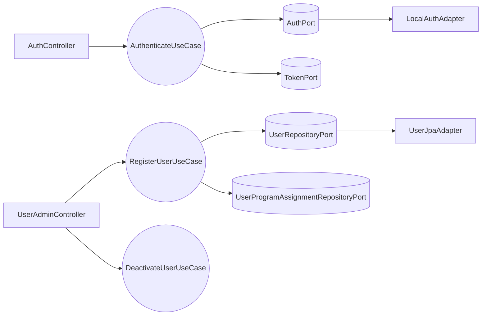

# Design Doc `DD-UC-001` — Autenticación y Gestión de Usuarios (MOD-AUTH)

> **Qué es**: documento de diseño del módulo **MOD-AUTH** para SIGESA v1.0. Describe **cómo** implementar autenticación JWT (FSD-UC-001) y gestión de usuarios por [JD] (FSD-UC-002) con arquitectura hexagonal estricta.
>
> **Relación con otros documentos**:
> - **Trazabilidad obligatoria al FSD**: `FSD-UC-001`, `FSD-UC-002`.
> - **Implementa** [`ADR-0003`](../adr/ADR-0003-authentication-adapter.md) (`AuthPort` + `LocalAuthAdapter` v1.0).
> - Complementa JWT/RBAC (ADR_007 baseline); no reemplaza el ADR.
> - Alimenta el **DTP** vía `@dtp-sync` tras implementar.

## 1. Objetivo y contexto

- **Qué resuelve este feature**: Identidad y acceso seguro para [CC], [TD] y [JD] mediante login JWT con claims `role` y `programScope`; registro de usuarios por [JD] con cuenta **INACTIVA** hasta primer acceso; revocación que conserva historial de auditoría. Prerrequisito de MOD-PROCESS, MOD-EVIDENCE y MOD-DASH.
- **Caso(s) de uso del FSD que implementa**:
  - `FSD-UC-001` (Autenticación y sesión) — [`docs/product/uc/FSD-UC-001.md`](../product/uc/FSD-UC-001.md)
  - `FSD-UC-002` (Gestión de usuarios [JD]) — [`docs/product/uc/FSD-UC-002.md`](../product/uc/FSD-UC-002.md)
- **Alcance**:
  | Incluido | Excluido (v1.0) |
  |---|---|
  | `POST /api/v1/auth/login` con JWT (`role`, `programScope`) | `LdapAuthAdapter` (v1.1) |
  | `POST /api/v1/admin/users` ([JD]) | SSO / OIDC |
  | `PATCH /api/v1/admin/users/{id}/deactivate` | Multi-rol por usuario |
  | Entidad `user_program_assignment` (FSD-BR-09) | Frontend `/login` |
  | Activación INACTIVE→ACTIVE en primer login | Recuperación de contraseña |
  | 401 genérico sin revelar existencia (A1 UC-001) | Blocklist refresh token (opcional) |
  | Validación `@umss.edu.bo` (FSD-BR-12) | UC-017 completo (stub `AuditLogPort`) |
  | Columnas `failed_attempts`/`locked_until` en DDL (reservadas) | Bloqueo por intentos / `429 AUTH_LOCKED` (v1.1) |

## 2. Diseño (el "cómo") `[humano+máquina]`

- **Enfoque elegido**: Módulo hexagonal bajo `com.umss.sigesa` (dominio, `application.service.auth`, adaptadores `adapter.in`/`adapter.out`). **Dominio y aplicación sin dependencias de Spring/JPA.** Spring Security y JPA solo en adaptadores de entrada/salida. Credenciales vía `AuthPort` → `LocalAuthAdapter` (ADR-0003).

- **Componentes tocados** (capas hexagonales):

  | Capa | Componentes |
  |---|---|
  | **Dominio** | `AppUser`, `Role`, `UserStatus`, `UserProgramAssignment`, `Email`, `ProgramScope`, excepciones |
  | **Aplicación** | `AuthenticateUseCase`, `RegisterUserUseCase`, `DeactivateUserUseCase` |
  | **Puertos out** | `AuthPort`, `UserRepositoryPort`, `UserProgramAssignmentRepositoryPort`, `TokenPort`, `AuditLogPort` |
  | **Adaptadores in** | `AuthController`, `UserAdminController`, `JwtAuthenticationFilter`, `SecurityConfig` |
  | **Adaptadores out** | `LocalAuthAdapter`, `UserJpaAdapter`, `UserProgramAssignmentJpaAdapter`, `JwtTokenAdapter` |

- **Reglas de dominio**:
  1. Un usuario = un rol (`CC`, `TD`, `JD`).
  2. **`AppUser` sin `programId` plano**; alcance en **`UserProgramAssignment`**.
  3. `UserStatus`: `INACTIVE` → `ACTIVE` (primer login) → `DEACTIVATED` (revocación).
  4. Login A1: **todo** fallo de autenticación en `POST /auth/login` (usuario inexistente, password incorrecto/vacío, `DEACTIVATED`, email vacío o dominio ≠ `@umss.edu.bo`) → mismo `401 AUTH_INVALID_CREDENTIALS`. Login **no** usa `@Valid` en DTO; validación en `Email.forLogin()` + `AuthenticateService`.
  5. Registro/admin: dominio email inválido → `422 INVALID_EMAIL_DOMAIN`; email duplicado → `409 EMAIL_ALREADY_REGISTERED` (mensaje genérico, sin revelar el valor).
  6. Login A2: sin rol → `403`.
  7. Revocación A1 UC-002: soft deactivate + `revoked_at` en asignaciones; **sin DELETE** de usuario ni auditoría.
  8. **Perímetro JWT v1.0:** todo `/api/v1/**` excepto `POST /auth/login` exige `Authorization: Bearer`. Contraseña temporal en alta se entrega por **canal offline** (no en response API v1.0).

- **Contratos y tipos**:

  ```java
  public interface AuthPort {
      Optional<AuthenticatedIdentity> authenticate(Email email, char[] rawPassword);
  }

  public record LoginRequest(String email, String password) {}
  public record LoginResponse(String accessToken, long expiresIn, String role, List<UUID> programScope) {}
  public record RegisterUserRequest(String email, String role, UUID programId) {}
  public record RegisterUserResponse(UUID userId, String status) {}
  ```

  **JWT claims**: `sub` (userId), `email`, `role`, `programScope[]`, `exp`, `iat`.

  **DDL**:

  ```sql
  CREATE TABLE app_user (
      id UUID PRIMARY KEY,
      email VARCHAR(150) NOT NULL UNIQUE,
      password_hash VARCHAR(255) NOT NULL,
      role VARCHAR(10) NOT NULL CHECK (role IN ('CC','TD','JD')),
      status VARCHAR(15) NOT NULL CHECK (status IN ('INACTIVE','ACTIVE','DEACTIVATED')),
      failed_attempts INT NOT NULL DEFAULT 0,
      locked_until TIMESTAMP,
      created_at TIMESTAMP NOT NULL DEFAULT CURRENT_TIMESTAMP,
      updated_at TIMESTAMP NOT NULL DEFAULT CURRENT_TIMESTAMP,
      CONSTRAINT chk_email_umss CHECK (email LIKE '%@umss.edu.bo')
  );

  CREATE TABLE user_program_assignment (
      id UUID PRIMARY KEY,
      user_id UUID NOT NULL REFERENCES app_user(id),
      program_id UUID NOT NULL,
      assigned_at TIMESTAMP NOT NULL DEFAULT CURRENT_TIMESTAMP,
      revoked_at TIMESTAMP
  );
  CREATE UNIQUE INDEX uk_upa_active ON user_program_assignment(user_id, program_id) WHERE revoked_at IS NULL;
  ```

- **API REST** ([`api_contracts.md`](../product/api_contracts.md)):

  | Método | Ruta | UC | Rol |
  |---|---|---|---|
  | POST | `/api/v1/auth/login` | FSD-UC-001 | público |
  | POST | `/api/v1/admin/users` | FSD-UC-002 | `[JD]` |
  | PATCH | `/api/v1/admin/users/{id}/deactivate` | FSD-UC-002 | `[JD]` |

- **Diagrama**:



## 3. Alternativas consideradas

| Alternativa | Pros | Contras | ¿Elegida? |
|---|---|---|---|
| **A. `AuthPort` + `LocalAuthAdapter`; Spring Security solo en adaptador in** | Cumple ADR-0003; dominio testeable; LDAP = nuevo adaptador | Filtro JWT + lógica en use case | **sí** |
| **B. Acoplar auth a `AuthenticationManager` / `UserDetailsService` en aplicación** | Menos clases | Acopla dominio a Spring; refactor costoso v1.1 | **no** |
| **C. `@Service` Spring en casos de uso** | Prototipo rápido | Rompe hexagonal estricta | **no** |
| **D. JWT en controlador sin `TokenPort`** | Menos interfaces | Duplicación; difícil rotar TTL | **no** |

**Conclusión ADR-0003**: **No requiere ADR nuevo.** La alternativa A implementa la decisión ya aceptada en ADR-0003. Spring Security queda en el **perímetro** (filtro, `@PreAuthorize`); verificación de credenciales detrás de `AuthPort`.

> Cambio de contrato `AuthPort` o abandono del patrón adapter → delta + ADR antes de merge.

## 4. Impacto en las specs vivas `[máquina]`

| Artefacto vivo | Cambio | ¿Delta vs DTI vFinal? | Sync |
|---|---|---|---|
| `docs/product/uc/FSD-UC-001.md` | Estado → **Hecho** | no | `@dtp-sync` 2026-06-22 |
| `docs/product/uc/FSD-UC-002.md` | Estado → **Hecho** | no | `@dtp-sync` 2026-06-22 |
| `docs/product/03_prd/PRD.md` | US-001/002/003 → **Hecho backend** | no | `@dtp-sync` 2026-06-22 |
| `docs/product/api_contracts.md` | Códigos 401/409/204 MOD-AUTH; campo `error` global | no | sync 2026-06-23 |
| `docs/product/DTP.md` | §A.1, §A.3, §B.1 MOD-AUTH | no | `@dtp-sync` 2026-06-22 |
| `docs/product/modelo_datos.md` | `user_program_assignment` en §6 | no | `@dtp-sync` 2026-06-22 |
| `docs/product/diagramas/D-SEQ-001-auth-jwt.mmd` | A1 → 401; activación INACTIVE | no | sync 2026-06-23 |
| `docs/product/diagramas/MAR-SEQ-001-autenticacion-jwt.mmd` | A1 → 401; sin AUTH_LOCKED v1.0 | no | sync 2026-06-23 |
| `docs/product/reglas_negocio.md` | FSD-BR-12 login A1 → 401 | no | sync 2026-06-23 |
| `docs/adr/ADR-0003-authentication-adapter.md` | ADR vivo MOD-AUTH | no | sync 2026-06-23 |
| `docs/product/FSD.md` | UC-001/002 → **Hecho** | no | `@dtp-sync` 2026-06-22 |

> **Recordatorio**: `docs/baseline/` **no se toca**.

## 5. Prompts usados `[máquina]`

| Prompt | Tarea | Artefacto generado |
|---|---|---|
| `PR-IMPL-004` | Implementación MOD-AUTH (hexagonal, JWT, user_program_assignment) | `src/.../auth/**`, tests, DDL |

> **Paso 3 (README):** `PR-IMPL-004` generado vía [`@sigesa-prompt-contract-architect`](../../.cursor/skills/sigesa-prompt-contract-architect/SKILL.md), **no** dentro del flujo `@feature-design-doc`. Ver [`PR-IMPL-004`](../prompts/impl/PR-IMPL-004.md). Tras ejecutar (Paso 4): `@save-prompt-mapping PR-IMPL-004` → `@dtp-sync` (Paso 6).

## 6. Plan de pruebas y evals

Derivado de Gherkin FSD-UC-001 y FSD-UC-002.

### Resultado obtenido (2026-06-22)

| Capa | Clase de test | Escenarios Gherkin cubiertos | Estado |
|---|---|---|---|
| **Unit** | `AuthenticateServiceTest` | UC-001 login OK [CC]/[JD]; A1 401 genérico; A2 403; INACTIVE→ACTIVE | implementado |
| **Unit** | `RegisterUserServiceTest` | UC-002 alta [CC]/[TD]/[JD] INACTIVE; assignment; FSD-BR-12; scope/rol | implementado |
| **Unit** | `DeactivateUserServiceTest` | UC-002 A1 revocación + audit | implementado |
| **Unit** | `LocalAuthAdapterTest` | Argon2 verify OK/KO; DEACTIVATED; user missing | implementado |
| **Integración servicios** | `ModAuthServiceIntegrationTest` | UC-001 login + A1; UC-002 alta + A1 revocación (sin Spring/BD) | implementado |
| **Integración HTTP** | `AuthControllerTest` | UC-001 200 JWT; A1 body idéntico | implementado |
| **Integración HTTP** | `UserAdminControllerTest` | UC-002 POST [JD] 201; 401/403 roles | implementado |
| **Integración HTTP** | `JwtAuthenticationFilterTest` | UC-001 E3 / US-003 → 401 | implementado |
| **Integración HTTP** | `AuthenticatedApiSmokeTest` | Perímetro JWT `/dashboard/kpis` y `/processes`; A1 dominio/vacíos en login | implementado |
| **Integración JPA** | `UserProgramAssignmentRepositoryTest` | FK; revoke soft; historial preservado | implementado |

> **Nota de nombres:** `AuthenticateService` ≡ AuthenticationService del dominio; `RegisterUserService` ≡ CreateUserService (caso de uso `RegisterUserUseCase`).

### Mapeo Gherkin → tests

| Escenario FSD | Test(s) |
|---|---|
| UC-001: Inicio de sesión exitoso con rol | `AuthenticateServiceTest.loginExitoso*`; `ModAuthServiceIntegrationTest.fsdUc001_loginExitoso*`; `AuthControllerTest.login_returnsJwtOnSuccess` |
| UC-001: Credenciales inválidas (A1) | `AuthenticateServiceTest.credencialesInvalidas*`; `AuthenticateServiceTest.credencialesInvalidas_emailNoUmss`; `ModAuthServiceIntegrationTest.fsdUc001_*`; `AuthControllerTest.login_invalidCredentials*`; `AuthenticatedApiSmokeTest.loginInvalidEmailDomainReturns401` |
| UC-001 E3 / US-003: Sin autenticación | `JwtAuthenticationFilterTest.sensitiveActionWithoutTokenReturns401` |
| UC-002: Alta con rol | `RegisterUserServiceTest.alta*`; `RegisterUserServiceTest.emailDuplicado*`; `ModAuthServiceIntegrationTest.fsdUc002_alta*`; `UserAdminControllerTest.register_withJdRole*` |
| UC-002 A1: Revocación | `DeactivateUserServiceTest`; `ModAuthServiceIntegrationTest.fsdUc002_revocacion*` |

### JaCoCo (agents.md)

Regla en `pom.xml` — umbral **≥ 90% líneas** en:

- `com.umss.sigesa.application.service.auth.AuthenticateService`
- `com.umss.sigesa.application.service.auth.RegisterUserService`
- `com.umss.sigesa.application.service.auth.DeactivateUserService`

| Clase | Cobertura verificada | Comando |
|---|---|---|
| `AuthenticateService` | pendiente — requiere `JAVA_HOME` + `mvn verify` local | `mvn verify` |
| `RegisterUserService` | pendiente — requiere `JAVA_HOME` + `mvn verify` local | `mvn verify` |
| `DeactivateUserService` | pendiente — requiere `JAVA_HOME` + `mvn verify` local | `mvn verify` |

Reporte esperado: `target/site/jacoco/index.html` tras `mvn verify`.

### Detalle por capa (referencia)

- **Unit** (JUnit 5 + Mockito, sin BD/HTTP/Spring):
  - `AuthenticateServiceTest`: login OK [CC]/[JD] con `programScope`; 401 genérico A1; 403 A2; INACTIVE→ACTIVE; audit `logLogin`.
  - `RegisterUserServiceTest`: alta [CC] → INACTIVE + assignment; [TD]/[JD] sin assignment; email no `@umss.edu.bo`; [CC] sin `programId`; rol inválido/vacío.
  - `DeactivateUserServiceTest`: DEACTIVATED + `revokeAllActiveByUserId`; audit `logUserDeactivated`.
  - `LocalAuthAdapterTest`: password OK/KO; DEACTIVATED; usuario inexistente.

- **Integración servicios** (`ModAuthServiceIntegrationTest` + `support/*` in-memory):
  - Flujos end-to-end Authenticate + Register + Deactivate con puertos fake.

- **Integración HTTP / JPA**: ver tabla «Resultado obtenido».

- **Evals de IA**: N/A.

## 7. Definition of Done (checklist)

### Cumplido

- [x] **`fsd_uc` declarado y enlazado** — frontmatter: `FSD-UC-001`, `FSD-UC-002`; enlaces en §1.
- [x] **Diseño (§2) y alternativas (§3) documentados** — hexagonal, reglas de dominio, DDL, API, diagrama.
- [x] **ADR-0003 referenciado** — `AuthPort` + `LocalAuthAdapter`; sin ADR adicional requerido (§3).
- [x] **§4 Impacto en specs vivas registrado** — tabla §4 con columnas Sync; `@dtp-sync` 2026-06-22 aplicado a DTP, FSD, `api_contracts`, `modelo_datos`.
- [x] **Prompt(s) en `docs/prompts/impl/`** — `PR-IMPL-004` presente.
- [x] **`PROMPT_MAPPING.md` registrado** — PM-001…PM-007 (tabla resumen + cuerpos PM-006, PM-007).
- [x] **Tests/evals (§6) implementados** — unit, integración servicios, HTTP, JPA, smoke JWT (`AuthenticatedApiSmokeTest`).
- [x] **DTP actualizado vía `@dtp-sync`** — `docs/product/DTP.md` §A.1, §A.2, §A.3, §B.1 (2026-06-22).

- [x] **PRD vivo (`docs/product/03_prd/PRD.md`)** — US-001/002/003 marcadas **Hecho backend** (2026-06-22); frontend `/login` fuera de alcance MOD-AUTH v1.0.

### Pendiente (acción manual o verificación)

- [ ] **JaCoCo ≥ 90% verificado** — ejecutar `.\mvnw.cmd verify` con JDK 21; registrar % real en §6 (tabla JaCoCo). *Bloqueante AGENTS.md.*
- [ ] **PR con trazabilidad completa** — abrir PR `feature/auth-mod-auth` → `main` con `PR-IMPL-004`, PM-001…PM-007, commits `5cd14df`…`f38976b`, breaking change JWT (DTP §A.2 #1). Plantilla en descripción del PR (ver chat / README).

### Cumplido (infra / config)

- [x] **Integración Flyway (prod)** — `flyway-core` en `pom.xml`; `application-prod.yaml` (`spring.flyway.enabled=true`, `ddl-auto: validate`); dev/test: Flyway off + `AuthSchemaInitializer` (`@Profile("!prod")`).

### Diferido v1.1 (no bloquea DoD MOD-AUTH)

- [ ] **`AuditLogPort` real (UC-017 / MOD-AUD)** — v1.0 usa `NoOpAuditLogAdapter` (§1 alcance excluido). Sustituir al implementar auditoría persistente.
