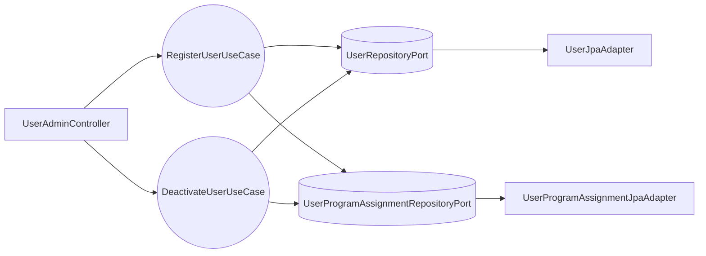

# Design Doc `DD-UC-002` — Gestión de usuarios [JD] (MOD-AUTH)

> **Qué es**: documento de diseño de **FSD-UC-002** para SIGESA v1.0. Describe **cómo** implementar alta y revocación de usuarios internos por [JD], modelo de identidad, roles y asignación de alcance por carrera, con arquitectura hexagonal estricta.
>
> **Relación con otros documentos**:
> - **Trazabilidad obligatoria al FSD**: [`FSD-UC-002`](../product/uc/FSD-UC-002.md).
> - **Modelo de identidad** consumido por login en [`DD-UC-001`](./DD-UC-001.md) vía `AuthPort` / `LocalAuthAdapter`.
> - Alimenta el **DTP** vía `@dtp-sync` tras implementar.

## Dependencias

- Este DD es **dueño** del modelo `AppUser`, catálogo de roles (`CC`, `TD`, `JD`), `UserStatus`, `Email` (validación admin), `UserProgramAssignment`, DDL `app_user` / `user_program_assignment` y puertos `UserRepositoryPort` / `UserProgramAssignmentRepositoryPort`.
- [`DD-UC-001`](./DD-UC-001.md) **consume** este modelo para login, emisión JWT y activación `INACTIVE`→`ACTIVE` en primer acceso; no redefine entidades ni tablas.
- Los endpoints admin exigen sesión JWT emitida por [`DD-UC-001`](./DD-UC-001.md) y rol `[JD]` en `SecurityConfig`.

## 1. Objetivo y contexto

- **Qué resuelve este feature**: Registro de usuarios internos por [JD] con cuenta **INACTIVE** hasta primer acceso; asignación de alcance por carrera (`user_program_assignment`); revocación soft que conserva historial de auditoría. Parte del módulo MOD-AUTH.
- **Caso de uso del FSD que implementa**:
  - `FSD-UC-002` (Gestión de usuarios [JD]) — [`docs/product/uc/FSD-UC-002.md`](../product/uc/FSD-UC-002.md)
- **Alcance**:
  | Incluido | Excluido (v1.0) |
  |---|---|
  | `POST /api/v1/admin/users` ([JD]) | Multi-rol por usuario |
  | `PATCH /api/v1/admin/users/{id}/deactivate` ([JD]) | Frontend `/admin/users` |
  | Entidad `user_program_assignment` (FSD-BR-09) | Recuperación de contraseña |
  | Modelo `AppUser`, `Role`, `UserStatus`, `Email` | UC-017 completo (stub `AuditLogPort`) |
  | Cuenta **INACTIVE** hasta primer login | `DELETE` físico de usuario o historial |
  | Validación `@umss.edu.bo` en registro (FSD-BR-12) | LDAP / SSO (v1.1) |
  | Columnas `failed_attempts`/`locked_until` en DDL (reservadas) | Bloqueo por intentos / `429 AUTH_LOCKED` (v1.1) |
  | Contraseña temporal generada en servidor; entrega **offline** | Password temporal en response API v1.0 |

## 2. Diseño (el "cómo") `[humano+máquina]`

- **Enfoque elegido**: Casos de uso de administración bajo `com.umss.sigesa.application.service.auth` (`RegisterUserService`, `DeactivateUserService`). **Dominio y aplicación sin dependencias de Spring/JPA.** JPA solo en adaptadores de salida.

- **Componentes tocados** (capas hexagonales):

  | Capa | Componentes |
  |---|---|
  | **Dominio** | `AppUser`, `Role`, `UserStatus`, `UserProgramAssignment`, `Email`, `ProgramScope`, excepciones (`DuplicateEmailException`, `InvalidEmailDomainException`, `InvalidScopeException`, `InvalidRoleException`, `UserNotFoundException`) |
  | **Aplicación** | `RegisterUserUseCase`, `DeactivateUserUseCase` |
  | **Puertos out** | `UserRepositoryPort`, `UserProgramAssignmentRepositoryPort`, `AuditLogPort` (stub `logUserRegistered`, `logUserDeactivated`) |
  | **Adaptadores in** | `UserAdminController` |
  | **Adaptadores out** | `UserJpaAdapter`, `UserProgramAssignmentJpaAdapter`, `NoOpAuditLogAdapter` |

- **Reglas de dominio (UC-002)**:
  1. Un usuario = un rol (`CC`, `TD`, `JD`).
  2. **`AppUser` sin `programId` plano**; alcance en **`UserProgramAssignment`** (FSD-BR-09).
  3. `UserStatus`: `INACTIVE` → `ACTIVE` (primer login, ver [`DD-UC-001`](./DD-UC-001.md)) → `DEACTIVATED` (revocación).
  4. Registro/admin: dominio email inválido → `422 INVALID_EMAIL_DOMAIN`; email duplicado → `409 EMAIL_ALREADY_REGISTERED` (mensaje genérico, sin revelar el valor).
  5. Revocación A1 UC-002: soft deactivate + `revoked_at` en asignaciones activas; **sin DELETE** de usuario ni auditoría.
  6. `[CC]` requiere `programId` en registro; `[TD]`/`[JD]` no.
  7. Contraseña temporal en alta se genera en servidor y se entrega por **canal offline** (no en response API v1.0).

- **Contratos y tipos**:

  ```java
  public record RegisterUserRequest(String email, String role, UUID programId) {}
  public record RegisterUserResponse(UUID userId, String status) {}
  ```

  **DDL** (dueño de este DD):

  ```sql
  CREATE TABLE app_user (
      id UUID PRIMARY KEY,
      email VARCHAR(150) NOT NULL UNIQUE,
      password_hash VARCHAR(255) NOT NULL,
      role VARCHAR(10) NOT NULL CHECK (role IN ('CC','TD','JD')),
      status VARCHAR(15) NOT NULL CHECK (status IN ('INACTIVE','ACTIVE','DEACTIVATED')),
      failed_attempts INT NOT NULL DEFAULT 0,
      locked_until TIMESTAMP,
      created_at TIMESTAMP NOT NULL DEFAULT CURRENT_TIMESTAMP,
      updated_at TIMESTAMP NOT NULL DEFAULT CURRENT_TIMESTAMP,
      CONSTRAINT chk_email_umss CHECK (email LIKE '%@umss.edu.bo')
  );

  CREATE TABLE user_program_assignment (
      id UUID PRIMARY KEY,
      user_id UUID NOT NULL REFERENCES app_user(id),
      program_id UUID NOT NULL,
      assigned_at TIMESTAMP NOT NULL DEFAULT CURRENT_TIMESTAMP,
      revoked_at TIMESTAMP
  );
  CREATE UNIQUE INDEX uk_upa_active ON user_program_assignment(user_id, program_id) WHERE revoked_at IS NULL;
  ```

- **API REST** ([`api_contracts.md`](../product/api_contracts.md)):

  | Método | Ruta | UC | Rol |
  |---|---|---|---|
  | POST | `/api/v1/admin/users` | FSD-UC-002 | `[JD]` |
  | PATCH | `/api/v1/admin/users/{id}/deactivate` | FSD-UC-002 | `[JD]` |

- **Diagrama**:



## 3. Alternativas consideradas

| Alternativa | Pros | Contras | ¿Elegida? |
|---|---|---|---|
| **A. Alcance en `UserProgramAssignment` (tabla separada)** | Cumple FSD-BR-09; historial con `revoked_at` | Más joins que campo plano | **sí** |
| **B. `programId` plano en `AppUser`** | Menos tablas | No soporta historial ni multi-asignación futura | **no** |
| **C. Revocación con DELETE físico** | Simplicidad | Viola conservación de auditoría UC-002 A1 | **no** |
| **D. Password temporal en response JSON** | UX inmediata | Exposición en tránsito; delta DTP §A.2 #2 | **no** |

## 4. Impacto en las specs vivas `[máquina]`

| Artefacto vivo | Cambio | ¿Delta vs DTI vFinal? | Sync |
|---|---|---|---|
| `docs/product/uc/FSD-UC-002.md` | Estado → **Hecho** | no | `@dtp-sync` 2026-06-22 |
| `docs/product/03_prd/PRD.md` | US-002 → **Hecho backend** | no | `@dtp-sync` 2026-06-22 |
| `docs/product/api_contracts.md` | Admin users; códigos 409/422/204 | no | sync 2026-06-23 |
| `docs/product/DTP.md` | §A.2 #2 password offline; §A.3 UC-002; §B.1 admin users | no | `@dtp-sync` 2026-06-22 |
| `docs/product/modelo_datos.md` | `app_user`, `user_program_assignment` en §6 | no | `@dtp-sync` 2026-06-22 |
| `docs/product/FSD.md` | UC-002 → **Hecho**; enlace a `DD-UC-002` | no | sync 2026-06-23 |

> **Recordatorio**: `docs/baseline/` **no se toca**.

## 5. Prompts usados `[máquina]`

| Prompt | Tarea | Artefacto generado |
|---|---|---|
| `PR-IMPL-002` | Implementación admin users, assignment, DDL (histórico unificado: [`PR-IMPL-004`](../prompts/impl/archive/PR-IMPL-004.md)) | `RegisterUserService`, `DeactivateUserService`, `UserAdminController`, tests UC-002 |

> Ver [`PR-IMPL-002`](../prompts/impl/PR-IMPL-002.md). Login/JWT: [`PR-IMPL-001`](../prompts/impl/PR-IMPL-001.md).

## 6. Plan de pruebas y evals

Derivado de Gherkin FSD-UC-002.

### Resultado obtenido (2026-06-22)

| Capa | Clase de test | Escenarios Gherkin cubiertos | Estado |
|---|---|---|---|
| **Unit** | `RegisterUserServiceTest` | UC-002 alta [CC]/[TD]/[JD] INACTIVE; assignment; FSD-BR-12; scope/rol | implementado |
| **Unit** | `DeactivateUserServiceTest` | UC-002 A1 revocación + audit | implementado |
| **Integración servicios** | `ModAuthServiceIntegrationTest` | UC-002 alta + A1 revocación (sin Spring/BD) | implementado |
| **Integración HTTP** | `UserAdminControllerTest` | UC-002 POST [JD] 201; 401/403 roles | implementado |
| **Integración JPA** | `UserProgramAssignmentRepositoryTest` | FK; revoke soft; historial preservado | implementado |

> **Nota de nombres:** `RegisterUserService` ≡ CreateUserService (caso de uso `RegisterUserUseCase`).

### Mapeo Gherkin → tests

| Escenario FSD | Test(s) |
|---|---|
| UC-002: Alta con rol | `RegisterUserServiceTest.alta*`; `RegisterUserServiceTest.emailDuplicado*`; `ModAuthServiceIntegrationTest.fsdUc002_alta*`; `UserAdminControllerTest.register_withJdRole*` |
| UC-002 A1: Revocación | `DeactivateUserServiceTest`; `ModAuthServiceIntegrationTest.fsdUc002_revocacion*` |

### JaCoCo (agents.md)

Regla en `pom.xml` — umbral **≥ 90% líneas** en:

- `com.umss.sigesa.application.service.auth.RegisterUserService`
- `com.umss.sigesa.application.service.auth.DeactivateUserService`

| Clase | Cobertura verificada | Comando |
|---|---|---|
| `RegisterUserService` | pendiente — requiere `JAVA_HOME` + `mvn verify` local | `mvn verify` |
| `DeactivateUserService` | pendiente — requiere `JAVA_HOME` + `mvn verify` local | `mvn verify` |

### Detalle por capa (referencia)

- **Unit** (JUnit 5 + Mockito, sin BD/HTTP/Spring):
  - `RegisterUserServiceTest`: alta [CC] → INACTIVE + assignment; [TD]/[JD] sin assignment; email no `@umss.edu.bo`; [CC] sin `programId`; rol inválido/vacío; email duplicado.
  - `DeactivateUserServiceTest`: DEACTIVATED + `revokeAllActiveByUserId`; audit `logUserDeactivated`.

- **Integración servicios** (`ModAuthServiceIntegrationTest` + `support/*` in-memory):
  - Flujos Register + Deactivate con puertos fake.

- **Evals de IA**: N/A.

## 7. Definition of Done (checklist)

### Cumplido

- [x] **`fsd_uc` declarado y enlazado** — frontmatter: `FSD-UC-002`; enlace en §1.
- [x] **Diseño (§2) y alternativas (§3) documentados** — hexagonal, reglas de dominio, DDL, API, diagrama.
- [x] **§4 Impacto en specs vivas registrado** — tabla §4; `@dtp-sync` 2026-06-22.
- [x] **Prompt(s) en `docs/prompts/impl/`** — `PR-IMPL-002` presente.
- [x] **Tests/evals (§6) implementados** — unit, integración servicios, HTTP, JPA UC-002.
- [x] **Integración Flyway (prod)** — `flyway-core` en `pom.xml`; `application-prod.yaml`; dev/test: `AuthSchemaInitializer` (`@Profile("!prod")`).

### Pendiente (acción manual o verificación)

- [ ] **JaCoCo ≥ 90% verificado** — `RegisterUserService`, `DeactivateUserService`; `.\mvnw.cmd verify` con JDK 21.
- [ ] **PR con trazabilidad completa** — `FSD-UC-002` · `DD-UC-002` · `PR-IMPL-002`.

### Diferido v1.1 (no bloquea DoD UC-002)

- [ ] **`AuditLogPort` real (UC-017 / MOD-AUD)** — v1.0 usa `NoOpAuditLogAdapter` (§1 alcance excluido).
