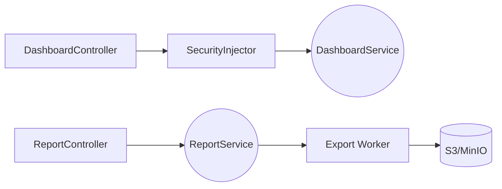

# Design Doc `DD-UC-004` — Reporting / Dashboard (MOD-DASH · MOD-REPORT)

> **Qué es**: diseño del módulo backend de paneles operativos y reportes para [CC], [TD] y [JD]. Arquitectura híbrida **sync** (KPIs/bandeja) + **async** (export Excel/PDF).
>
> **Trazabilidad FSD**: UC-011 Dashboard [CC] · UC-012 Bandeja [TD] · UC-013 Semáforo [JD] · UC-014 Reporte PDF.  
> **ADR:** [ADR-0015](../adr/ADR-0015-dashboard-sync-async-reporting.md).  
> **UI (AcredIA DS):** repo padre `sigesa-docs/figma/` — frames coordinator, technician inbox, jd-admin-dashboard.

## 1. Objetivo y contexto

- **Qué resuelve**: KPIs y tablas paginadas de baja latencia para dashboards; exportaciones pesadas (.xlsx) sin bloquear HTTP; RBAC obligatorio vía `SecurityInjector` sobre `FilterPayload` (FSD-BR-09, FSD-BR-14).
- **Casos de uso FSD**:
  - [`FSD-UC-011`](../product/uc/FSD-UC-011.md) — Dashboard [CC] · `GET /dashboard/coordinator`
  - [`FSD-UC-012`](../product/uc/FSD-UC-012.md) — Bandeja [TD] · `GET /dashboard/technician`
  - [`FSD-UC-013`](../product/uc/FSD-UC-013.md) — Semáforo [JD] · `GET /dashboard/executive`
  - [`FSD-UC-014`](../product/uc/FSD-UC-014.md) — PDF ejecutivo · `POST /reports/executive/pdf`
- **Alcance**:

| Incluido | Excluido (v1.0 / v1.1) |
|----------|-------------------------|
| `DashboardService` sync + cache Caffeine | Render UI / charts (frontend) |
| `ReportService` async + `ReportRun` | API-DASH-03 executive (MVP front fuera) |
| Excel export streaming (POI SXSSF) | CSV simple |
| `SecurityInjector` RBAC (JWT MOD-AUTH) | ETL / data warehouse |
| DTOs en controllers | Exponer entidades JPA |

### Alineación API (canónico vs código actual)

| ID | Ruta canónica | Implementación actual | Estado |
|----|---------------|----------------------|--------|
| API-DASH-01 | `GET /dashboard/coordinator` | `/dashboard/kpis` (provisional) | Drift — migrar |
| API-DASH-02 | `GET /dashboard/technician` | `/dashboard/data` (provisional) | Drift — migrar |
| API-DASH-03 | `GET /dashboard/executive` | — | v1.1 |
| API-REP-01 | `POST /reports/executive/pdf` | — | Pendiente |
| — | `POST /reports/{id}/export` | `ReportController` | Excel async |

## 2. Diseño (el "cómo") `[humano+máquina]`

- **Enfoque:** módulo `com.umss.sigesa.reports` con separación sync/async ([ADR-0015](../adr/ADR-0015-dashboard-sync-async-reporting.md)). Integración JWT: todo `/api/v1/**` autenticado (MOD-AUTH `DD-UC-001`).

- **Componentes**:

| Capa | Componentes |
|------|-------------|
| **Dominio** | `ReportDefinition`, `ReportRun`, `FilterPayload`, `ReportMetric` |
| **Persistencia** | `ReportDefinitionRepository`, `ReportRunRepository` (JSON vía `MapToJsonConverter`) |
| **Servicio sync** | `DashboardService` / `DashboardServiceImpl` |
| **Servicio async** | `ReportService` / `ReportServiceImpl` + worker Virtual Threads |
| **Seguridad** | `SecurityInjector` / `SimpleSecurityInjector` |
| **Web** | `DashboardController`, `ReportController` + DTOs |

- **DDL principal**:

```sql
CREATE TYPE report_run_status AS ENUM ('PENDING','PROCESSING','COMPLETED','FAILED');

CREATE TABLE report_definition (
  id BIGINT GENERATED ALWAYS AS IDENTITY PRIMARY KEY,
  codigo VARCHAR(100) NOT NULL UNIQUE,
  nombre VARCHAR(255) NOT NULL,
  audiences JSONB,
  filters_allowed JSONB,
  metrics JSONB,
  version INT DEFAULT 1,
  created_at TIMESTAMP NOT NULL DEFAULT CURRENT_TIMESTAMP,
  deleted_at TIMESTAMP
);

CREATE TABLE report_run (
  id BIGINT GENERATED ALWAYS AS IDENTITY PRIMARY KEY,
  report_definition_id BIGINT NOT NULL REFERENCES report_definition(id),
  params JSONB NOT NULL,
  status report_run_status NOT NULL DEFAULT 'PENDING',
  result_metadata JSONB,
  download_url VARCHAR(1000),
  created_by VARCHAR(100)
);
```

- **Contratos de servicio**:

```java
public interface DashboardService {
  List<ReportKpiDTO> getKpis(FilterPayload filter, Pageable pageable, String actor);
  Page<ReportDetailRowDTO> getPaginatedData(FilterPayload filter, Pageable pageable, String actor);
}

public interface ReportService {
  ReportRunResponse submitExport(Long definitionId, FilterPayload filter, String actor);
  ReportRunResponse getRun(Long runId, String actor);
}
```

- **API REST** ([`api_contracts.md`](../product/api_contracts.md)):

| Método | Ruta | UC | Rol |
|--------|------|-----|-----|
| GET | `/api/v1/dashboard/coordinator` | UC-011 | [CC] |
| GET | `/api/v1/dashboard/technician` | UC-012 | [TD] |
| GET | `/api/v1/dashboard/executive` | UC-013 | [JD] |
| POST | `/api/v1/reports/{id}/export` | UC-014 | según audiences |
| POST | `/api/v1/reports/executive/pdf` | UC-014 | [JD] |

- **Diagrama**:



## 3. Alternativas consideradas

| Alternativa | Pros | Contras | Elegida |
|-------------|------|---------|---------|
| A. Sync + async (ADR-0015) | Baja latencia; auditoría | Dos APIs | si |
| B. Todo vía ReportRun | Un pipeline | Latencia KPIs | no |
| C. Redis cache | Escala | Complejidad MVP | no |

## 4. Impacto en las specs vivas

| Artefacto | Cambio |
|-----------|--------|
| `docs/product/uc/FSD-UC-011` … `014` | Estado en progreso |
| `docs/product/DTP.md` | §B.2 MOD-DASH |
| `docs/product/api_contracts.md` | MOD-DASH drift nota |
| `docs/adr/ADR-0015` | Decisión sync/async |

## 5. Prompts usados

| Prompt | Artefacto |
|--------|-----------|
| `PR-IMPL-005` | `com.umss.sigesa.reports.*` |

## 6. Plan de pruebas

| ID | Escenario | UC | TC |
|----|-----------|-----|-----|
| T-DASH-01 | [CC] KPIs su carrera | 011 | TC-09a |
| T-DASH-02 | carrera ajena 403 | 011 | TC-09a |
| T-DASH-03 | bandeja [TD] | 012 | TC-09b |
| T-RPT-01 | export COMPLETED | 014 | TC-11 |

JaCoCo ≥ 90 %: `DashboardServiceImpl`, `ReportServiceImpl`.

## 7. Definition of Done

- [x] fsd_uc 011–014 enlazados
- [x] ADR-0015 + PR-IMPL-005
- [ ] JaCoCo 90 %
- [ ] API-DASH-01/02 canónicas
- [ ] DTP sync completo

## Anexo — Migración documental

| Legacy | Canónico |
|--------|----------|
| `design_docs/design_dashboard.md` | este archivo |
| `design_docs/base_design_system.md` | `docs/plantillas/BASE_DESIGN_SYSTEM_BACKEND.md` |
| `.cursor/prompts/reporting_dashboard.prompt.md` | `docs/prompts/impl/PR-IMPL-005.md` |
