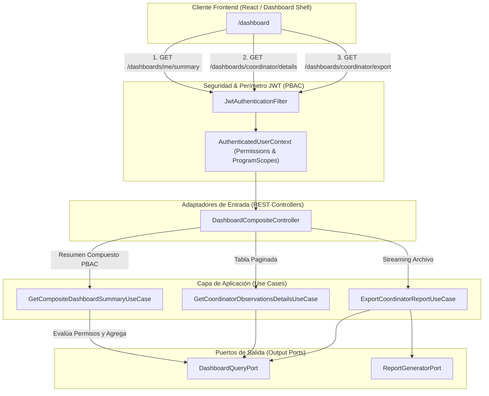

# Design Doc `DD-UC-011` — Dashboard Híbrido Compuesto por Permisos (PBAC)

> **Qué es**: Documento de diseño técnico exhaustivo para la implementación de la arquitectura híbrida de Dashboards en SIGESA. Define el patrón **Composite Summary por Permisos (PBAC)** para la consulta unificada de métricas/KPIs (`GET /dashboards/me/summary`) combinado con recursos modulares granularizados para registros detallados paginados y exportaciones binarias.
>
> **Relación con otros documentos**:
> - **Trazabilidad obligatoria al FSD**: [`FSD-UC-011`](../product/uc/FSD-UC-011.md).
> - **Gobernanza y Contrato de Prompt**: [`PR-CONTRACT-DD-DASHBOARD`](../prompts/prompt_contract_design_doc_dashboard.md).
> - **Arquitectura Hexagonal y Decisiones**: [`ADR_002_monolito_modular`](../baseline/05_dti/adrs/ADR_002_monolito_modular.md).
> - **Contratos de API del Producto**: [`api_contracts.md`](../product/api_contracts.md).

---

## 1. Objetivo y contexto

- **Qué resuelve este feature**: Evoluciona el esquema de dashboards hacia un enfoque **basado en permisos granulares (PBAC - Permission-Based Access Control)**. Permite que usuarios con múltiples roles (ej. un usuario que es Coordinador `[CC]` y además forma parte del Comité Técnico `[TD]`) obtengan la totalidad de sus métricas y KPIs consolidados en una **única petición HTTP** (`GET /api/v1/dashboards/me/summary`). A la vez, mantiene endpoints especializados para la lista detallada paginada de observaciones ordenadas por fecha límite ascendente y para la exportación de reportes en streaming.
- **Caso(s) de uso del FSD que implementa**: [`FSD-UC-011`](../product/uc/FSD-UC-011.md) (`Dashboard [CC] y observaciones`).
- **Alcance**:
  | Incluido | Excluido (v1.0) / Expansión Futura |
  |---|---|
  | Endpoint Compuesto de KPIs por Permisos (`GET /api/v1/dashboards/me/summary`). | Paginación unificada de dominios heterogéneos en una sola llamada (se mantiene modular por tipo de recurso). |
  | Aislamiento multitenant dinámico por `academic_program_id` y permisos en JWT. | Motores CQRS con brokers asíncronos distribuidos (se usan consultas optimizadas locales). |
  | Listado granular paginado con ordenamiento por `fechaLimite` ascendente (`/coordinator/details`). | Modificaciones a la máquina de estados fundamental de evidencias (`04_state_machine.md`). |
  | Exportación binaria en streaming (`xlsx`, `csv`, `pdf`) con `Content-Disposition`. | |

---

## 2. Diseño (el "cómo") `[humano+máquina]`

- **Enfoque elegido**: Arquitectura Híbrida (**Composite Summary Shell + Granular Widgets**). 
  1. El servicio `GetCompositeDashboardSummaryUseCase` inspecciona los permisos del contexto autenticado (`SecurityContext`). Evalúa dinámicamente qué secciones de datos construir (`coordinatorSection`, `technicianSection`, `executiveSection`), retornando solo aquellas autorizadas.
  2. Los servicios detallados (`GetCoordinatorObservationsDetailsUseCase` y `ExportCoordinatorReportUseCase`) se invocan bajo demanda para paginaciones y descargas de archivos.

- **Componentes tocados (capas hexagonales)**:

  | Capa | Componentes |
  |---|---|
  | **Dominio** | `CompositeDashboardSummary`, `CoordinatorKpiSection`, `TechnicianKpiSection`, `ObservationSummary`, `AcademicProgramId` |
  | **Aplicación** | `GetCompositeDashboardSummaryUseCase`, `GetCoordinatorObservationsDetailsUseCase`, `ExportCoordinatorReportUseCase` |
  | **Puertos out** | `DashboardQueryPort`, `ObservationRepositoryPort`, `ReportGeneratorPort` |
  | **Adaptadores in** | `DashboardCompositeController` (`/api/v1/dashboards/**`), `DashboardExceptionHandler` |
  | **Adaptadores out** | `JpaDashboardQueryAdapter`, `ApachePoiReportGeneratorAdapter`, `ITextPdfReportGeneratorAdapter` |

- **Diagrama de Arquitectura Híbrida Compuesta**:



---

### Especificación de Contratos API (Patrón Híbrido Compuesto)

#### 1. Endpoint Compuesto de KPIs por Permisos (PBAC Summary)
- **HTTP Method:** `GET`
- **Path:** `/api/v1/dashboards/me/summary`
- **Headers:** `Authorization: Bearer <token>`
- **Comportamiento Arquitectónico:** El backend verifica las autorizaciones granulares (`READ_CC_DASHBOARD`, `READ_TD_DASHBOARD`, `READ_JD_DASHBOARD`). Solo las secciones autorizadas se pueblan en el JSON; las no autorizadas o no asignadas se devuelven como `null`.
- **Response Schema (`200 OK`):**
```json
{
  "userId": "usr-8842-umss",
  "grantedPermissions": ["READ_CC_DASHBOARD", "READ_TD_DASHBOARD"],
  "coordinatorSection": {
    "programId": "3fa85f64-5717-4562-b3fc-2c963f66afa6",
    "programName": "Ingeniería de Sistemas",
    "totalIndicadores": 45,
    "porcentajeAvanceGlobal": 68.5,
    "evidenciasAprobadas": 120,
    "evidenciasRechazadas": 15,
    "observacionesPendientes": 8,
    "fasesAvance": [
      { "faseId": 1, "nombre": "Fase 1: Autoevaluación", "porcentaje": 100.0, "estado": "COMPLETADA" },
      { "faseId": 2, "nombre": "Fase 2: Verificación de Evidencias", "porcentaje": 65.0, "estado": "EN_PROCESO" }
    ],
    "cuellosDeBotella": [
      { "indicadorId": "IND-102", "codigoCriterio": "CRIT-3.1", "diasEstancado": 14 }
    ]
  },
  "technicianSection": {
    "evidenciasPendientesRevision": 12,
    "indicadoresAsignados": 18
  },
  "executiveSection": null
}
```

#### 2. Endpoint de Registros Detallados (Paginado)
- **HTTP Method:** `GET`
- **Path:** `/api/v1/dashboards/coordinator/details`
- **Headers:** `Authorization: Bearer <token>`
- **Query Params:** `page` (default `0`), `size` (default `10`), `sort` (default `fechaLimite,asc`), `faseId`, `estado`
- **Response Schema (`200 OK`):**
```json
{
  "content": [
    {
      "observacionId": "OBS-2026-089",
      "indicadorId": "IND-102",
      "codigoIndicador": "IND-3.1.2",
      "tituloIndicador": "Infraestructura de Laboratorios de Computación",
      "descripcion": "Evidencia incompleta: falta certificado de calibración de equipos.",
      "fechaEmision": "2026-06-10",
      "fechaLimite": "2026-07-01",
      "diasRestantes": 4,
      "estado": "PENDIENTE_SUBSANACION",
      "urlSubsanacion": "/coordinator/evidences/IND-102/subsanar"
    }
  ],
  "totalElements": 8,
  "totalPages": 1,
  "size": 10,
  "number": 0
}
```

#### 3. Endpoint de Descarga de Reporte Completo (Streaming Binary Export)
- **HTTP Method:** `GET`
- **Path:** `/api/v1/dashboards/coordinator/export`
- **Headers:** `Authorization: Bearer <token>`
- **Query Params:** `format` (`xlsx` | `csv` | `pdf`), `faseId`, `estado`
- **Response (`200 OK`):**
  - **Content-Disposition:** `attachment; filename="reporte_dashboard_coordinator_20260627_1759.xlsx"`
  - **Body:** Binary File Stream filtrado por el contexto de permisos y programa asignado.

---

## 3. Alternativas consideradas

| Alternativa | Pros | Contras | ¿Elegida? |
|-------------|------|---------|-----------|
| **A. Rutas Rígidas Aisladas por Rol (`/coordinator/kpis`)** | Separación estricta por rol. | Fuerza múltiples peticiones HTTP a usuarios multi-rol y dificulta dashboards consolidados. | **No** |
| **B. Endpoint Único Monolítico Total** | Una sola llamada para todo. | Consultas SQL pesadas, riesgo de colapso si una sección falla, imposibilidad de paginar listas mixtas. | **No** |
| **C. Arquitectura Híbrida PBAC (Composite Shell + Granular Widgets)** | **Resumen compuesto en 1 llamada**, renderizado dinámico según permisos, mantiene paginación y descargas eficientes. | Requiere lógica de ensamblado de secciones basadas en permisos en la capa de aplicación. | **Sí** |

---

## 4. Impacto en las specs vivas `[máquina]`

| Artefacto vivo | Cambio | ¿Delta vs DTI vFinal? |
|----------------|--------|-----------------------|
| `docs/product/FSD.md` (`FSD-UC-011`) | Actualizar a modelo híbrido compuesto por permisos (PBAC). | No |
| `docs/product/uc/FSD-UC-011.md` | Documentar el endpoint compuesto `GET /dashboards/me/summary` y endpoints detallados. | No |
| `docs/product/api_contracts.md` | Formalizar la suite híbrida (`API-DASH-01a` resumen compuesto PBAC, `01b` detalles, `01c` export). | Sí → Evolución de API living spec. |
| `docs/product/DTP.md` | Registrar el delta arquitectónico de la transición a PBAC en la sección A.2. | Sí |

---

## 5. Prompts usados `[máquina]`

| Prompt | Tarea | Artefacto generado |
|--------|-------|--------------------|
| `PR-IMPL-011` | Generación del controlador compuesto, evaluador de permisos PBAC, servicios de aplicación y DTOs híbridos. | `DashboardCompositeController.java`, services y tests. |

---

## 6. Plan de pruebas y evals

- **Unit Tests**:
  - `CompositeDashboardSummaryServiceTest`: Verificar que usuarios con permisos mixtos reciban ambas secciones pobladas y que usuarios con rol único reciban `null` en las secciones no autorizadas.
- **Integration Tests**:
  - `DashboardCompositeControllerIT`: Validar respuestas HTTP `200 OK` en `/dashboards/me/summary` evaluando diferentes tokens JWT con combinaciones de permisos.
- **E2E / Gherkin Validation**:
  - Escenario `Vista multi-permiso`: Verificar consolidación de KPIs en una sola respuesta HTTP sin fuga de datos entre programas no autorizados.

---

## 7. Definition of Done (checklist)

- [x] Arquitectura Híbrida Compuesta por Permisos (PBAC) formalizada en `DD-UC-011.md`.
- [x] Endpoint `GET /api/v1/dashboards/me/summary` especificado con estructura JSON condicional por permisos.
- [x] Recursos modulares para paginación y exportaciones en streaming definidos.
- [x] Impacto en specs vivas (`FSD.md`, `api_contracts.md`, `DTP.md`) documentado y sincronizado.
