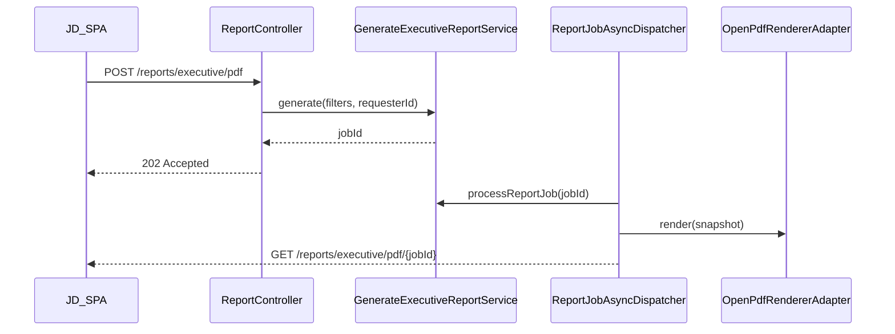

# DD-UC-014: Reporte ejecutivo PDF (MOD-REPORT)

## 1. Propósito y Objetivo

Implementar el módulo **MOD-REPORT** para que el actor **[JD]** genere reportes ejecutivos PDF desde el panel con filtros (`facultyId`, `programId`, `managementYear`). La generación es **asíncrona** (job + polling) con P95 ≤ 5 min (NFR-003). Solo **[JD]** puede solicitar reportes (**FSD-BR-14**).

---

## 2. Capa de Dominio (Core)

### Entidades / Value Objects

* `ReportJob`: job de generación con estados `PENDING → IN_PROGRESS → COMPLETED | FAILED`.
* `ExecutiveReportFilters`: `facultyId?`, `programId?`, `managementYear` (obligatorio).
* `ExecutiveReportSnapshot`: datos agregados para renderizar el PDF (programas, semáforos, conteos).
* `ReportJobStatus`: enum (`PENDING`, `IN_PROGRESS`, `COMPLETED`, `FAILED`).

### Excepciones de Dominio

* `ReportJobNotFoundException` → HTTP 404.
* `ReportAccessDeniedException` → HTTP 403 (job de otro solicitante).
* `ReportTemplateException` → job `FAILED` con código `REPORT_TEMPLATE`.

---

## 3. Puertos

### Inbound (Casos de Uso)

* `GenerateExecutiveReportUseCase`: encola job y devuelve `jobId`.
* `GetReportJobStatusUseCase`: consulta estado y URL de descarga.
* `ProcessReportJobUseCase`: worker interno — agrega datos, renderiza PDF, persiste artefacto.
* `DownloadReportArtifactUseCase`: devuelve bytes del PDF completado.

### Outbound

* `ReportJobRepositoryPort`: CRUD de jobs.
* `ExecutiveDataPort`: obtiene snapshot agregado según filtros (stub v1.0 hasta UC-013).
* `PdfRendererPort`: renderiza `ExecutiveReportSnapshot` → `byte[]`.
* `ReportArtifactStoragePort`: almacena/recupera PDF (filesystem v1.0; S3 v1.1).
* `AuditLogPort`: stub existente — registrar solicitud de reporte.

---

## 4. Flujo Asíncrono



---

## 5. Adaptadores REST

| Método | Ruta | Rol | Respuesta |
|--------|------|-----|-----------|
| POST | `/api/v1/reports/executive/pdf` | JD | 202 `{ jobId }` |
| GET | `/api/v1/reports/executive/pdf/{jobId}` | JD | 200 `{ status, downloadUrl? }` |
| GET | `/api/v1/reports/executive/pdf/{jobId}/download` | JD | 200 `application/pdf` |

---

## 6. DTOs (records)

```java
public record GenerateExecutiveReportRequest(
    UUID facultyId,
    UUID programId,
    @NotNull Integer managementYear
) {}

public record ReportJobAcceptedResponse(UUID jobId) {}

public record ReportJobStatusResponse(
    UUID jobId,
    String status,
    String downloadUrl,
    String errorCode
) {}
```

---

## 7. Persistencia

Tabla `report_job`:

| Columna | Tipo | Notas |
|---------|------|-------|
| id | UUID PK | |
| requester_id | UUID | FK lógica app_user |
| faculty_id | UUID nullable | filtro |
| program_id | UUID nullable | filtro |
| management_year | INT | filtro |
| status | VARCHAR | enum |
| artifact_key | VARCHAR nullable | ruta relativa en storage |
| error_code | VARCHAR nullable | ej. REPORT_TEMPLATE |
| created_at | TIMESTAMP | |
| completed_at | TIMESTAMP nullable | |

Artefactos PDF en `sigesa.report.storage-path` (default `./data/reports`), TTL gestionado en v1.1.

---

## 8. Reglas Duras

| ID | Regla |
|----|-------|
| R1 | Solo rol `[JD]` en endpoints `/reports/**` (FSD-BR-14). |
| R2 | Dominio y casos de uso sin imports Spring/JPA. |
| R3 | Controladores exponen solo DTOs `record`. |
| R4 | Generación PDF vía `PdfRendererPort` (OpenPDF en adaptador). |
| R5 | Job fallido no expone bytes parciales; estado `FAILED` + `errorCode`. |
| R6 | Solicitante solo accede a sus propios jobs. |

---

## 9. Plan de Pruebas

* **Unit:** `GenerateExecutiveReportService`, `ProcessReportJobService` (mock ports).
* **Integration:** `ReportJobJpaAdapter` con H2.
* **WebMvc:** `ReportController` — 202 al crear, 403 sin rol JD.
* **Gherkin:** escenario FSD-UC-014 — PDF con timestamp y filtros.

---

## 10. Integración con FSD-UC-013 (Panel semáforo)

MOD-DASH debe exponer **`ExecutiveDashboardQueryPort`** (`fetchExecutiveSnapshot`) alimentado por la misma proyección que `GET /api/v1/dashboard/executive` (`proj_executive_semaphore` en DTI async).

Cuando UC-013 registre ese bean:

1. `ExecutiveDataDashboardAdapter` (@Primary) reemplaza automáticamente a `ExecutiveDataStubAdapter`.
2. El PDF ejecutivo refleja semáforos reales sin duplicar lógica de agregación.

**Implementación pendiente UC-013:** `ExecutiveDashboardJpaAdapter implements ExecutiveDashboardQueryPort`.

---

## 11. Impacto en Specs Vivas

| Artefacto | Cambio |
|-----------|--------|
| `docs/product/DTP.md` | Dependencia OpenPDF; tabla `report_job`; endpoints MOD-REPORT |
| `docs/product/FSD.md` | UC-014 → En Curso |
