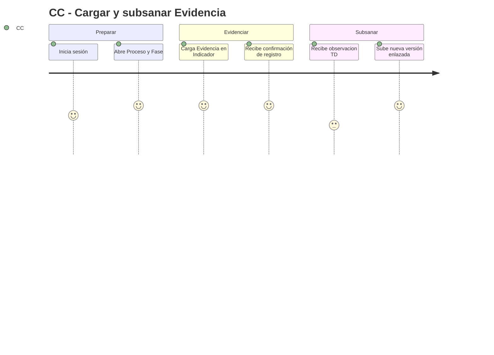
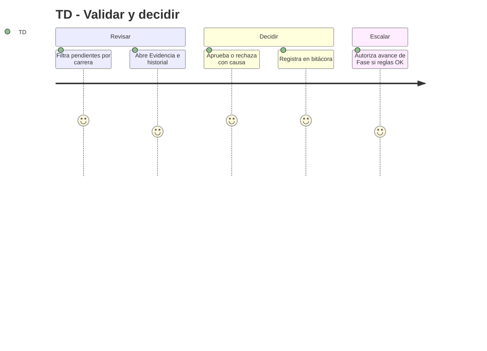
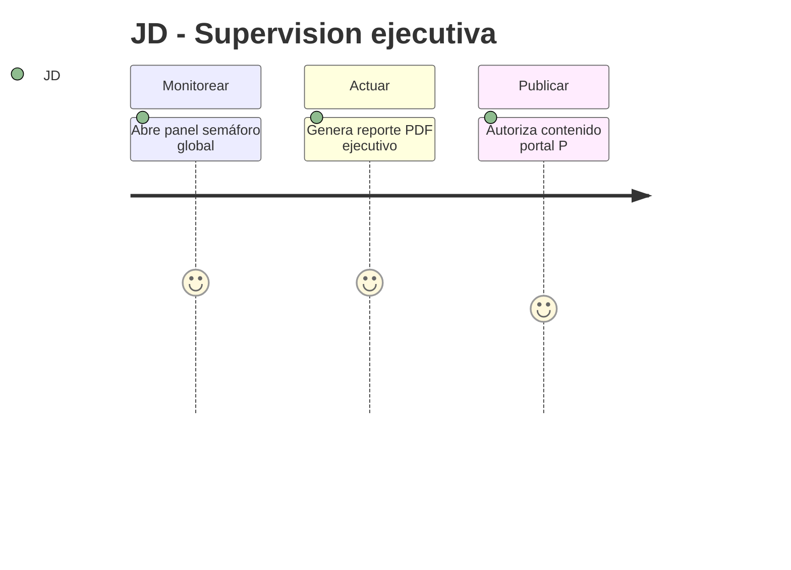

# Product Requirements Document (PRD) — SIGESA / AcredIA

## Control de versión del documento

| Campo | Valor |
|-------|-------|
| **Versión** | **Dorada v1.0** |
| **Última actualización (timestamp)** | `2026-05-16T15:44:47-04:00` |
| **Resumen de cambios (esta versión)** | Enlace a roadmap canónico [`ROADMAP.md`](ROADMAP.md). Primera Versión Dorada del PRD: consolidación desde BRD Dorada v2.1, MRD Dorada v1.1 y aportes `team/*/docs/03_prd/`. Incluye **24 user stories** con Gherkin (camino feliz y triste), **28 requisitos funcionales**, **16 NFRs**, constitution, journeys Mermaid, MoSCoW, RICE y trazabilidad BRD↔MRD↔FSD. Producto = **sistema de automatización** de acreditación (no ERP). |
| **BRD de referencia** | `docs/01_brd/BRD.md` — Dorada v2.1 |
| **MRD de referencia** | `docs/02_mrd/MRD.md` — Dorada v1.1 |
| **Estado de auditoría** | **Apto para FSD Dorado** — ver §19 |

> **Propósito:** definir **qué debe hacer el producto** para cumplir BRD y MRD, con nivel suficiente para diseño, ingeniería y QA. Responde a «¿qué hace SIGESA?» (no cómo lo implementa la arquitectura).

---

## 0. Metadatos

| Campo | Valor |
|-------|-------|
| Producto | SIGESA / AcredIA — Sistema de automatización del ciclo de acreditación (UMSS) |
| Ámbito | `docs/03_prd/` (canónico) |
| Versión | **Dorada v1.0** |
| Fecha | 16/05/2026 |
| Timestamp última edición | `2026-05-16T15:30:07-04:00` |
| Product Manager / Autor | Equipo AcredIA (consolidación documental) |
| Revisores | Jefatura DUEA · Tech Lead · QA · Docente |
| Estado | Borrador para validación institucional |
| Glosario | `context/03_domain_glossary.md` |
| **Roadmap de producto** | **[`ROADMAP.md`](ROADMAP.md)** — fases F0–F5, releases, Gantt, trazabilidad |
| **Diagramas (`.mmd`)** | [`07_diagramas/`](07_diagramas/README.md) → [`../07_diagramas/`](../07_diagramas/README.md) |
| FSD | [`docs/04_fsd/FSD.md`](../04_fsd/FSD.md) Dorada v1.0 |
| Trazabilidad | [`matriz_trazabilidad.md`](../../matriz_trazabilidad.md) |
| Fuentes consolidadas | `team/borisAngulo/docs/03_prd/PRD_v1.md` · `team/alexAlvarez/docs/03_prd/user_stories.md` · `team/aylenGonzales/03_prd/PRD_v1.md` · `team/Marlene/03_prd/PRD.md` |
| Skill aplicada | `sigesa-generacion-documentos-negocio` (negocio) · regla QA Gherkin (`.cursor/rules/04_sigesa_qa_gherkin_coverage.mdc`) |

---

## 0.1 Constitution (invariantes de producto)

Estos principios son **no negociables** para FSD, implementación y pruebas:

1. **Append-only:** ninguna **Evidencia** aprobada se elimina físicamente; correcciones = nueva versión + trazabilidad (BRD-CST-01).
2. **Validación [TD]:** ningún indicador/fase avanza sin reglas de la máquina de estados y rol **[TD]** cuando corresponde (BRD-REQ-009).
3. **No-ERP:** SIGESA automatiza el dominio acreditación CEUB/ARCU-SUR; no sustituye SIIS, RRHH ni finanzas (BRD-CST-07).
4. **Trazabilidad BDD:** todo `Must` tiene Gherkin en este PRD; tests referencian `PRD-US-xxx` y `PRD-NFR-xxx`.
5. **Baja curva:** flujos críticos ≤ 3 pasos visibles para [CC]; mensajes de error accionables (BRD-REQ-025).

---

## 1. Resumen del producto

SIGESA responde a la **dispersión documental** en acreditación UMSS (**CEUB**, **ARCU-SUR**): Excel, correo y mensajería generan **20+ minutos** por búsqueda, versiones contradictorias y reportes manuales. El producto es un **sistema de automatización** que centraliza **Proceso → Fase → Indicador → Evidencia**, automatiza validación **[TD]**, observaciones, alertas, semáforos y reportes para **[CC]**, **[TD]**, **[JD]** y consulta **[P]**.

**Usuarios:** [CC], [TD], [JD], [EE] (acotado), [P]. **Valor:** localización ≤ 2 min, reporte ejecutivo ≤ 5 min (P95), observaciones 100 % en sistema en piloto, append-only auditable.

---

## 2. Objetivos del producto

| ID | Objetivo del producto | BRD | Métrica | Meta |
|----|------------------------|-----|---------|------|
| PRD-OP-01 | Reducir tiempo de localización de **Evidencia** | BRD-OBJ-01 | Minutos/tarea representativa | ≤ 2 min |
| PRD-OP-02 | Trazabilidad Proceso→Indicador→Evidencia | BRD-OBJ-04 | % fases completas | 100 % piloto |
| PRD-OP-03 | Cumplimiento de hitos de **Fase** | BRD-OBJ-03 | % hitos a tiempo | +20 pp vs. base |
| PRD-OP-04 | Reporte ejecutivo autónomo [JD] | BRD-OBJ-06 | P95 generación PDF | ≤ 5 min |
| PRD-OP-05 | Adopción actores clave | BRD-OBJ-07 | MAU/registrados | ≥ 80 % mes +3 |
| PRD-OP-06 | Seguridad RBAC y sesión institucional | BRD-REQ-001 | Incidentes críticos acceso | 0 |
| PRD-OP-07 | Canal único de observaciones | BRD-REQ-008 | % observaciones en SIGESA | ≥ 90 % piloto |

---

## 3. Alcance (*Scope*)

### 3.1 Dentro del alcance (release v1.0 — P1/P2 Must+Should core)

- Autenticación correo UMSS y RBAC ([JD], [TD], [CC], [EE], [P]).
- **Proceso** CEUB/ARCU-SUR, **Fases**, taxonomía **Dimensión → Criterio → Indicador**.
- Carga, búsqueda, versionado y subsanación de **Evidencia** (append-only).
- Observaciones [TD]↔[CC]; aprobación/rechazo de indicador; avance de fase controlado.
- Panel semáforo [JD]; dashboard [CC]/[TD].
- Alertas por correo institucional; reporte ejecutivo PDF.
- Bitácora de auditoría; respaldo verificable (negocio).
- Portal [P] consulta estado publicado; experiencia responsive básica [CC] (Should).

### 3.2 Fuera de alcance (backlog / explícitamente no producto)

| Ítem | Justificación |
|------|----------------|
| **ERP / SIIS / RRHH / tesorería** | BRD §14.2, BRD-CST-07 — otro dominio |
| Integración tiempo real como backbone institucional | Solo conectores puntuales futuros de datos maestros |
| Pagos en línea | BRD fuera de alcance |
| Rankings QS/THE | Fuera de alcance |
| Dictamen automático de acreditación sin humano | BRD-RB-14, MRD IA Could |

### 3.3 Roadmap de producto

El plan detallado de entregas (fases **F0–F5**, releases **v1.0 / v1.1 / v2.0**, diagrama Gantt, matriz épica×historia, gates go/no-go y validación Discovery) está en el documento canónico:

**[`docs/03_prd/ROADMAP.md`](ROADMAP.md)**

Resumen ejecutivo:

| Versión | Contenido | Fases BRD |
|---------|-----------|-----------|
| **v1.0-rc / v1.0** | P1 Must: auth, Evidencia, workflow, panel, alertas, PDF, auditoría | F1–F3 |
| **v1.1** | P2 Should: importación, portal [P], UX/WCAG, exportaciones | F4 |
| **v2.0** | P3 Could: certificados, planes de mejora, IA/chatbot — **dominio acreditación**, no ERP | F5 |

### 3.4 Roadmap de validación (Discovery)

> Detalle ampliado en [`ROADMAP.md` §6](ROADMAP.md#6-roadmap-de-validación-discovery).

| Ciclo | Hipótesis | Método | Éxito | MRD |
|-------|-----------|--------|-------|-----|
| S1 | Panel [JD] reduce consultas informales | Telemetría + conteo | ≥ 30 % | H1 |
| S2 | Importación masiva ahorra carga inicial | Tarea cronometrada | ≥ 20 % | H4 |
| S3 | Alertas mejoran hitos | Plan vs. real | +20 pp | H3 |
| S4 | Búsqueda ≤ 2 min vs. status quo | Cronometría piloto | Mediana ≤ 2 min | H4 / MRD-N-13 |

---

## 4. Personas y *user journeys*

### 4.1 Personas (resumen MRD §4)

- **[JD]:** semáforos, reportes, configuración, publicación portal.
- **[TD]:** bandeja revisión, rechazo con causa, búsqueda global.
- **[CC]:** carga, subsanación, observaciones, dashboard (incl. móvil Should).
- **[P]:** consulta estado y certificados publicados (v1.1+).

### 4.2 User journeys (Mermaid)

> Diagramas detallados (fuente editable): [`07_diagramas/seq-001-journey-cc-subsanacion-secuencia.mmd`](07_diagramas/seq-001-journey-cc-subsanacion-secuencia.mmd) · [`state-001-journey-cc-subsanacion-estados.mmd`](07_diagramas/state-001-journey-cc-subsanacion-estados.mmd) · [`seq-002-journey-td-cierre-fase-secuencia.mmd`](07_diagramas/seq-002-journey-td-cierre-fase-secuencia.mmd)







---

## 5. User stories y criterios de aceptación (Gherkin)

> **24 historias** INVEST. Prioridad MoSCoW. Tests deben referenciar `@Tag("PRD-US-xxx")` y NFR cuando aplique.

### 5.0 Índice de épicas

| Épica | Historias | Foco |
|-------|-----------|------|
| E1 | US-001–003, US-023 | Auth, roles, plantillas |
| E2 | US-004–008, US-024 | Evidencia, búsqueda, versionado, importación |
| E3 | US-009–011, US-014, US-015 | Workflow [TD], fases |
| E4 | US-012–013, US-021 | Dashboards y reportes |
| E5 | US-017–019 | Notificaciones |
| E6 | US-016, US-020 | Portal [P] |
| E7 | US-022, US-025 | Auditoría y UX carga |

### 5.1 Épica E1 — Identidad, roles y configuración

| ID | Historia | Pri. | Estado backend | BRD / MRD |
|----|----------|------|----------------|-----------|
| PRD-US-001 | Como usuario interno, quiero iniciar sesión con correo UMSS para acceder según mi rol | Must | **Hecho** (`FSD-UC-001`, DD-UC-001) | BRD-REQ-001 / MRD-N-09 |
| PRD-US-002 | Como [JD], quiero crear usuarios y asignar roles | Must | **Hecho** (`FSD-UC-002`, DD-UC-001) | BRD-REQ-001 |
| PRD-US-003 | Como sistema, quiero rechazar acciones sin sesión válida | Must | **Hecho** (perímetro JWT; `AuthenticatedApiSmokeTest`) | BRD-REQ-001 |
| PRD-US-023 | Como [JD], quiero configurar plantillas CEUB/ARCU-SUR (Fases, Indicadores) | Must | En curso | BRD-REQ-004 / MRD-N-01 |

#### PRD-US-001 — Inicio de sesión

> **Implementación backend (2026-06-22):** `POST /api/v1/auth/login`, JWT, A1 estricto → 401. Frontend `/login` fuera de alcance MOD-AUTH v1.0.

```gherkin
# language: es
Escenario: Inicio de sesión exitoso con rol asignado
  Dado un usuario con correo institucional UMSS activo y rol [CC], [TD] o [JD]
  Cuando inicia sesión con credenciales válidas
  Entonces el sistema crea una sesión autenticada
  Y redirige al panel correspondiente a su rol

Escenario: Credenciales inválidas
  Dado un usuario en la pantalla de inicio de sesión
  Cuando ingresa credenciales incorrectas
  Entonces el sistema rechaza el acceso
  Y muestra un mensaje de error sin revelar si el usuario existe
```

#### PRD-US-002 — Gestión de usuarios [JD]

> **Implementación backend (2026-06-22):** `POST/PATCH /api/v1/admin/users*` ([JD]), alta INACTIVE, revoke soft. Password temporal: canal offline v1.0.

```gherkin
Escenario: Alta de usuario con rol
  Dado un [JD] autenticado
  Cuando registra un usuario con correo UMSS y rol [CC]
  Entonces el sistema crea la cuenta inactiva hasta primer acceso
  Y asocia permisos solo a la carrera autorizada

Escenario: Revocación de acceso
  Dado un usuario [CC] que deja la coordinación
  Cuando el [JD] desactiva la cuenta
  Entonces el usuario no puede iniciar sesión
  Y conserva historial de acciones previas en auditoría
```

#### PRD-US-003 — Sin sesión

> **Implementación backend (2026-06-22):** `SecurityConfig` + `JwtAuthenticationFilter`; smoke en `/fases` y `/processes`.

```gherkin
Escenario: Acción sensible sin autenticación
  Dado un usuario no autenticado
  Cuando intenta cargar o aprobar una Evidencia
  Entonces el sistema rechaza la operación con código de no autorizado
  Y no registra cambios de estado
```

#### PRD-US-008 — Bloqueo eliminación (camino triste — append-only)

```gherkin
Escenario: Intento de eliminar Evidencia aprobada
  Dado una Evidencia en estado Aprobado
  Cuando un usuario intenta eliminarla físicamente
  Entonces el sistema rechaza la operación
  Y registra el intento en la bitácora de auditoría
  Y mantiene todas las versiones existentes
```

### 5.2 Épica E2 — Evidencia y versionado

| ID | Historia | Pri. | BRD / MRD |
|----|----------|------|-----------|
| PRD-US-004 | Como [CC] o [TD], quiero buscar Evidencia por carrera, Fase, Indicador y gestión | Must | BRD-REQ-020 / MRD-N-13 |
| PRD-US-005 | Como [CC], quiero cargar Evidencia vinculada a Indicador | Must | BRD-REQ-005 |
| PRD-US-006 | Como [CC], quiero subsanar tras observación con nueva versión enlazada | Must | BRD-REQ-008 |
| PRD-US-007 | Como [CC] o [TD], quiero ver historial de versiones | Must | BRD-REQ-006 |
| PRD-US-024 | Como [CC], quiero importar actividades/evidencias desde planilla | Must | BRD-REQ-019 / MRD-N-14 |

#### PRD-US-004 — Búsqueda

```gherkin
Escenario: Búsqueda con resultados en tiempo de tarea acotado
  Dado un [TD] autenticado con Evidencias indexadas en el piloto
  Cuando busca por carrera, Fase e Indicador con término conocido
  Entonces el sistema muestra resultados relevantes
  Y la tarea completa de localizar y abrir la Evidencia correcta toma como máximo 2 minutos

Escenario: Sin resultados
  Dado que no existen Evidencias que coincidan con el filtro
  Cuando ejecuta la búsqueda
  Entonces el sistema muestra "No se encontraron resultados" con sugerencia de ampliar filtros
```

#### PRD-US-005 — Carga de Evidencia

```gherkin
Escenario: Carga exitosa con metadatos obligatorios
  Dado un [CC] autenticado y un Indicador válido en su carrera
  Cuando carga una Evidencia y completa metadatos obligatorios
  Entonces el sistema crea la Evidencia versión 1 vinculada al Indicador
  Y notifica al [TD] asignado que hay revisión pendiente

Escenario: Carga sin clasificación rechazada
  Dado un [CC] en el formulario de carga
  Cuando intenta guardar sin Indicador/Criterio asociado
  Entonces el sistema rechaza la operación
  Y indica qué campo falta completar
```

#### PRD-US-007 — Historial de versiones

```gherkin
Escenario: Versión vigente visible
  Dado un Indicador con Evidencia en versiones 1 y 2
  Cuando el [TD] abre el historial
  Entonces la versión 2 aparece como vigente
  Y la versión 1 permanece consultable en solo lectura

Escenario: Trazabilidad de subsanación
  Dado la versión 2 creada por subsanación
  Cuando se consulta su detalle
  Entonces muestra el identificador de la observación origen
```

#### PRD-US-006 — Subsanación

```gherkin
Escenario: Subsanación enlazada a observación
  Dado un Indicador en estado Observado con observación O-123
  Cuando el [CC] carga una nueva versión de Evidencia
  Entonces el sistema registra la versión 2 enlazada a O-123
  Y conserva la versión 1 sin eliminarla
```

### 5.3 Épica E3 — Validación [TD] y fases

| ID | Historia | Pri. | BRD / MRD |
|----|----------|------|-----------|
| PRD-US-009 | Como [TD], quiero rechazar Indicador con justificación obligatoria | Must | BRD-REQ-008 |
| PRD-US-010 | Como [TD], quiero aprobar Indicador | Must | BRD-REQ-009 |
| PRD-US-011 | Como [TD], quiero autorizar avance de Fase solo si indicadores resueltos | Must | BRD-REQ-009 / MRD-N-05 |
| PRD-US-014 | Como [TD], quiero filtrar bandeja por carrera, Fase, estado | Must | MRD-N-13 |
| PRD-US-015 | Como [CC], quiero ver observaciones abiertas ordenadas por plazo | Should | BRD-REQ-008 |

#### PRD-US-009 — Rechazo

```gherkin
Escenario: Rechazo con justificación obligatoria
  Dado un [TD] revisando un Indicador
  Cuando confirma rechazo sin texto de justificación
  Entonces el sistema impide el rechazo
  Y solicita motivo obligatorio

Escenario: Rechazo exitoso notifica al CC
  Dado un [TD] con justificación válida
  Cuando confirma el rechazo del Indicador
  Entonces el Indicador pasa a estado Observado
  Y el [CC] recibe notificación en un máximo de 15 minutos
```

#### PRD-US-011 — Máquina de estados (camino triste)

```gherkin
Escenario: Avance de Fase bloqueado con indicadores pendientes
  Dado una Fase con al menos un Indicador no Aprobado
  Cuando el [TD] intenta cerrar la Fase
  Entonces el sistema rechaza la transición
  Y lista los Indicadores pendientes

Escenario: Salto de estado no autorizado
  Dado un usuario [CC] sin permiso de cierre de Fase
  Cuando intenta forzar estado Cerrado en la Fase
  Entonces el sistema rechaza la operación
```

#### PRD-US-010 — Aprobación de Indicador

```gherkin
Escenario: Aprobación exitosa
  Dado un [TD] con Evidencia conforme
  Cuando aprueba el Indicador
  Entonces el estado pasa a Aprobado
  Y el [CC] recibe notificación en un máximo de 15 minutos

Escenario: Último indicador cierra fase
  Dado todos los Indicadores de la Fase en Aprobado salvo uno
  Cuando el [TD] aprueba el último pendiente
  Entonces el sistema marca la Fase como lista para cierre según reglas
```

#### PRD-US-014 — Bandeja de auditoría [TD]

```gherkin
Escenario: Filtro por carrera y estado
  Dado un [TD] en la bandeja de revisión
  Cuando filtra por carrera "Ingeniería" y estado Pendiente
  Entonces solo ve Indicadores que cumplen ambos criterios
```

#### PRD-US-015 — Observaciones abiertas [CC]

```gherkin
Escenario: Orden por fecha límite
  Dado tres observaciones abiertas con plazos distintos
  Cuando el [CC] abre su lista
  Entonces la observación con plazo más próximo aparece primero
```

#### PRD-US-023 — Plantillas normativas

```gherkin
Escenario: Activación de plantilla CEUB
  Dado un [JD] con plantilla CEUB validada
  Cuando activa la plantilla para el periodo vigente
  Entonces los nuevos Procesos usan Fases e Indicadores de esa plantilla
  Y los Procesos en curso conservan la plantilla con la que iniciaron
```

#### PRD-US-024 — Importación masiva

```gherkin
Escenario: Importación válida desde planilla
  Dado un [CC] con plantilla de importación descargada
  Cuando sube la planilla con filas válidas
  Entonces el sistema crea actividades/evidencias en borrador vinculadas a Indicadores
  Y reporta filas rechazadas con causa por fila

Escenario: Planilla con errores de formato
  Dado una planilla de importación con columnas obligatorias faltantes
  Cuando intenta importar
  Entonces el sistema rechaza la planilla completa
  Y no crea registros parciales inconsistentes
```

### 5.4 Épica E4 — Dashboards y reportes

| ID | Historia | Pri. | BRD / MRD |
|----|----------|------|-----------|
| PRD-US-012 | Como [CC], quiero dashboard de mi carrera con fases y observaciones | Must | MRD-N-06 |
| PRD-US-013 | Como [JD], quiero panel semáforo por carrera y facultad | Must | BRD-REQ-010 / MRD-N-06 |
| PRD-US-021 | Como [JD], quiero generar reporte ejecutivo PDF en ≤ 2 clics | Must | BRD-REQ-012 / MRD-N-08 |

#### PRD-US-012 — Dashboard [CC]

```gherkin
Escenario: Vista de carrera propia
  Dado un [CC] autenticado de la carrera X
  Cuando abre su dashboard
  Entonces ve el avance por Fase de la carrera X
  Y no ve datos de otras carreras

Escenario: Acceso rápido a observación
  Dado una observación abierta en el dashboard
  Cuando selecciona la observación
  Entonces navega al Indicador y formulario de subsanación
```

#### PRD-US-013 — Semáforo

```gherkin
Escenario: Vista consolidada en menos de 2 minutos
  Dado un [JD] autenticado
  Cuando abre el panel ejecutivo global
  Entonces ve semáforos por carrera y facultad
  Y obtiene la vista sin asistencia técnica ad-hoc en menos de 2 minutos

Escenario: Coherencia con reglas de completitud
  Dado reglas de completitud configuradas para el piloto
  Cuando una carrera tiene indicadores críticos vencidos
  Entonces el semáforo de esa carrera es Rojo
```

#### PRD-US-021 — Reporte PDF

```gherkin
Escenario: Generación de reporte ejecutivo
  Dado un [JD] en el panel con filtros aplicados
  Cuando selecciona "Generar reporte PDF" desde el contexto de trabajo
  Entonces el sistema produce un PDF con marca temporal y filtros
  Y el tiempo de generación P95 es como máximo 5 minutos
```

### 5.5 Épica E5 — Notificaciones

| ID | Historia | Pri. | BRD / MRD |
|----|----------|------|-----------|
| PRD-US-017 | Como [CC], quiero notificación de aprobación/rechazo de Indicador | Must | BRD-REQ-011 |
| PRD-US-018 | Como [CC], quiero alertas de plazos próximos | Must | BRD-REQ-011 |
| PRD-US-019 | Como [TD], quiero notificación de nueva Evidencia cargada | Must | BRD-REQ-011 |

#### PRD-US-017 — Notificaciones aprobación/rechazo

```gherkin
Escenario: Enlace profundo desde notificación
  Dado un [CC] que recibe notificación de rechazo
  Cuando abre el enlace del correo
  Entonces aterriza en el Indicador y observación sin reautenticación adicional si la sesión sigue activa
```

#### PRD-US-019 — Notificación nueva Evidencia [TD]

```gherkin
Escenario: Nueva carga en bandeja
  Dado un [CC] que confirma carga de Evidencia
  Cuando el registro queda en estado Pendiente de revisión
  Entonces el [TD] asignado recibe notificación con enlace a la bandeja filtrada
```

```gherkin
# PRD-US-018
Escenario: Alerta de plazo próximo
  Dado una Fase con fecha límite en 3 días y configuración de alerta activa
  Cuando el job de alertas se ejecuta
  Entonces el [CC] recibe correo institucional con enlace directo al Indicador
```

### 5.6 Épica E6 — Portal [P]

| ID | Historia | Pri. | BRD / MRD |
|----|----------|------|-----------|
| PRD-US-016 | Como [P], quiero consultar estado de acreditación sin login | Should | BRD-REQ-016 / MRD-N-18 |
| PRD-US-020 | Como [P], quiero descargar certificado publicado por [JD] | Could | BRD-REQ-023 |

```gherkin
Escenario: Portal sin borradores
  Dado contenido no publicado por [JD]
  Cuando un visitante anónimo consulta el portal
  Entonces no ve borradores ni observaciones internas
  Y solo información con flag Publicado

Escenario: Consulta de estado publicado
  Dado una carrera con estado publicado oficialmente
  Cuando el visitante busca por nombre de carrera
  Entonces ve el estado de acreditación vigente
```

#### PRD-US-020 — Certificado [P] (Could)

```gherkin
Escenario: Descarga solo si publicado
  Dado un certificado marcado como Publicado por [JD]
  Cuando un visitante solicita descarga
  Entonces obtiene el PDF oficial con metadatos de vigencia
  Y no puede descargar borradores
```

### 5.7 Épica E7 — Auditoría y UX

| ID | Historia | Pri. | BRD / MRD |
|----|----------|------|-----------|
| PRD-US-022 | Como [JD], quiero consultar bitácora de auditoría exportable | Should | BRD-REQ-015 |
| PRD-US-025 | Como [CC], quiero barra de progreso en cargas pesadas | Should | BRD-REQ-025 |

```gherkin
Escenario: Registro en bitácora
  Dado una acción de aprobación de Indicador por [TD]
  Cuando la acción se confirma
  Entonces el sistema registra actor, timestamp, acción e identificador de entidad

Escenario: Progreso en carga de Evidencia grande
  Dado un [CC] cargando una Evidencia mayor al umbral configurado
  Cuando la carga está en curso
  Entonces el sistema muestra barra de progreso determinada
  Y evita permitir un segundo envío duplicado hasta completar
```

---

## 6. Priorización

### 6.1 MoSCoW (resumen)

| Prioridad | Historias |
|-----------|-----------|
| Must | US-001–011, US-021, US-023–024 (core piloto) |
| Should | US-012–020, US-022, US-025 |
| Could | US-020 (certificado), IA en v2.0 |

### 6.2 RICE (top 10)

| ID | Reach | Impact | Conf. | Effort | RICE |
|----|-------|--------|-------|--------|------|
| PRD-US-005 | 120 | 3 | 0.9 | 5 | 64.8 |
| PRD-US-009 | 40 | 3 | 0.85 | 5 | 20.4 |
| PRD-US-013 | 5 | 3 | 0.8 | 8 | 1.5 |
| PRD-US-004 | 160 | 2 | 0.85 | 5 | 54.4 |
| PRD-US-011 | 40 | 3 | 0.8 | 8 | 12.0 |
| PRD-US-021 | 5 | 2 | 0.85 | 5 | 1.7 |
| PRD-US-008 | 160 | 3 | 0.95 | 3 | 152 |
| PRD-US-001 | 200 | 2 | 0.95 | 5 | 76 |
| PRD-US-018 | 120 | 2 | 0.8 | 3 | 64 |
| PRD-US-006 | 120 | 3 | 0.85 | 5 | 61.2 |
| PRD-US-016 | 38000 | 1 | 0.7 | 5 | 5320 |

---

## 7. Requerimientos funcionales (alto nivel)

| ID | Requisito | Historias | Pri. | BRD | MRD |
|----|-----------|-----------|------|-----|-----|
| PRD-REQ-001 | Autenticación y RBAC por rol | US-001–003 | Must | BRD-REQ-001 | MRD-N-09 |
| PRD-REQ-002 | Gestión de Proceso CEUB/ARCU-SUR por carrera | US-023 | Must | BRD-REQ-002 | MRD-N-01 |
| PRD-REQ-003 | Configuración de Fases y cierre con reglas | US-011 | Must | BRD-REQ-003 | MRD-N-01 |
| PRD-REQ-004 | Taxonomía Dimensión→Criterio→Indicador | US-023 | Must | BRD-REQ-004 | MRD-N-01 |
| PRD-REQ-005 | Carga Evidencia solo [CC] (salvo delegación) | US-005 | Must | BRD-REQ-005 | MRD-N-02 |
| PRD-REQ-006 | Versionado con autor y fecha | US-006,007 | Must | BRD-REQ-006 | MRD-N-02 |
| PRD-REQ-007 | Append-only / sin borrado aprobados | US-008 | Must | BRD-REQ-007 | MRD-N-03 |
| PRD-REQ-008 | Observaciones y subsanación enlazada | US-006,009,015 | Must | BRD-REQ-008 | MRD-N-04 |
| PRD-REQ-009 | Aprobar/rechazar Indicador; estados | US-009,010 | Must | BRD-REQ-009 | MRD-N-05 |
| PRD-REQ-010 | Máquina de estados Fase/Indicador | US-011 | Must | BRD-REQ-009 | MRD-N-05 |
| PRD-REQ-011 | Panel semáforo [JD] | US-013 | Must | BRD-REQ-010 | MRD-N-06 |
| PRD-REQ-012 | Dashboard [CC]/[TD] | US-012,014 | Must | **BRD-REQ-026** | MRD-N-06 |
| PRD-REQ-013 | Alertas correo institucional | US-017–019 | Must | BRD-REQ-011 | MRD-N-07 |
| PRD-REQ-014 | Reporte ejecutivo PDF | US-021 | Must | BRD-REQ-012 | MRD-N-08 |
| PRD-REQ-015 | Búsqueda de Evidencia | US-004 | Must | BRD-REQ-020 | MRD-N-13 |
| PRD-REQ-016 | Un Proceso activo por tipo/periodo | US-023 | Must | BRD-REQ-013 | MRD-N-10 |
| PRD-REQ-017 | Cronograma y bloqueo de cierre | US-011 | Must | BRD-REQ-014 | MRD-N-11 |
| PRD-REQ-018 | Bitácora de auditoría | US-022 | Should | BRD-REQ-015 | MRD-N-12 |
| PRD-REQ-019 | Portal [P] solo publicados | US-016 | Should | BRD-REQ-016 | MRD-N-18 |
| PRD-REQ-020 | Importación planilla | US-024 | Must | BRD-REQ-019 | MRD-N-14 |
| PRD-REQ-021 | Respaldo diario verificable | — | Must | BRD-REQ-021 | MRD-N-15 |
| PRD-REQ-022 | UX progreso y errores accionables | US-025 | Should | BRD-REQ-025 | MRD-N-16 |
| PRD-REQ-023 | Responsive [CC]: **lectura** Must v1.0; **carga/subsanación** móvil v1.1 | US-012 | Must (lectura) / Should (carga móvil) | BRD §21.1 Q-04 | MRD-N-17 |
| PRD-REQ-024 | Planes de mejora | — | Should | BRD-REQ-022 | MRD-N-19 |
| PRD-REQ-025 | Exportación PDF/Excel ampliada | US-021 | Could | BRD-REQ-017 | MRD-N-20 |
| PRD-REQ-026 | Certificados publicados | US-020 | Could | BRD-REQ-023 | MRD-N-21 |
| PRD-REQ-027 | IA explicable (sugerencias) | — | Could | BRD-REQ-018 | MRD-N-22 |
| PRD-REQ-028 | Chatbot FAQ normativo | — | Could | BRD-REQ-024 | MRD-N-22 |

---

## 8. Requerimientos no funcionales

> Especificación verificable y trazabilidad BDD: [`docs/05_nfr/NFR_ISO25010.md`](../05_nfr/NFR_ISO25010.md) (Dorada v1.1). Regla QA: `.cursor/rules/04_sigesa_qa_gherkin_coverage.mdc`.

| ID | Categoría | Requerimiento | Métrica | Umbral | BRD/MRD |
|----|-----------|---------------|---------|--------|---------|
| PRD-NFR-001 | Rendimiento | Respuesta API operaciones frecuentes | p95 | < 500 ms | MRD |
| PRD-NFR-002 | Rendimiento | Tarea búsqueda Evidencia (E2E) | tiempo | ≤ 2 min | BRD-KPI-01 |
| PRD-NFR-003 | Rendimiento | Generación reporte PDF | P95 | ≤ 5 min | BRD-KPI-04 |
| PRD-NFR-004 | Rendimiento | Notificación evento crítico | tiempo | ≤ 15 min | BRD-REQ-011 |
| PRD-NFR-005 | Disponibilidad | Servicio en horario extendido piloto | uptime | ≥ 99 % | MRD |
| PRD-NFR-006 | Seguridad | TLS en tránsito | versión | TLS 1.2+ | UMSS |
| PRD-NFR-007 | Seguridad | Cifrado en reposo Evidencias | estándar | AES-256 o equivalente | BRD-REQ-021 |
| PRD-NFR-008 | Seguridad | RBAC 100 % acciones sensibles | cobertura | 100 % | BRD-REQ-001 |
| PRD-NFR-009 | Seguridad | Separación datos [CC] por carrera | incidentes | 0 críticos | BRD-CST-04 |
| PRD-NFR-010 | Usabilidad | Validación en formularios largos | cobertura | 100 % campos críticos | BRD-REQ-025 |
| PRD-NFR-011 | Usabilidad | Barra progreso cargas > umbral | cobertura | 100 % | BRD-REQ-025 |
| PRD-NFR-012 | Accesibilidad | WCAG 2.2 AA componentes críticos | auditoría | 0 críticos AA | BRD-OBJ-12 |
| PRD-NFR-013 | Compatibilidad | Chrome, Firefox, Edge últimas 2 versiones | pruebas | pass UAT | — |
| PRD-NFR-014 | Mantenibilidad | Trazabilidad tests ↔ PRD-US / NFR | cobertura Must | 100 % | Regla QA |
| PRD-NFR-015 | Resiliencia | Respaldo diario verificable | frecuencia | 1/día + confirmación | BRD-REQ-021 |
| PRD-NFR-016 | Dominio | No-ERP: sin módulos SIIS/RRHH en v1 | revisión | 0 módulos ERP | BRD-CST-07 |

---

## 9. Dependencias e integraciones

| Sistema | Tipo | Propósito | Riesgo |
|---------|------|-----------|--------|
| Correo institucional UMSS | Salida | Alertas y notificaciones | Medio |
| IdP / LDAP UMSS (si aplica) | Entrada | Autenticación | Alto — confirmar con TI |
| Datos maestros carreras/facultades | Entrada manual o CSV puntual | Parametrización | Alto |
| Almacenamiento objeto | Infra | Evidencias versionadas | Medio |
| SIIS / ERP | **Fuera v1** | No integración producto central | Bajo si se respeta alcance |

---

## 10. Supuestos y restricciones

- Correo UMSS activo para todos los usuarios piloto (BRD-ASM-02).
- Acta DUEA: SIGESA canal oficial de Evidencia en piloto (BRD-ASM-04).
- Plantillas CEUB/ARCU-SUR validadas por [TD]/[JD] antes de go-live.
- Línea base KPI medida en F0 (BRD-ASM-05).
- **Restricción:** no ampliar alcance a ERP en v1 (BRD-CST-07).

---

## 11. Experiencia de usuario

- Referencia: artefactos M2 / bitácora UX (feb–mar 2026) — enlazar cuando se publiquen rutas en repo.
- Design system institucional UMSS cuando exista; mínimo WCAG 2.2 AA en formularios, tablas y estados.
- [CC]: patrones tipo ofimática; [TD]: densidad informativa y filtros; [JD]: lectura ejecutiva y semáforos.

---

## 12. Métricas de éxito del producto

| Métrica | Tipo | Meta | BRD/MRD |
|---------|------|------|---------|
| **North Star** | % procesos con Evidencias críticas al día | ≥ 80 % | MRD-NSM-01 |
| Localización Evidencia | Eficiencia | ≤ 2 min | BRD-KPI-01 |
| Reporte PDF P95 | Eficiencia | ≤ 5 min | BRD-KPI-04 |
| Adopción MAU | Adopción | ≥ 80 % | BRD-KPI-05 |
| Observaciones en sistema | Calidad proceso | ≥ 90 % | MRD-KPI-03 |
| Core tasks éxito | UX | ≥ 95 % | BRD-KPI-10 |

---

## 13. Riesgos del producto

| Riesgo | P | I | Mitigación |
|--------|---|---|------------|
| Scope creep hacia ERP | M | A | BRD-CST-07; revisión [JD] por release |
| Tests sin tag PRD-US | M | A | PRD-NFR-014; CI |
| Mobile solo Should y se asume Must | M | M | MRD-Q-01; validar en piloto |
| Plantillas normativas incorrectas | B | A | Comité normativo BRD-GOV-02 |

---

## 14. Trazabilidad

La matriz **autoritativa** (28 `PRD-REQ`, 24 `PRD-US`, 18 `FSD-UC`, NFR, ADR, TC) está en:

- [`matriz_trazabilidad.md`](../../matriz_trazabilidad.md) — **Dorada v1.1** (§2 vista PRD-REQ, §4 vista US)
- [`docs/08_trazabilidad/report_findings.md`](../08_trazabilidad/report_findings.md) — auditoría y preguntas abiertas

**Muestra (Must P1):**

| PRD-REQ | BRD-REQ | FSD-UC | Estado backend |
|---------|---------|--------|----------------|
| PRD-REQ-001 | BRD-REQ-001 | FSD-UC-001, UC-002 | **Hecho** (MOD-AUTH) |
| PRD-REQ-005 | BRD-REQ-005 | FSD-UC-004 | Pendiente |
| PRD-REQ-007 | BRD-REQ-007 | FSD-UC-005 | Pendiente |
| PRD-REQ-009 | BRD-REQ-009 | FSD-UC-008, UC-009 | Pendiente |
| PRD-REQ-011 | BRD-REQ-010 | FSD-UC-013 | Pendiente |
| PRD-REQ-015 | BRD-REQ-020 | FSD-UC-007 | Pendiente |

> La tabla resumida anterior en esta sección contenía IDs FSD incorrectos; corregido en auditoría v1.1 (ver informe E-01).

---

## 15. Decisiones

### 15.1 Resueltas (2026-05-16)

| ID | Decisión | Referencia |
|----|----------|------------|
| PRD-Q-01 | Responsive **lectura** [CC] = **Must v1.0**; carga/subsanación móvil = **v1.1** (desktop-first carga en v1.0) | BRD §21.1 Q-04 |
| PRD-Q-02 | **Credenciales locales** v1.0; **LDAP/SSO** v1.1 vía Adapter | [`ADR-0003`](../adr/ADR-0003-authentication-adapter.md) |
| PRD-Q-03 | Barra de progreso para Evidencias **> 5 MB** | BRD-REQ-025, NFR-011 |
| PRD-Q-04 | Arquitectura cloud distribuida v1.0 con servicios desacoplados para Evidence, auditoría, cierre de Phase y notificaciones | BRD-RB-19 · [`ADR-0010`](../adr/ADR-0010-event-driven-choreography.md) · [`ADR-0011`](../adr/ADR-0011-sqs-fifo-phase-closure.md) · [`ADR-0013`](../adr/ADR-0013-s3-evidence-blob-storage.md) |

### 15.2 Pendientes

| ID | Tema | Impacto |
|----|------|---------|
| BRD-Q-04 | Listado **2–3 carreras piloto** + fechas (§14.3 BRD) | UAT F2, ROADMAP |

Heredadas BRD-Q-01…Q-03, Q-05…Q-08: ver BRD §21.

---

## 16. Registro de cambios

| Versión | Timestamp | Autor | Cambio |
|---------|-----------|-------|--------|
| v1.0 | `2026-05-15T00:00:00-04:00` | Equipo SIGESA | Borrador inicial |
| **Dorada v1.0** | `2026-05-16T15:30:07-04:00` | Equipo AcredIA | Versión Dorada completa |

---

## 17. Checklist de entrega (plantilla PRD)

- [x] ≥ 15 user stories con INVEST y Gherkin (**24**)
- [x] Caminos tristes: append-only, sin sesión, fase bloqueada (US-008, 003, 011)
- [x] MoSCoW + RICE top-10
- [x] ≥ 2 user journeys Mermaid
- [x] NFRs con umbrales (**16**)
- [x] Roadmap versiones + Discovery
- [x] Trazabilidad BRD → MRD → PRD → FSD
- [x] No-ERP explícito (constitution + NFR-016)
- [ ] Revisión por pares registrada

---

## 18. Checklist de auditoría documental

| Criterio | Estado |
|----------|--------|
| Alineado BRD Dorada v2.1 (automatización, no ERP) | Cumple |
| Alineado MRD Dorada v1.1 | Cumple |
| ≥ 20 user stories | Cumple (24) |
| Gherkin por historia Must | Cumple (bloques §5) |
| Regla QA @Tag PRD-US | Cumple (NFR-014) |
| Sin prescribir stack en PRD | Cumple |

**Veredicto:** listo para **FSD Dorado** en `docs/04_fsd/FSD.md`.

---

## Control de versión (cierre del documento)

| Campo | Valor |
|-------|-------|
| **Versión** | **Dorada v1.0** |
| **Timestamp** | `2026-05-16T15:30:07-04:00` |
| **Cambios aplicados** | PRD Dorado: 24 US + Gherkin, 28 REQ, 16 NFR, trazabilidad, sistema de automatización (no ERP). |

*Documento canónico SIGESA — UMSS, Cochabamba, Bolivia, 2026.*  